# TIL for 2025-10-25
**学習時間**：5.0h  
- RANTEQ：0.0h  
- 読書(&書籍内の実習)：2.0h  
- その他：3.0h
----

## 今日の予定

```mermaid
gantt
    title 1日の予定
    dateFormat  HH:mm
    axisFormat  %H:%M

    section 午前
    Anki        :    task1, 09:30, 30m
    Anki              :  task2, 10:30, 30m
    読書（Ruby）                  :         task3, 11:00, 30m

    section 午後
    Anki              :         task7, 13:30, 30m
    LeetCode     :         task9, 14:00, 60m

    %% section 夜 %%
    Anki              :         task11, 18:00, 30m
    読書(SQL)              :         task12, 21:00, 30m
    読書実習(Ruby)              :         task13, 21:30, 60m
```

### 学習内容 & 学び
#### 読書
- **ゼロからはじめるデータベース操作**
	- 6.1~6.2

- **プロを目指す人のためのRuby入門**
	- 5.1~5.4
	- 5.5(実習)
		- トップレベルに宣言したハッシュが関数内で参照できない
			- 定数として宣言することで参照可能
			- Rubyだと、変数名が大文字だと定数として扱われる（constなどはいらない）

#### その他
- **LeetCode**
	- 586. Customer Placing the Largest Number of Orders(Easy)
		- "LIMIT 1"とするだけで一番上の行をとってこれる
			- "LIMIT"と"OFFSET"はセットで使わないといけないと思っていた
		- サブクエリを使う必要がなかった
		- ORDER句で2つ指定するという発想がなかった
	- 585. Investments in 2016(Mid)
		- LeetCodeでは"CREATE VIEW"は使えないらしい
          - あらかじめ用意されたテーブルを使うしかない
		- "IN"の使い方を初めて知った
			- INの後に指定した複数の値に含まれるかどうかを判定し、True, Falseを返す

---

### 感想・反省・その他
- 久々に学習記録を更新した
  - 忙しくて学習ができていなかっただけですが...
- やっぱり仕事と関係のない学習は楽しい