# TIL for 2025-10-26
## **学習時間**：5.5h  
- RANTEQ：2.0h  
- 読書(&書籍内の実習)：0.5h  
- その他：3.0h

## 予定

```mermaid
gantt
    title 1日の予定
    dateFormat  HH:mm
    axisFormat  %H:%M

    section 午前
    Anki        :    task1, 11:00, 30m
    読書（DB）              :  task2, 11:30, 30m
    DBスペシャリスト                  :         task3, 12:00, 60m

    section 午後
    Anki        :    task4, 14:30, 30m
    学習記録               :         task5, 15:00, 60m
    RUNTEQ(Rails基礎)               :         task6, 16:00, 120m

    %% section 夜 %%
```


---
## やったこと
#### RUNTEQ
-  13\. 掲示板の編集、削除機能の実装
	- 本題と関係ないが、"method: :delete"がシンボルを使っていることを理解した
    	- Rubyの本の昨日読んだ範囲にシンボルがあったため
	- deleteした際に、boards_pathに飛ばしたいので、"link_to"メソッドの引数にboards_pathを指定したが、うまくいかない
	- カリキュラムのテキストにはなぜか"board_path(@board)"と書いてあり、それを試すとshowアクションの"set_board"メソッドで「そのIDのボードはない」と言われる
		- だからlink_toメソッドの引数にはboards_pathを指定すべきなはず
			- 違った、"method: :delete"を指定した際のlink_toの引数に与えるパスは、DELETEの対象を与えるので、"board_path"であっている
	- コントローラのリダイレクト先が間違えている？
		```
		def destroy
			@board.destroy!
			flash[:success] = t('defaults.flash_message.deleted', item: Board.model_name.human)
			redirect_to boards_path
		end
		```
		- デバッグすると、以下のエラーが出ていた
			```
			Started DELETE "/boards" for 172.19.0.1 at 2025-10-26 17:32:21 +0900          Cannot render console from 172.19.0.1! Allowed networks: 127.0.0.0/127.255.255.255, ::1 
			ActionController::RoutingError (No route matches [DELETE] "/boards"):  
			```
			- "/boards"に対してDELETEしようとしていそう
				- SHOWしたい
			- "redirect_to action: :index"としてもだめだった
		- "redirect_to board_path, status: :see_other"とすることで、DELETEしようとはしなくなった
			- "see_other"をつけることで「次のリクエストは GET で取りに行け」という明確な指示を与えられる
			- ただ、なぜか消したボードをGetしようとしてエラーがでる
		- "redirect_to action: :index, status: :see_other"とすることで、エラーなしに削除することに成功
			- "redirect_to board_path, status: :see_other"でうまくいかなかったのは、"boards_path"ではなく、"board_path"にしていたからだった。
    	- 一旦要件は満たせたはず
		- robocupは通ったが、rspecは通らなかった
			- 疲れたので、今日はここまで
#### 読書&実習
- **達人に学ぶDB設計徹底指南書**
	- 6.4~6章末
#### その他
- **DBスペシャリスト 問題集**
	- 午前-Ⅱ
		- SQL
			- R3-問9
			- 不正解
				- 射影を理解できていなかった
					- 学び：射影とは、関係R(A1, A2, ..., An)から一部を取り出して新しい関係を作る操作
					- したがって、既存の関係から新しい関係を作成する場合、A1, ..., Anに対してそれぞれ「新しい関係に含めるか否か」の2つの選択をするため、2のn乗が正解となる
			- H25-問6
				- 正解
		- 概念データモデル
			- R5-3
				- 正解 
---
## ふりかえり
### Keep（良かったこと・継続したいこと）
- 思考の過程を学習記録に残せたこと
  - 翌日見ても、自分が何を考えていたのかがわかる
### Problem（課題・困ったこと）
- まだ書き足りていない部分もある気がする
### Try（次に試したいこと・改善案）
- とりあえず今は考えたことをすべて書くくらいのイメージで思考の記録を残したい
---
## 気づき・学び・面白かったこと（Insights）
- 学習記録はやはり重要