# TIL for 2025-10-27
## **学習時間**：2.0h  
- RANTEQ：0.0h  
- 読書(&書籍内の実習)：0.0h  
- その他：2.0h
----
## 今日の予定

```mermaid
gantt
    title 1日の予定
    dateFormat  HH:mm
    axisFormat  %H:%M

    section 午前
    Anki        :    task1, 05:00, 30m
    学習記録                  :         task2, 05:30, 30m
    Atcoder(Ruby)               :         task5, 06:00, 60m

    section 午後
    
    %% section 夜 %%
```

---
## やったこと
- **競プロ（Ruby）**
	- ABC 429
		- A. Too Many Requests
			- 思考
				- 繰り返しにtimsメソッドを使いたかったが1から始まるため使えなかった
					- timesメソッドは0から始まるため
				- コンソールからの入力の受け取り方をいつも忘れる
					- "n m"のような空白区切りの受け取り方(+整数に変換)
					```
					n, m = gets.split.map(&:to_i)
					```
		- B. N - 1
			- 思考
				- 配列の定義の仕方も忘れていた
					- "[]"で囲む
						```
						array = [1, 2, 3]
						```
				- 配列の合計を取得するメソッドは"sum"
					```
					a = [1,2,3]; 
					a.sum 
					#=> 6
					```
				- 真偽値で返すメソッドには"?"をつけるべき
					```
					def sum_without_one_equals?(m, array)
					```
			- 反省（with ChatGPT)
				- 個数nを入力として受けたっていたが使用していなかった
				- 関数名をスネークケースにしていなかった
					```		  
					def isSumM?(m, array)
					```
					- 関数名としてもいまいち
				- アルゴリズムもよりスマートにできた
					- 自分の回答
						```
						def isSumM?(m, array)
							sum_all = array.sum
							array.each do |n|
								if (sum_all - n == m)
									return true
								end
							end
							false
						end
						```
					- chatGPTの回答
						```
						def sum_without_one_equals?(m, a)
							target = a.sum - m
							a.include?(target)
						end
						```
						- 合計からある目的の値を引いた値が、配列に存在するかどうかで判断している
						- 発想の転換によりアルゴリズムが簡潔になっている
---
## ふりかえり
### Keep（良かったこと・継続したいこと）
- 月曜日の朝から取り組めたこと
### Problem（課題・困ったこと）
- 仕方ないが、Rubyの仕様を忘れていることが多い
### Try（次に試したいこと・改善案）
- 特になし
---
## 気づき・学び・面白かったこと（Insights）
- AtCoderの問題を解くときは、愚直な解法ではなく、発想の転換の行うことでより簡潔でスマートなコードが書けるという気づき
