# TIL for 2025-10-28
## **学習時間**：4.75h  
- RANTEQ：1.0h  
- 読書(&書籍内の実習)：0.5h  
- その他：3.25h
----
## 今日の予定

```mermaid
gantt
    title 1日の予定
    dateFormat  HH:mm
    axisFormat  %H:%M

    section 午前
    Anki        :    task1, 06:30, 30m
    読書（Web）              :  task2, 07:00, 30m
    学習記録                  :         task3, 07:30, 30m
    LeetCode               :         task5, 08:00, 60m

    section 午後
    LeetCode               :         task6, 20:00, 75m
    RUNTEQ(Rails)               :         task7, 21:15, 60m

    %% section 夜 %%
```

---
## やったこと
### RUNTEQ
- 13\. 掲示板の編集、削除機能の実装(Rails基礎)

### 読書&実習
- **Webを支える技術**
	- 9.8~9章末
### その他
- **LeetCode**
	- 595\. Big Countries(Easy)
		- 2分くらいで解けた
		- SQLの処理順を理解してから、SQLへの理解度が抜群に上がった気がする
			- FROM->WHERE->GROUP->HAVING->SELECT->ORDER->LIMIT...
	- 550\. Game Play Analysis IV(Mid)
		- 複雑そうな問題はまずやるべきことを分解する
			1. プレイヤーごとに行を分ける
				- GROUP BY もしくは相関サブクエリ？
			2. event_dateの昇順に変更
			3. 1番上の日付と2番目の日付が1日違いか否かを各プレイヤーごとに判定
			4. Trueだったプレイヤー数を全体のプレイヤー数で割る（小数点2桁まで表示）
				- 1で躓いた 
		- ChatGPTにヒントのをもらったうえでのやるべきことを改めて考えた
			1. 各プレイヤーの初回ログイン日を取得
				- MIN(event_date)
				- これを相関サブクエリとする
			2. 初回ログイン日の次の日にログインしたかを判定
				- "date" 型のデータのn日後のデータを取得する場合には"DATA_ADD"関数を使う
					```
					DATE_ADD(date, INTERVAL N DAY)
					```
			3. Trueだったプレイヤー数を全体のプレイヤー数で割る（小数点2桁まで表示）
				- 小数点以下の桁数表示はROUND関数 
		- 何とか解けた
			```
			SELECT ROUND((SELECT COUNT(*)
				FROM Activity AS A1
				WHERE DATE_ADD(event_date, INTERVAL -1 DAY) = (
					SELECT MIN(event_date)
					FROM Activity AS A2
					WHERE A1.player_id = A2.player_id)
				)/COUNT(DISTINCT player_id), 2) AS fraction
			FROM Activity
			```
			- 結局、スカラサブクエリの中に相関サブクエリを使うような複雑な構造になってしまった
			- 内側から説明すると、まず以下の相関サブクエリで各プレイヤーの初回ログイン日を取得している
				```
				SELECT MIN(event_date)
				FROM Activity AS A2
				WHERE A1.player_id = A2.player_id
				```
			- その外側で、取得した初回ログイン日の次の日にログインしているプレイヤーの数を算出している
				```
				SELECT COUNT(*)
				FROM Activity AS A1
				WHERE DATE_ADD(event_date, INTERVAL -1 DAY) = $初回ログイン日$
				```
			- 最後に初回ログイン日の次の日もログインしたプレイヤーの数を、全プレイヤーの数で割っている
				```
				SELECT ROUND($X$/COUNT(DISTINCT player_id), 2) AS fraction
				FROM Activity
				```
				- $X$:初回ログイン日の次の日もログインしたプレイヤー数

			- 反省 with ChatGPT
			  - 指摘された問題点
			     >- 問題点（あなたのSQL）
			       >	1. **分子が重複カウントの恐れ**  
			       > 	  `COUNT(*)` は、同一プレイヤーが「初回翌日」に複数行あると重複します。  
			       > 	  → **`COUNT(DISTINCT player_id)`** で人数だけ数えるか、`EXISTS` を使う。
			       >	2. **列の修飾が不足**  
			       > 	  `event_date` は `A1.event_date` を指すはず。明示しましょう。
			       >	3. **可読性（翌日判定）**  
			       > 	  `DATE_ADD(A1.event_date, INTERVAL -1 DAY) = 初回日` より、  
			       > 	  `A1.event_date = 初回日 + 1日` の方が読みやすい。
			       >	4. **小数化の明示**（保険）  
			       > 	  MySQL の `/` は実数を返しますが、環境に依存しないよう 1.0 を掛けておくと安心。

		  - 反省  
			- 1の重複カウントは全く意識できていなかった
			- 2の列の修飾は内部のサブクエリの"A2"は該当箇所では参照できないはずだからいいと思ったが、ChatGPTから以下の反論が来た

	    	>	**それでも「修飾すべき」と言う理由**  
	    	>		SQLエンジニアリングの観点では、以下のような理由から「明示修飾（A1.event_date）」が望ましいとされます。  
	   		>		- 明示的で誤解を防ぐ  
	       	>			  - 相関サブクエリ内外で同じ列名（`event_date`）を使っているため、読み手が「これはどっちのスコープ？」と一瞬迷う。  
       		>		- 保守性が高い  
	       	>			  - テーブル構造やJOINが増えた際に、暗黙のスコープ解決が意図しない列を拾うリスクがある。  
       		>		- スタイルガイド上の慣例  
	       	>			  - Google・Meta・AWSなどでも「明示修飾」が標準。


				- そこまで言われると納得する
			- 3の可読性はおっしゃる通りだが、自分が作成したSQLだとより見づらくなってはしまいそう
			- 4は確かにSQLの本に書いてあった気がする。今後小数点を扱う際には気を付けたい
      	  - ChatGPT先生の回答
            ```
            SELECT
                ROUND(
                1.0 * COUNT(DISTINCT a.player_id) /
                (SELECT COUNT(DISTINCT player_id) FROM Activity),
                2
                ) AS fraction
            FROM Activity a
            JOIN (
                SELECT player_id, MIN(event_date) AS first_day
                FROM Activity
                GROUP BY player_id
            ) f
                ON a.player_id = f.player_id
                AND a.event_date = DATE_ADD(f.first_day, INTERVAL 1 DAY);
            ```
            - JOIN句でサブクエリとして、プレイヤーごとのidおよび初回ログイン日を取得し、idが等しい、且つ初回ログイン日の次の日もログインしているものだけで、内部結合を行っている
            - 自分のよりも記述は長いが可読性はだいぶ高い
---
## ふりかえり
### Keep（良かったこと・継続したいこと）
- ChatGPTとの反省でいろいろと深堀できた
### Problem（課題・困ったこと）
- マークダウンでの引用ブロックの使い方にめちゃくちゃ苦戦した
	- 正直、まだ全然制御できていない
	- なんで引用ブロックだけですべての構造がずれてしまうのか...
### Try（次に試したいこと・改善案）
- マークダウンでの引用ブロックを適切に使えるようになりたい
---
## 気づき・学び・面白かったこと（Insights）
- マークダウンの引用ブロックの難しさ