# TIL for 2025-10-30
## **学習時間**：3.0h  
- RANTEQ：0.0h  
- 読書(&書籍内の実習)：0.5h  
- その他：2.5h
----
## 今日の予定

```mermaid
gantt
    title 1日の予定
    dateFormat  HH:mm
    axisFormat  %H:%M

    section 午前
    Anki        :    task1, 06:30, 30m
    読書（Ruby）              :  task2, 07:00, 30m
    DBスペシャリスト過去問                  :         task3, 08:00, 60m
    Atcoder(Ruby)               :         task5, 09:00, 60m

    section 午後

    %% section 夜 %%
```

---
## やったこと
### 読書&実習
- **プロを目指す人のためのRuby入門**
	- 5.6

### その他
- **DBスペシャリスト 過去問**
	- 午前-Ⅱ
		- 重要キーワード
			- H19-20
				- 自分の回答：エ
    			- 正解：イ
    				- データ管理者(Data Administrator)とデータベース管理者(Database Administrator)の違い
    					- イメージとしては、データベースの初期の構想などをデータ管理者が考え、実際に運用が始まった後の管理などをデータベース管理者が行う
			- H29-1
				- 自分の回答：ア
      				- ほかの回答が適切でない理由
    					- イ：概念スキーマをコンピュータ上に実現させるのは内部スキーマ
    					- ウ：わからない
    						- サブスキーマとは？
    							- 外部スキーマの別の言い方らしい
    					- エ：個々のプログラムやユーザからみたデータベースは外部スキーマ
    			- 正解：ア

			- H21-1
				- 自分の回答：エ
    			- 正解：ウ
					- サブスキーマは外部スキーマに相当する
			- H18-43
				- 自分の回答：エ
					- ほかの回答が適切でない理由
						- ア：わからない
						- イ：わからない
						- ウ：わからない
				- 正解：ウ
    				- バッファ管理はFIFO(First In First Out)ではなく、LRU(Least Recently Used)が用いられる
			- H29-16
				- 自分の回答：エ
					- ほかの回答が適切でない理由
						- ア：トランザクションにおいて、処理の一部だけが実行されることはない
						- イ：トランザクション実行完了後に障害によって実行結果が失われることはない
						- ウ：トランザクションの実行の結果が矛盾状態になることはない
				- 正解：ウ
			- R4-15
				- 自分の回答：ウ
					- ほかの回答が適切でない理由
						- ア：Isolation（独立性）の説明
						- イ：Durability(耐久性)の説明
						- エ：？
				- 正解：ウ
- **AtCoder（Ruby）**
	- ABC428
		- A - Grandma's Footsteps
			- 自分のコード
				```
				def calc_meter(speed, run_time, interval_time, remaining_time)
				  total_meter = 0
				  while remaining_time > 0
				    if(remaining_time - run_time > 0)
				      total_meter += speed * run_time
				    else
				      total_meter += speed * remaining_time
				    end
				    remaining_time -= run_time + interval_time
				  end
				  total_meter
				end
				
				s, a, b, x = gets.split.map(&:to_i)
				p calc_meter(s, a, b, x)
				```
			- ChatGPTからの指摘
				- 現状の関数 calc_meter は正しい結果を返しますが、ループで時間を減らす実装は冗長です。
					```
					def calc_meter(speed, run_time, interval_time, total_time)
					  cycle = run_time + interval_time
					  full_cycles = total_time / cycle
					  rest = total_time % cycle
					  run_total = full_cycles * run_time + [rest, run_time].min
					  speed * run_total
					end
					```
					- 確かに繰り返しなしで実行できた
			- ChatGPTの回答
				```
				# ABC428 A - Grandma's Footsteps
				s, a, b, x = STDIN.read.split.map!(&:to_i)
				
				q, r = x.divmod(a + b)           # q: 完全な周期の回数, r: 余り秒
				run_seconds = q * a + [r, a].min # 走っている総秒数
				puts s * run_seconds
				```
				- めちゃくちゃ簡潔
			- 反省
				- 計算量などを意識してプログラムを解きたい
			- 備考
				- 「Grandma's Footsteps」とは、イギリスの「だるまさんがころんだ」と似た遊びのことらしい
---
## ふりかえり
### Keep（良かったこと・継続したいこと）
- 特になし
### Problem（課題・困ったこと）
- AtCoderの問題を解くときに計算量などを意識できていない
### Try（次に試したいこと・改善案）
- AtCoderの問題を解くときに計算量などを意識したい
---
## 気づき・学び・面白かったこと（Insights）
- アルゴリズムの計算量