# TIL for 2025-10-31
## **学習時間**：1.6h  
- RANTEQ：0.8h  
- 読書(&書籍内の実習)：0.0h  
- その他：0.8h
----
## 今日の予定

```mermaid
gantt
    title 1日の予定
    dateFormat  HH:mm
    axisFormat  %H:%M

    section 午前
    Anki        :    task1, 05:45, 30m
    学習記録                  :         task3, 06:15, 20m
    RUNTEQ(Rails基礎)               :         task6, 06:35, 50m

    section 午後

    %% section 夜 %%
```

---
## やったこと
### RUNTEQ
- (具体的な内容は省略)
- 備考
  - RUNTEQの課題を解いているときはtmuxで3画面を分割して作業していたので、以下の関数を.bashrcに設定した
  	- 引数に指定したパスに移動し、そこで3画面に分割する
  	```
  	runteq() {
  	  cd "$1" && tmux new-session \; split-window -h \; split-window -h
  	}
  	``` 
  - dockerの立ち上げとかも自動で行いたいので、それも含めるようにした
  	```
  	runteq() {
  	  local dir="${1:-~/runteq}"
  	  cd "$dir" || return
  	
  	  tmux new-session -d -s runteq_session
  	  tmux split-window -h -t runteq_session
  	  tmux split-window -h -t runteq_session
  	  tmux select-layout -t runteq_session even-horizontal
  	
  	  tmux send-keys -t runteq_session:0.1 "docker compose up" C-m
  	  sleep 2
  	  tmux send-keys -t runteq_session:0.2 "docker compose exec web bin/dev" C-m
  	
  	  tmux attach-session -t runteq_session
  	}
  	```

---
## ふりかえり
### Keep（良かったこと・継続したいこと）
- 効率化のエイリアスの設定を行ったこと
### Problem（課題・困ったこと）
- エイリアス設定が気になって、課題が全く進まなかった
### Try（次に試したいこと・改善案）
- docker desktopの起動も併せて行いたいが、それは難しそう？
  - Windowsのスタートアップアプリに登録するくらいの妥協点に落ち着きそう
---
## 気づき・学び・面白かったこと（Insights）
- 効率化は重要