# TIL for 2025-11-01
## **学習時間**：10.0h  
- RANTEQ：4.5h  
- 読書(&書籍内の実習)：1.0h  
- その他：4.5h
----
## 今日の予定

```mermaid
gantt
    title 1日の予定
    dateFormat  HH:mm
    axisFormat  %H:%M

    section 午前
    Anki        :    task1, 06:00, 30m
    読書（DB）              :  task2, 06:30, 30m
    学習記録                  :         task3, 07:00, 30m
    LeetCode               :         task5, 09:00, 150m

    section 午後
    読書(Ruby)              :         task8, 13:30, 30m
    VSCode スニペット設定              :         task7, 14:00, 30m
    DBスペシャリスト 過去問     :         task9, 14:30, 60m
    RUNTEQ(Rails基礎)    :         task10, 15:30, 210m

    section 夜
    RUNTEQ(Rails基礎)    :         task11, 20:00, 60m
```

---
## やったこと
### RUNTEQ
- (詳細は記載しない)
  - ただ、長い戦いではあった 
### 読書&実習
- **達人に学ぶDB設計徹底指南書**
	- 7.1~7.6
- **プロを目指す人のためのRuby入門**
  - 5.7~章末

### その他
- **LeetCode**
	- 196\. Delete Duplicate Emails(Easy)
		- なぜかSQLの出力が変わらない
		- SKIP
	- 596\. Classes With at Least 5 Students(Easy)
		- 自分の回答
			```
			SELECT class
			FROM Courses
			GROUP BY class
			HAVING COUNT(student) >= 5
			```
		- ChatGPTからの指摘
 			> - COUNT(student)` よりも `COUNT(DISTINCT student)` を使う方が安全
 			>	- LeetCode の問題文では「**at least 5 students**」＝**5人以上の学生がそのクラスに属している**という意味です。
 			>	- `Courses` テーブルでは、同じ学生が同じクラスに複数回出てくる可能性があります（例えば重複登録や誤記など）。
 			>	- その場合、`COUNT(student)` は「重複を含む行数」を数えるため、**同じ学生が複数回登録されていたら過大にカウント**します。

        - ChatGPTの回答
            ```
            SELECT class
            FROM Courses
            GROUP BY class
            HAVING COUNT(DISTINCT student) >= 5;
            ```
            > ### なぜこれが最適？
            > - 要件どおり：「各 class に所属する ユニークな学生数 が 5 以上」を満たすため COUNT(DISTINCT > student) を使用（重複登録があっても正確）。
            > - 簡潔 & 可搬：サブクエリ不要、主要RDBMSでそのまま通る。
            > - NULL安全：COUNT(DISTINCT ...) は NULL を数えないため自然に無視される。
            > ### パフォーマンスのひとこと
            > - インデックス：CREATE INDEX idx_courses_class_student ON Courses(class, student);
              > - GROUP BY class と DISTINCT student の両方に効きやすい。

        - 反省
          - 重複の可能性をまた考えられていなかった
    - 602\. Friend Requests II: Who Has the Most Friends(Mid)
      - 解く順序を考える
        1. 重複を消したテーブル（サブクエリ）の作成
            1.1 requester_id, accepter_idだけを抽出し、DISTINCTを行う
        2. requester_id, accepter_idに存在するidを抽出する
        3. 各idごとに、requester_idに出てくる回数とaccepter_idに出てくる回数を求める
            3.1 回数の算出はCOUNT関数
        4. 友達の合計数をソートする
        5. 1位のidおよび友達の数を出力
      - 実装
        - 2がうまくいかない
          - INNER JOINはもちろん、OUTERJOINでもすべてのidをとってこれない
          - "UNION"なら実現可能
            - 結合ではなく、テーブルの足し算を行う
            - requestとacceptと同列に扱い、それらを足し合わせる
            - 今回は重複を消したくないので"UNION ALL"を使う
        - 5でも躓く
          - 友達の合計数が１位と同じidを出力するために、WHERE句でスカラサブクレリを用いたが、以下のエラーが出る
            ```
            Table 'test.friendsnum' doesn't exist
            ```
          - なお、エラーが出た時点のSQLは以下
              ```
              SELECT id, friend_num AS num
              FROM(
                  SELECT id, SUM(unit_num) as friend_num
                  FROM (
                      SELECT requester_id AS id, COUNT(*) AS unit_num
                      FROM RequestAccepted
                      GROUP BY requester_id
                      UNION ALL
                      SELECT accepter_id AS id, COUNT(*) AS unit_num
                      FROM RequestAccepted
                      GROUP BY accepter_id
                  ) AS combined
                  GROUP BY id) AS friendsNum
              WHERE friend_num = (
                  SELECT MAX(friend_num)
                  FROM friendsNum)
              ```
            - FROM句でのサブクエリにエイリアスをつけ、それをWHERE句のスカラサブクエリで使っている点が間違っている
            - WITH句で一度、名前を付けて解決
                ```
                WITH friends AS (
                SELECT id, SUM(unit_num) AS friend_num
                FROM (
                    SELECT requester_id AS id, COUNT(*) AS unit_num
                    FROM RequestAccepted
                    GROUP BY requester_id
                    UNION ALL
                    SELECT accepter_id AS id, COUNT(*) AS unit_num
                    FROM RequestAccepted
                    GROUP BY accepter_id
                ) AS combined
                GROUP BY id
                )
                SELECT id, friend_num AS num
                FROM friends
                WHERE friend_num = (SELECT MAX(friend_num) FROM friends)
                ORDER BY id;
                ```
              - もっとスマートな回答はありそう
      - ChatGPTからの指摘
       > - 同一フレンドの重複カウント
       >   - 今は COUNT(*) を役割別（requester/accepter）に数えて最後に SUM しています。
       >   - 同じペアが複数行あると 同一フレンドを重複カウント します。
       >   - 要件は「友だちの人数」なので、各 id について相手（friend）を DISTINCT で数える必要があります。

       > - タイブレーク（最小 id）未対応
       >   - WHERE friend_num = (SELECT MAX(friend_num) ...) だと最大人数で複数行返ります。
       >   - 問題は「最多の1人。タイは id が最小」を要求 → ORDER BY num DESC, id ASC LIMIT 1 が必要。

       > - スキーマ防御（任意）
       >   - 自己友達（requester_id = accepter_id）が無い前提が多いですが、防御的に除外しておくと安全です。
      - ChatGPTの回答
        ```
        SELECT id, COUNT(DISTINCT friend) AS num
        FROM (
        SELECT requester_id AS id, accepter_id AS friend
        FROM RequestAccepted
        UNION ALL
        SELECT accepter_id AS id, requester_id AS friend
        FROM RequestAccepted
        ) AS pairs
        GROUP BY id
        ORDER BY num DESC, id ASC
        LIMIT 1;
        ```

      - 反省
        - また重複カウントを考慮できていない
          - SQLを提出する前に確認するチェックリストを作ろうと思う
        - 最小id未対応に関しては、問題文の"Follow up"の内容に従って、同率１位が複数人した場合に対応しただけなので無視
        - スキーマ防御は確かにあったほうがいい
- **DBスペシャリスト 過去問**
	- 午前-Ⅱ
		- SQL
		- 概念データモデル
		- 関係スキーマ
  		- H28-3
        - 自分の回答：エ
          - Aを導く方法がない
        - 正解：エ
      - H25-2
        - 自分の回答：ウ
          - 理由：？
        - 正解：エ
      - R4-4
        - 自分の回答：?
          - ほかの回答が適切でない理由
            - ア：?
            - イ：?
            - ウ：?
            - エ：?
        - 正解：イ
		- 重要キーワード
    		- H23-14
              - 自分の回答：ア
                  - ほかの回答が適切でない理由
                      - イ：独立性（Isolation）の説明
                      - ウ：原始性（Atomicity）の説明
                      - エ：耐久性（Durability）の説明
              - 正解：ア
        - H20-41
          - 自分の回答：ア
            - ほかの回答が適切でない理由
              - イ：独立性（Isolation）の説明
              - ウ：原始性（Atomicity）の説明
              - エ：一貫性（Consisitency）の説明
          - 正解：ア
        - H21-13
          - 自分の回答：ア
            - ほかの回答が適切でない理由
              - イ：？
              - ウ：?
              - エ：?
          - 正解：ア
        - R5-17
          - 自分の回答：ア
          - 正解：エ
            - 複数のトランザクションを同時実行したとしても個別に実行しても結果が同じである性質を直列可能性という
- **AtCoder（Ruby）**
- その他
  - 作業記録をObsidianからVSCodeに移行中なので、テンプレートのようなことができるスニペットの設定などを行っていた
  - ファイルの種類ごとのスニペットとファイルの種類などに関係しないスニペットがあり、マークダウンは前者で実現できないため、後者を選らばざるをえなかった
---
## ふりかえり
### Keep（良かったこと・継続したいこと）
- RUNTEQの課題のテストを通すためにいろいろと試行錯誤したことで以下の理解が深まった
	- Railsの環境ごとの設定(config/environment)
		- development.rb
		- production.rb
		- test.rb
	- 以下の設定項目
		- config.consider_all_requests_local
			- ブラウザ上へのエラーの表示
		- config.action_dispatch.show_exceptions
			- trueを設定すると、例外をrescueして適切なHTMLエラーページをレンダリングする
### Problem（課題・困ったこと）
- RUNTEQの課題のテストが通らないことへの深堀りに時間をかけすぎた
	- 講師の方に相談をしたほうが良かったのかもしれないが、自分で調べられる範囲は自分で調べたい
### Try（次に試したいこと・改善案）
- 特になし
---
## 気づき・学び・面白かったこと（Insights）
- Railsの例外処理