# TIL for 2025-11-02
## **学習時間**：3.5h  
- RANTEQ：0.0h  
- 読書(&書籍内の実習)：0.5h  
- その他：3.0h
----
## 今日の予定

```mermaid
gantt
    title 1日の予定
    dateFormat  HH:mm
    axisFormat  %H:%M

    section 午後
    Anki              :         task7, 16:15, 30m
    読書(SQL)              :         task8, 17:15, 30m
    学習記録     :         task9, 17:45, 150m

    %% section 夜 %%
```

---
## やったこと

### 読書&実習
- **ゼロからはじめるデータベース操作**
	- 6.3

### その他
- 備考
	- 昨日の学習記録をまとめるのに時間をかけすぎた
		- ほとんど"consider_all_requests_local"と"show_exceptions"について調べなおしていただけ
---
## ふりかえり
### Keep（良かったこと・継続したいこと）
- 昨日の振り返りに時間をかけたことで理解度は高まった
### Problem（課題・困ったこと）
- 特になし
### Try（次に試したいこと・改善案）
- 特になし
---
## 気づき・学び・面白かったこと（Insights）
- 特になし