# TIL for 2025-11-03
## **学習時間**：6.25h  
- RANTEQ：1.25h  
- 読書(&書籍内の実習)：2.5h  
- その他：2.5h
----
## 今日の予定

```mermaid
gantt
    title 1日の予定
    dateFormat  HH:mm
    axisFormat  %H:%M

    section 午前
    Anki        :    task1, 07:00, 30m
    読書（Ruby）              :  task2, 07:30, 30m
    学習記録                  :         task3, 08:00, 30m
    読書&実習（Ruby）               :         task5, 09:30, 90m

    section 午後
    読書(Web)              :         task7, 13:15, 30m
    LeetCode              :         task8, 13:45, 75m
    RUNTEQ(Rails基礎)     :         task9, 15:00, 30m

    section 夜
    LeetCode              :         task10, 20:00, 45m
    RUNTEQ(Rails基礎)     :         task11, 20:45, 45m
```

---
## やったこと
### RUNTEQ
- 14\.  ブックマーク機能の追加
	- (内容は省略)

### 読書&実習
- **Webを支える技術**
	- 10章
  - **プロを目指す人のためのRuby入門**
	- 6.1~6.3
	- 6.4(実習)
		- 改行ありの文字列を用いるにはヒアドキュメントを用いる
			```
			<<(識別子)
			...
			...
			(識別子)
			```
			- ヒアドキュメント内のインデントを無視した場合には最初の識別子の前に"~"を加える
				- コードの可読性が上がる
		- gsubメソッドをキャプチャした文字列に対して、メソッドを適用したい場合、ブロック式を使用する
			```
			string.gsub(\(正規表現\)) {
				"#{$1.strip}..."
			}
			```

### その他
- **LeetCode**
	- 607\. Sales Person(Easy)
		- SQL解くときのチェックリスト
			- [x] 重複チェックをできているか？
			- [ ] ~~異なる列において、同じものを意味する値が入る可能性がある場合、自己関係（self edge）は **除外**するフィルタを入れているか？~~
		- EXCEPT演算子 
			```
			SELECT column1, column2, ... FROM table1
			EXCEPT
			SELECT column1, column2, ... FROM table2;
			```
			- table1の結果からtable2の結果に含まれる行を除外した集合を返す
		- 自分の回答
			```
			SELECT name
			FROM SalesPerson
			EXCEPT
			SELECT s.name
			FROM SalesPerson AS s LEFT OUTER JOIN Orders AS o ON o.sales_id = s.sales_id
			    LEFT OUTER JOIN Company AS c ON o.com_id = c.com_id
			WHERE c.name = 'RED'
			```
			- 下のSELECT分で'RED'会社とかかわりがあった社員を抽出し、それをEXCEPTで除外している
		- Claude Codeからの指摘
			>- LEFT JOINではなくINNER JOINを使う方が：
			>	- 意図が明確（「REDと取引がある人」を抽出している）
			>	- 無駄なNULL処理がない
			>	- 他の開発者が読みやすい

		- Claude Codeの回答
			```
			SELECT name
			FROM SalesPerson
			WHERE sales_id NOT IN (
			    SELECT DISTINCT sales_id
			    FROM Orders
			    WHERE com_id = (
			        SELECT com_id
			        FROM Company
			        WHERE name = 'RED'
			    )
			);
			```
			- 利点:
				- コードが読みやすく、意図が明確
				- ネストしたサブクエリで段階的に絞り込み
			- 注意点:
			- サブクエリにNULL値が含まれる場合、NOT INは予期しない動作をする可能性がある
			- この問題では問題ないが、本番環境ではNOT EXISTSの方が安全な場合もある
		- NULL安全な回答
			```
			SELECT name
			FROM SalesPerson sp
			WHERE NOT EXISTS (
			    SELECT 1
			    FROM Orders o
			    JOIN Company c ON o.com_id = c.com_id
			    WHERE c.name = 'RED'
			      AND o.sales_id = sp.sales_id
			);
			```
			- 利点:
				- NULL値に対して安全
				- 一般的にパフォーマンスが良い(相関サブクエリだが最適化されやすい)
				- 存在チェックのため、最初の一致で処理を停止できる

		- ChatGPTからの指摘
		- MySQLは EXCEPT をサポートしていません
			- LeetCode の実行環境は MySQL。集合差は NOT EXISTS / NOT IN / 左外部結合のアンチ結合で書きます。
		- LEFT JOIN … WHERE c.name='RED' は実質 INNER JOIN
		  - 右側テーブル列に対する WHERE 条件を置くと NULL 行が落ちるため、左外部の意味が消えます。
		  - （この位置での LEFT は無意味。使うなら c.name='RED' を ON 句 に置く。）
		- 重複名の可能性に未対応
		  - 1人の営業が RED へ複数受注していると、s.name が重複して返る可能性。
		  - 集合差なら消えますが、MySQLで書き直すときは DISTINCT で明示するのが無難。
		
		- ChatGPTの回答
			```
			SELECT s.name
			FROM SalesPerson AS s
			WHERE NOT EXISTS (
			  SELECT 1
			  FROM Orders AS o
			  JOIN Company AS c ON c.com_id = o.com_id
			  WHERE o.sales_id = s.sales_id
			    AND c.name = 'RED'
			);
			```
		- 反省
			- JOIN以外の選択肢を考えるべきだった
				- チェックリストに追加
		- ChatGPTとClaude Codeの違い
			- Claude Codeは応答速度は速いが、問題文の解釈が間違っていたので、その指摘をする必要があった
			- ChatGPTの"MySQLは EXCEPT をサポートしていません"は適切には"MySQL 8.0.30以前"だと使えない
			- ChatGPTの"重複名の可能性に未対応"はEXCEPT使用時には問題ない
	- 608\. Tree Node
		- SQLを解くときのチェックリスト
			- [x] 重複チェックをできているか？
				- すべての行を出力させているから考慮しなくていい 
			- [x] 異なる列において、同じものを意味する値が入る可能性がある場合、自己関係（self edge）は **除外**するフィルタを入れているか？
				- WHERE句に入れた 
			- [x] JOINを使用する場合、ほかの選択肢がないかを考慮する(INやEXISTSなど)
				- JOIN句を使用していない
		- 自分の回答
			```
			SELECT id, 
			    CASE WHEN p_id IS NULL
			            THEN 'Root'
			        WHEN id IN (
			            SELECT p_id
			            FROM Tree AS B
			        )
			            THEN 'Inner'
			        ELSE 'Leaf'
			    END AS type
			FROM Tree AS A
			WHERE id <> p_id OR p_id IS NULL
			```
			- CASE分を初めて実用した
			- 自己関係を除外するためにWHERE句を追加したが、本来はいらないはず
				- 後ろの"p_id IS NULL"は"id <> p_ID"だけだと、p_idがNULLの場合もはじかれるので追加した
		- Claude Codeからの指摘
			>1. WHERE句が不要かつ危険
			>`WHERE id <> p_id OR p_id IS NULL`
			>- 問題文を見る限り、すべてのノードを出力する必要があります。
			>2. サブクエリのパフォーマンス問題
			>```
			WHEN id IN ( 
			 >   SELECT p_id 
			 >   FROM Tree AS B 
			>) 
			>```
			>- この書き方では：
			>	- 全行に対してサブクエリが実行される可能性がある
			>	- NULLの扱いに注意が必要（p_idがNULLの行が含まれる）
			>3. NULLの扱いが不完全
			>- サブクエリ内で：
			>`SELECT p_id FROM Tree`
			>	- これはp_id IS NULLの行も含みます。IN演算子では通常問題になりませんが、厳密には：
			>	- `SELECT p_id FROM Tree WHERE p_id IS NOT NULL`
			>		- とする方が明確です。
		- Claude Codeの回答
			```
			SELECT 
			    t1.id,
			    CASE 
			        WHEN t1.p_id IS NULL THEN 'Root'
			        WHEN t2.id IS NOT NULL THEN 'Inner'
			        ELSE 'Leaf'
			    END AS type
			FROM tree t1
			LEFT JOIN tree t2 ON t1.id = t2.p_id
			GROUP BY t1.id
			ORDER BY t1.id;
			```
			>解説:
			>- LEFT JOIN tree t2 ON t1.id = t2.p_id: 自己結合で「t1が親として参照されているか」をチェック
			>- t1.p_id IS NULL: Rootノード（親がいない）
			>- t2.id IS NOT NULL: 子ノードが存在する（Inner または Root）
			>- ELSE: 親がいて子がいない = Leaf
			
			>利点:
			>- 1回のテーブルスキャンと1回のJOINで完結
			>- インデックスが効く（p_idにインデックスがあれば高速）
			>- 可読性が高い
			>- GROUP BY または DISTINCT で重複を排除
			
		- ChatGPTからの指摘
			>- WHERE で行を落としている
			>　- WHERE id <> p_id OR p_id IS NULL は「id = p_id の行」を排除します。
			>　- 問題は 全ノード（全行）に “Root/Inner/Leaf” を付与することなので、フィルタは不要です。
			>　- 将来の不正データ（自己ループ）も含め、落とさない方が安全です。
			
			>- IN (SELECT p_id …) より EXISTS が意図も性能も明確
			>　- EXISTS は「子が1件でもあれば true」を即時判定します。IN は重複や NULL を含む集合を作るため、読み手にも最適化にも優しくありません。
		- ChatGPTの回答
			```
			SELECT
			  t.id,
			  CASE
			    WHEN t.p_id IS NULL THEN 'Root'
			    WHEN EXISTS (SELECT 1 FROM Tree c WHERE c.p_id = t.id) THEN 'Inner'
			    ELSE 'Leaf'
			  END AS type
			FROM Tree t
			ORDER BY t.id;
			```
			
		- 反省
			- 無駄な自己関係を考慮してしまっていた
			- INの中身をサブクエリを用いる場合、EXISTSで代用できないかを検討する
				- チェックリストに追加
---
## ふりかえり
### Keep（良かったこと・継続したいこと）
- Claude Codeを使って、ChatGPTとの比較を行えたこと
	- ChatGPTの回答をClaude Codeに検証させる（その逆も）ことが特に有用
### Problem（課題・困ったこと）
- 振り返りに時間がかかりすぎる
	- 1件目のSQLの問題を振り返るだけで1時間くらいかかった...
### Try（次に試したいこと・改善案）
- 2つの生成AIを用いたより効果的な学習方法を探る
---
## 気づき・学び・面白かったこと（Insights）
- 複数の生成AIを用いた検証