# TIL for 2025-11-05
## **学習時間**：3.75h  
- RANTEQ：0.0h  
- 読書(&書籍内の実習)：0.5h  
- その他：3.25h
----
## 今日の予定

```mermaid
gantt
    title 1日の予定
    dateFormat  HH:mm
    axisFormat  %H:%M

    section 午前
    Anki        :    task1, 04:30, 30m
    読書（DB）              :  task2, 05:00, 30m
    学習記録                  :         task3, 05:30, 30m
    DBスペシャリスト 過去問               :         task5, 07:15, 60m

    section 午後
    Atcoder(Ruby)               :         task6, 19:45,75m

    %% section 夜 %%
```

---
## やったこと
### 読書&実習 
- **達人に学ぶDB設計徹底指南書**
	- 7.7~7章末
### その他
- **DBスペシャリスト 過去問**
	- 午前-Ⅱ
		- SQL
			- R2-7
				- 自分の回答：ウ
					- ほかの回答が適切でない理由
						- ア：COALESEは、引数を左から評価し、NULLでない値を返す関数であるため
						- イ：DISTINCTは重複を削除する関数であるため
						- エ：?
				- 正解：ア
					- 問題文の意図を理解できていなかった
			- H29-8
				- 自分の回答：ウ
					- COUNTであるため、カウントさせたくなかったら"NULL"を指定する必要がある
				- 正解：ウ
			- H29-9
				- 自分の回答：エ
					- 論理演算にNULLが含まれたら、結果は"unknown"になる？
				- 正解：エ
					- 注意点として、`unknown OR false = unknown`だが、`unknown AND false = false`になる
		- 重要キーワード
			- R-11
				- 自分の回答：エ
					- 一番適当だから
				- 正解：エ
			- H-19
				- 自分の回答：ウ
					- 一番適当だから
				- 正解：ウ
			-　H24-19
				- 自分の回答：?
					- Writeがある時点で、直列可能性はないのでは？
					- ほかの回答が適切でない理由
						- ア：T2の初めの"READ a"がT1がWriteした後の値になる可能性がある
						- イ：?
						- ウ：?
						- エ：?
				- 正解：エ
					- 2層ロックプロトコルが用いられている
						- 2層ロックプロトコルとは、使用するデータのロックを一度に取得し、すべてのデータを使用し終えた段階でアンロックする
			- R3-14
				- 自分の回答：イ
					- 一番適当だから
				- 正解：イ
			- H29-15
				- 自分の回答：ウ
					- 一番適当だから
					- ほかの回答が適切でない理由
						- ア：ロックの順番によってはデッドロックが発生する可能性がある
						- イ：ロックー＞アンロックの順番である必要がある
						- エ：？
				- 正解：エ
					- ２層ロックプロトコルでは、共有ロックおよび占有ロックが使われる
						- 共有ロックとは、複数のトランザクションが同時に取得可能であるが、書き込みは禁止される
						- 占有ロックとは、データをあるトランザクションのみが使用でき、ほかのトランザクションはロックできない状態
- **AtCoder（Ruby）**
	- ABC430
		- A - Candy Cookie Law
			- 自分のコード
				```
				def check_candy_cookie_law?(law_candy_num, law_cookie_num, my_candy_num, my_cookie_num)
				  if my_candy_num < law_candy_num 
					false
				  else
					if my_cookie_num >= law_cookie_num
					  false
					else
					  true
					end
				  end
				end
				
				a, b, c, d = gets.split().map(&:to_i)
				if check_candy_cookie_law?(a, b, c ,d)
				  puts 'Yes'
				else
				  puts 'No'
				end
				```

			- Claude Codeからの指摘
				>### 善提案(ロジックではなくコード品質について)
				>  1. ネストの深さを減らす
				>    - 現在のコードは2段ネストで読みづらいです。
				>    ```
				>    rubydef violating_law?(law_candy, law_cookie, my_candy, my_cookie)
				>      return false if my_candy < law_candy  # 早期リターン
				>      my_cookie < law_cookie
				>    end
				>    ```
				>    - または論理演算子を使う
				>    ```
				>    rubydef violating_law?(law_candy, law_cookie, my_candy, my_cookie)
				>      my_candy >= law_candy && my_cookie < law_cookie
				>    end
				>    ```
				>  2. 変数名を簡潔にする
				>    - law_candy_num → law_candy で十分意味が伝わります。
				>  3. メソッド名を明確にする
				>    - check_candy_cookie_law? → 何を返すのか不明瞭
				>    - violating_law? → 「違反しているか?」が明確
			
			- Claude Codeの回答
				```
				a, b, c, d = gets.split.map(&:to_i)
				puts c >= a && d < b ? 'Yes' : 'No'
				```
			
			- ChatGPTからの指摘
				>- ### 改善点
				>	- 入れ子の if を論理式で置き換え可能
				>	  - ネストせず「条件式そのもの」を返すと読みやすいです。
				>	- メソッドはオーバースペック（A問題規模）
				>	  - 一行で十分。関数化するなら短く・意図が伝わる名前に。
				>	- 細かなスタイル
				>	  - split() の () は不要（Rubyでは慣例的に省く）。
				>	  - 変数名は短くても意味が伝わるなら簡潔に。
			- ChatGPTの回答
				```
				def violates_cookie_law?(a, b, c, d)
				  c >= a && d < b
				end
				
				a, b, c, d = STDIN.read.split.map!(&:to_i)
				puts violates_cookie_law?(a, b, c, d) ? 'Yes' : 'No'
				```
			
			- 反省
				- 以下をチェックリストに追加
					- 論理演算子などを使ってネストを浅くできないか？
					- "true", "false"を直接返していないか？（条件式を返す）
					- 変数名を簡潔にできないか？
					- メソッド名は適切か？
		- B - Count Subgrid
			- 思考
				- どのようなデータを持つか？
					- M×Mの配列
				- 切り取ったパターンがすでに切り取ったパターンと一致するかどうかの比較方法は？
					- 1マスずつ比較？
						- 効率が悪い
					- 数値として持てないか？
						- "#"か"."かを2進数として持つ
							- Mの最大値は10
							- 10\*10の配列だと2の100乗になってしまう
							- 2の100乗は1.2676506e+30
								- Float型に収まる
				- 文字列改行含めた文字列を改行で分割し、Char型の配列に格納する
					```
					grid.split("\n")
					```
				- 切り取れるパターンを走査する
					- 眠いので続きは明日
			- チェックリスト
				- [ ] 早期リターンや論理演算子などを使ってネストを浅くできないか？
				- [ ] "true", "false"を直接返していないか？（条件式を返す）
				- [ ] 変数名を簡潔にできないか？
				- [ ] メソッド名は適切か？
---
## ふりかえり
### Keep（良かったこと・継続したいこと）
- 特になし
### Problem（課題・困ったこと）
- Atcoderにおいて、基本的な部分ができていないことが多い
### Try（次に試したいこと・改善案）
- Atcoderを解く際もチェックリストを活用する
---
## 気づき・学び・面白かったこと（Insights）
- 特になし