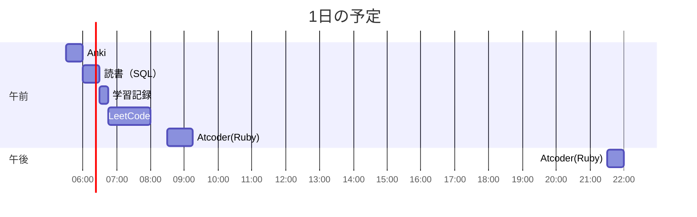

# TIL for 2025-11-07
## **学習時間**：3.75h  
- RANTEQ：0.0h  
- 読書(&書籍内の実習)：0.5h  
- その他：3.25h
----
## 今日の予定

---
## やったこと
### 読書&実習
- **ゼロからはじめるデータベース操作**
	- 7章
### その他
- **LeetCode**
	- 610\. Triangle Judgement(Easy)
		- 三角形の条件
			- |b-c| < a < b+c
		- SQL チェックリスト
			- [x] 重複チェックをできているか？
				- 全行出力する前提 
			- [x] 異なる列において、同じものを意味する値が入る可能性がある場合、自己関係（self edge）は **除外**するフィルタを入れているか？
				- 考慮しなくていい 
			- [x] JOINを使用する場合、ほかの選択肢がないかを考慮する(INやEXISTSなど)
				- JOIN句を使用していない 
			- [x] INの中身をサブクエリを用いる場合、EXISTSで代用できないかを検討する（パフォーマンスの観点）
				- INを用いていない
		- 自分のコード
			```
			SELECT *, 
				CASE WHEN (ABS(x-y) < z AND z < (x+y))
						AND (ABS(x-z) < y AND y < (x+z))
						AND (ABS(z-y) < x AND x < (z+y))
						THEN "Yes"
					ELSE "No"
				END AS triangle
			FROM Triangle
			```
			- SLECT句でCASE式を用いて、三角形の3辺であるか否かを判定している
		- Claude Codeからの指摘
			>#### 1. **不要な複雑さ**
			>あなたは各辺について：
			>- 下限条件: `|a - b| < c`
			>- 上限条件: `c < a + b`
			>の両方をチェックしています。
			>
			>**しかし、三角形の判定には `a + b > c` のみで十分です。**

		- Claude Codeの回答
			```
			SELECT 
			    x,
			    y,
			    z,
			    CASE 
			        WHEN x + y > z 
			         AND x + z > y 
			         AND y + z > x 
			        THEN 'Yes' 
			        ELSE 'No' 
			    END AS triangle
			FROM Triangle;
			```
			>- **理由:**
			>	1. **明確性**: 三角形の定義が一目でわかる
			>	2. **効率性**: 最小限の計算
			>	3. **可読性**: 条件が1行ずつ分かれている
			>	4. **標準性**: すべてのDBMSで動作

		- ChatGPTからの指摘
			>##### 指摘1：条件が冗長で読みにくい
			>	- 三角形判定は **「各2辺の和 > 残りの1辺」** の3条件だけで十分です。  
			>		- 下限側の `ABS(a-b) < c` は、長さが正のときは **上の3条件と同値**であり冗長です。  
			>	    → 可読性・最適化の観点でも和の不等式だけにしましょう。
			>##### 指摘2：文字列はシングルクォート推奨
			>- MySQLでは `"Yes"` でも動くことが多いですが、SQL標準や他DB互換を考えると **'Yes'** が無難。
			>##### 指摘3：`SELECT *` は明示列に
			>- LeetCodeの期待出力は `x, y, z, triangle`。`SELECT *` でも今回は同じ並びになりますが、実務では **列を明示**した方が安全（スキーマ変更に強い）。

		- ChatGPTの回答
			```
			SELECT
			  x, y, z,
			  CASE
			    WHEN x + y > z AND x + z > y AND y + z > x
			      THEN 'Yes'
			    ELSE 'No'
			  END AS triangle
			FROM Triangle;
			```
		
		- 反省
			- 文字列はシングルクォートを使う
			- SELECTで指定する列には"*"を使わずに明示的に指定する（スキーマ変更に強い）
				- チェックリストに追加
	- 570\. Managers with at Least 5 Direct Reports(Mid)
		- 思考
			- 部下が5人以上いる人の求め方
				- managerIdで分割し、その数が5以上であるidを求める
				- そのidと一致する人物の名前を出力する
		- SQL チェックリスト
			- [x] 重複チェックをできているか？
				- 結合を用いていない 
			- [x] 異なる列において、同じものを意味する値が入る可能性がある場合、自己関係（self edge）は **除外**するフィルタを入れているか？
				- 考慮しなくていい 
			- [x] JOINを使用する場合、ほかの選択肢がないかを考慮する(INやEXISTSなど)
				- JOIN句を使用していない 
			- [x] INの中身をサブクエリを用いる場合、EXISTSで代用できないかを検討する（パフォーマンスの観点）
				- EXISTSに書き換えたが、パフォーマンスが下がった ので、採用しない
			- [x] 文字列はシングルクォートを使う
			- [x] SELECTで指定する列には"\*"を使わずに明示的に指定する（スキーマ変更に強い）
		- 自分のコード
			```
			SELECT name
			FROM Employee AS a
			WHERE a.id IN (
			    SELECT b.managerId
			    FROM Employee AS b
			    WHERE b.managerId IS NOT NULL
			    GROUP BY b.managerId
			    HAVING COUNT(*) >=5
			)
			```
		
		- Claude Codeからの指摘
			>- **パフォーマンス** - IN句とサブクエリの組み合わせは、データ量が多い場合にパフォーマンスが劣る可能性があります
			>- **可読性** - エイリアスの命名（a, b）があまり直感的ではありません
		
		- Claude Codeの回答
			```
			SELECT m.name
			FROM Employee e
			INNER JOIN Employee m ON e.managerId = m.id
			GROUP BY m.id, m.name
			HAVING COUNT(*) >= 5;
			```
			- 自己結合を用いている
		- ChatGPTからの指摘
			>- **スペース/表記**  
			>    　`>=5` → `>= 5`（読みやすさ・チーム規約的に）
			>    
			>- **重名への備え（任意）**  
			>    　仕様上は `name` を返すだけですが、もし**同姓のマネージャが複数**いれば重複行になります。  
			>    　LeetCodeのデータでは問題になりませんが、実務なら `GROUP BY a.id, a.name` で一意化／`DISTINCT` を検討。

		- ChatGPTの回答
			```
			SELECT e.name
			FROM Employee AS e
			JOIN Employee AS r
			  ON r.managerId = e.id
			GROUP BY e.id, e.name
			HAVING COUNT(*) >= 5;
			```
			- Claude Codeと同様の回答
		- 反省 
			- EXPLAINを用いて、パフォーマンスを確認する
- **AtCoder（Ruby）**
	- ABC430
		- B - Count Subgrid
			- 思考
				- どのようなデータを持つか？
					- M×Mの配列
				- 切り取ったパターンがすでに切り取ったパターンと一致するかどうかの比較方法は？
					- 1マスずつ比較？
						- 効率が悪い
					- 数値として持てないか？
						- "#"か"."かを2進数として持つ
							- Mの最大値は10
							- 10\*10の配列だと2の100乗になってしまう
							- 2の100乗は1.2676506e+30
								- Float型に収まる
				- 文字列改行含めた文字列を改行で分割し、Char型の配列に格納する
					```
					grid.split("\n")
					```
				- 切り取れるパターンを走査する
				- 
			- チェックリスト
				- [x] 早期リターンや論理演算子などを使ってネストを浅くできないか？
				- [x] "true", "false"を直接返していないか？（条件式を返す）
				- [x] 変数名を簡潔にできないか？
				- [x] メソッド名は適切か？
	- 自分のコード
		```
		require 'set'
		
		def count_cutting_pattern(grid, grid_legth, length)
		  max_index = grid_legth-length
		
		  grid_pattern = Set.new
		  # 切り取れるパターンを走査する
		  (0..max_index).each do |height|
		    (0..max_index).each do |width|
		      key = length.times.map { |dx| grid[height+dx][width, length] }.join
		      grid_pattern.add(key)
		    end
		  end
		
		  grid_pattern.size
		end
		
		n, m = gets.split.map(&:to_i)
		grid = Array.new(n) { gets.chomp }
		
		puts(count_cutting_pattern(grid, n, m))
		```

		- Claude Codeからの指摘
		>##### 良い点
		>- Setを使って重複を自動的に排除している点は正解です
		>- 基本的なアルゴリズムは正しいです
		>##### 改善すべき点
		>1. 変数名のtypo
		>	`def count_cutting_pattern(grid, grid_legth, length)  # grid_legth → grid_length`
		>2. 変数名の意味の不明瞭さ
		>	- lengthは実際にはM（部分グリッドのサイズ）を表しているので、subgrid_sizeやmの方が分かりやすいです
		>	- heightとwidthは実際には行と列の開始位置なので、rowとcolまたはstart_rowとstart_colが適切です
		>3. 部分文字列の取得方法の改善
		>	- key = length.times.map { |dx| grid[height+dx][width, length] }.join
		>	- この実装でも動作しますが、より明確に書けます。

		- Claude Codeの回答
			```
			require 'set'
			
			class SubgridCounter
			  def initialize(grid)
			    @grid = grid
			    @n = grid.size
			  end
			
			  def count_unique_patterns(subgrid_size)
			    return 0 if subgrid_size > @n
			    
			    extract_all_subgrids(subgrid_size)
			      .to_set
			      .size
			  end
			
			  private
			
			  def extract_all_subgrids(size)
			    valid_positions.flat_map do |row, col|
			      extract_subgrid_at(row, col, size)
			    end
			  end
			
			  def valid_positions
			    max_start = @n - @m
			    (0..max_start).to_a.product((0..max_start).to_a)
			  end
			
			  def extract_subgrid_at(start_row, start_col, size)
			    size.times.map { |offset| 
			      @grid[start_row + offset][start_col, size]
			    }.join
			  end
			end
			
			# メイン処理
			n, m = gets.split.map(&:to_i)
			grid = n.times.map { gets.chomp }
			
			counter = SubgridCounter.new(grid)
			puts counter.count_unique_patterns(m)
			```
			- 競技プログラミング向けではないが、身に着けたいコードの書き方はこっち
		- ChatGPTからの指摘
			>##### 良い点
			>- M×M の全位置を二重ループで総当たり → 正攻法で正しい。
			>- Set を使い、部分グリッドをキー化（join）して一意化 → アルゴリズムとして妥当。
			>##### 改善ポイント
			>- スペルミス
			>    - grid_legth → grid_length。読み手の脳内補正コストが上がります。
			>- 引数名・変数名の意味合い
			>    - length は「長さ」を表す一般名詞で曖昧。ここは sub や m など “サブグリッドの一辺” を示す名前が良い。
			>   - ループ変数 height/width は 行/列 を表しているので i/j or row/col が自然。
			>- 境界の書き方
			>   - max_index = n - m は OK。
			>    - 0..max_index を 0.upto(n-m) と書くと意図がより直感的。
			>- 小さなRubyらしさ
			>    - grid_pattern.add(key) は << でも可（Set#<<）。
			>    - puts(count_cutting_pattern(...)) の括弧は省略可。

		- ChatGPTの回答
			```
			require 'set'
			
			n, m = gets.split.map!(&:to_i)
			s = Array.new(n) { gets.chomp }
			
			seen = Set.new
			0.upto(n - m) do |i|
			  0.upto(n - m) do |j|
			    seen << (0...m).map { |di| s[i + di][j, m] }.join
			  end
			end
			
			puts seen.size
			```

- 反省
	- 変数の名づけ方が甘い
---
## ふりかえり
### Keep（良かったこと・継続したいこと）
- 特になし
### Problem（課題・困ったこと）
- 疲れていたので、Atcoderの振り返りがてきとうになってしまった
### Try（次に試したいこと・改善案）
- 競技プログラミングで、クラスなどを使ってみる
---
## 気づき・学び・面白かったこと（Insights）
- 特になし