# TIL for 2025-11-08
## 学習時間集計結果
#### 総学習時間: 7時間30分
### カテゴリー別詳細
| カテゴリー | 学習時間 | 割合 |
| :----- | -----: | ----: |
| RUNTEQ    | 2時間00分 | 26.7% |
| 読書&実習 | 1時間00分 | 13.3% |
| その他    | 4時間30分 | 60.0% |
### 時間帯別分析
| 時間帯 | 学習時間 | 割合 |
| :----- | -----: | ----: |
| 午前 (5:00-12:00) | 4時間15分 | 56.7% |
| 午後 (12:00-18:00) | 2時間30分 | 33.3% |
| 夜間 (18:00-5:00) | 45分 | 10.0% |

---


## 今日の予定

```mermaid
gantt
    title 1日の予定
    dateFormat  HH:mm
    axisFormat  %H:%M

    section 午前
    Anki        :    task1, 07:00, 30m
    読書（SQL）              :  task2, 07:30, 30m
    学習記録                  :         task3, 08:00, 30m
    DBスペシャリスト 過去問               :         task5, 08:30, 45m
    RUNTEQ(Rails基礎)               :         task6, 09:30, 120m

    section 午後
    Anki        :    task4, 13:15, 30m
    読書(DB)              :         task7, 13:45, 30m
    AtCoder(Ruby)              :         task8, 14:15, 90m
    
    %% section 夜 %%
    AtCoder(Ruby)               :         task9, 18:50, 45m
```

---
## やったこと
### RUNTEQ
- (詳細は省略)
### 読書&実習
- **Ruby on Rails アプリケーションプログラミング**
	- 6.5~7.3
- **達人に学ぶDB設計徹底指南書**
	- 8.1~8.3
### その他
- **DBスペシャリスト 過去問**
	- 午前-Ⅱ
		- SQL
		- 概念データモデル
		- 関係スキーマ
			- R4-3
				- 自分の回答：ア
					- A->Cしか導けないため
				- 正解：ア
		- 重要キーワード
			- トランザクション管理
				- H18-34
					- 自分の回答：ア
						- ほかの回答が適切でない理由
							- イ：２層ロックは、テーブルの個数に関わらずまずロックする
							- ウ：デッドロックは発生しない
							- エ：読み込みのみを行うトランザクションでもロックする
					- 正解：ウ
				- R5-12
					- 自分の回答：エ
						- ほかの回答が適切でない理由
							- ア：すべてのトランザクションが直列に制御されるわけではない
							- イ：トランザクションのコミット順序はトランザクション開始順になるわけではない
							- ウ：ロックを解除した後にコミットするのはおかしい
					- 正解：エ
				- H24-13
					- 自分の回答：ア
						- ２層ロック方式ではデッドロックが発生する可能性がある
					- 正解：ア
				- H20-38
					- 自分の回答：イ
						- ①でaに対して共有ロックがかけられるため⑥のUPDATEは実行できない。また③および⑤のREADでbに対して共有ロックがかけられるため、⑦のUPDATEが実行できない。ここでデッドロックが発生する
					- 正解：イ
				- H16-40
					- 自分の回答：ア
						- ロック方式はデッドロックが発生する可能性があるため
					- 正解：ア
				- R4-13
					- 自分の回答：エ
						- ほかの回答が適切でない理由
							- ア：読み取り時にも占有ロックをかけると余計にデッドロックが発生する可能性が高まる
							- イ：まとめるというよりかはどの順番でロックをかけるかが重要
							- ウ：アと同様
					- 正解：エ
- **AtCoder（Ruby）**
	- ABC427
		- A - ABC -> AC
			- Atcoder（Ruby） チェックリスト 
				- [x] 早期リターンや論理演算子などを使ってネストを浅くできないか？
					- ネストはない 
				- [x] "true", "false"を直接返していないか？（条件式を返す）
				- [x] 変数名を簡潔にできないか？
				- [x] メソッド名は適切か？
				- [x] クラスなどを用いて、処理の分割などを考える
					- 処理が単純なのでクラスは用いない 
				- [x] 計算量を明記する
					- O(N) 
						- Nは文字列の長さ
			- 自分のコード
				```
				def cut_middle_char(str)
				  chars = str.chars
				  chars.delete_at((str.length-1)/2)
				  chars.join
				end
				
				str = gets
				puts cut_middle_char(str)
				``` 
			- Claude Codeからの指摘
				>- 改行文字の処理漏れ: getsは末尾に改行文字(\n)を含むため、gets.chompを使う必要があります
				>- 中央位置の計算誤り: 問題では「(L+1)/2番目」となっていますが、0ベースのインデックスではL/2になります
			- Claude Codeの回答
				```
				s = gets.chomp
				mid = s.length / 2
				puts s[0...mid] + s[mid+1..-1]
				```

			- ChatGPTからの指摘
			>	- 配列化して delete_at はオーバーキル
			>	  - 文字列の一部削除は スライス操作（部分文字列）だけで済む
			>	  - 配列に変換 → 削除 → join は 処理の無駄が多い
			>	- Ruby では文字列のまま部分抽出ができるので、
			>	  - `str[0, mid] + str[mid+1..] `のように書く方が自然です。
			- ChatGPTの回答
				- Claude Codeと同様
			- 反省
				- 処理の簡潔化を意識すべき
		- B - Sum of Digits Sequence
			- 思考
				- 処理を分解
					- 各桁の和を求める
					- f(Aj)の和を求める
				- 各桁の和を求める
					```
					def sum_digits(n)
					  n.to_s.chars.map(&:to_i).sum
					end
					```
					- 整数nを文字列にし、それをCharの配列にし、それぞれを整数に変換し、合計している
				- Ajの和を求める
					- 1からsum_digitsを呼び出し、返り血を足して、またそれに対してsum_digitsを呼ぶ
						```
						def sum_digits_sequence(n)
						  sum = 0
						  
						  # A(0)=1
						  sum += 1
						
						  # A(n)  n>0
						  (1...n).each do |num|
						    sum += sum_digits(sum)
						  end
						  sum
						end
						```
			- AtCoder(Ruby) チェックリスト
				- [x] 処理に冗長な部分かないかを確認
				- [x] 早期リターンや論理演算子などを使ってネストを浅くできないか？
				- [x] "true", "false"を直接返していないか？（条件式を返す）
				- [x] 変数名を簡潔にできないか？
				- [x] メソッド名は適切か？
				- [x] `gets`を使う場合は必ず`chomp`を検討(改行を含めないように)
				- [x] 可能であればクラスなどを用いて、処理の分割などを考える
				- [x] 計算量を明記する
					- O(N)
						- 入力Nに計算量が比例するため
			- 自分のコード
				```
				def sum_digits(n)
				  n.to_s.chars.map(&:to_i).sum
				end
				
				def sum_digits_sequence(n)
				  sum = 0
				  
				  # A(0)=1
				  sum += 1
				
				  # A(n)  n>0
				  (1...n).each do
				    sum += sum_digits(sum)
				  end
				  sum
				end
				
				n = gets.chomp.to_i
				puts sum_digits_sequence(n)
				```

			- Claude Codeからの指摘
				>- 主な問題：
				>	- アルゴリズムの根本的な誤り:
				>	  - 問題は「A[i] = Σf(A[j]) (j=0 to i-1)」つまり「これまでの全ての項の各桁の和」を求める
				>	  - あなたのコードは「前の結果の各桁の和を累積」している（全く別の計算）
				>	- 配列を保持していない:
				>	  - A[i]を計算するには、A[0]からA[i-1]まで全ての値が必要
			
			- Claude Codeの回答
				```
				def f(x)
				  x.digits.sum
				end
				
				n = gets.to_i
				a = [1]
				
				n.times do |i|
				  a << a.map { |x| f(x) }.sum
				end
				
				puts a[n]
				```
			>- この解法の利点：
			>	- 問題文の定義に忠実で理解しやすい
			>	- `digits`メソッドを使って簡潔に記述
			>	- 配列で全ての値を保持（デバッグしやすい）
			>	- 計算量O(n²)だが、n≤100なので十分高速
			>	- ChatGPTからの指摘
			- ChatGPTの指摘
			>	###### 良い点
			>	- オーダー設計が正しい：A₁=1 を初期値に置き、n=1 ならそのまま 1、n>1 なら n-1 回更新で Aₙ に到達。
			>	- 実装がシンプルで読みやすい。
			>	 
			>	##### 改善ポイント
			>	- イテレーションの表現
			>	  - (1...n).each は「回数」が意図なので (n-1).times の方が直感的。
			>	- 空行／コメントのノイズ
			>	  - コンテスト解答では最小限が読みやすい（編集時のミスも減る）。
			>	- 桁和の実装
			>	  - Ruby なら Integer#digits が使えるので n.digits.sum が最短で高速。
			- ChatGPTの回答
				```
				# B - Sum of Digits Sequence
				n = STDIN.read.to_i
				
				a = 1                 # A1 = 1 を初期値に置く（定義より A1 = f(A0) = 1）
				(n - 1).times { a += a.digits.sum }   # A_i = A_{i-1} + f(A_{i-1}) を i = 2..N に適用
				
				puts a
				```

			- 反省
				- イテレーションの表現は誤っていた
				- 計算量の考え方が誤っていた
					- 正しくはO(n * logAn)
					- "logAn"は各ステップの桁和
  - その他
	  - ObsidianのTemplater機能を使って、学習時間を自動で集計させるようにした
		  - 内容は以下(ChapGPT作)
			```
			<%*
			// Mermaid学習時間集計 - 最終版（全テーブル形式）
			
			const file = app.workspace.getActiveFile();
			const content = await app.vault.read(file);
			
			// 時間フォーマット関数
			function formatTime(minutes) {
			    const h = Math.floor(minutes / 60);
			    const m = minutes % 60;
			    if (h > 0) {
			        return h + "時間" + ("0" + m).slice(-2) + "分";
			    } else {
			        return m + "分";
			    }
			}
			
			// Mermaidブロックを抽出
			let mermaidText = "";
			const lines = content.split('\n');
			let inMermaid = false;
			
			for (let i = 0; i < lines.length; i++) {
			    if (lines[i].includes('```mermaid')) {
			        inMermaid = true;
			        continue;
			    }
			    if (lines[i].includes('```') && inMermaid) {
			        break;
			    }
			    if (inMermaid) {
			        mermaidText += lines[i] + '\n';
			    }
			}
			
			if (!mermaidText) {
			    tR += "⚠️ Mermaidガントチャートが見つかりませんでした。\n";
			} else {
			    // タスクを抽出
			    const taskLines = mermaidText.split('\n');
			    let tasks = [];
			    let totalMinutes = 0;
			    let runteqMinutes = 0;
			    let readingMinutes = 0;
			    let otherMinutes = 0;
			    
			    for (let line of taskLines) {
			        // 空白行、コメント、設定行をスキップ
			        const trimmedLine = line.trim();
			        if (!trimmedLine || 
			            trimmedLine.startsWith('gantt') || 
			            trimmedLine.startsWith('title') ||
			            trimmedLine.startsWith('dateFormat') ||
			            trimmedLine.startsWith('axisFormat') ||
			            trimmedLine.startsWith('section') ||
			            trimmedLine.startsWith('%%')) {
			            continue;
			        }
			        
			        // タスク行のパターン: "タスク名 : taskX, 時刻, 期間"
			        const pattern = /^(.+?)\s*:\s*(\w+),\s*(\d{2}:\d{2}),\s*(\d+)([mh])/;
			        const match = trimmedLine.match(pattern);
			        
			        if (match) {
			            const taskName = match[1].trim();
			            const startTime = match[3];
			            const durationValue = parseInt(match[4]);
			            const durationUnit = match[5];
			            
			            // 分に変換
			            let minutes = 0;
			            if (durationUnit === 'm') {
			                minutes = durationValue;
			            } else if (durationUnit === 'h') {
			                minutes = durationValue * 60;
			            }
			            
			            if (minutes > 0) {
			                // カテゴリー判定
			                let category = "その他";
			                if (taskName.includes('RUNTEQ')) {
			                    category = "RUNTEQ";
			                    runteqMinutes += minutes;
			                } else if (taskName.includes('読書')) {
			                    category = "読書&実習";
			                    readingMinutes += minutes;
			                } else {
			                    otherMinutes += minutes;
			                }
			                
			                totalMinutes += minutes;
			                tasks.push({
			                    name: taskName,
			                    startTime: startTime,
			                    minutes: minutes,
			                    category: category
			                });
			            }
			        }
			    }
			    
			    // レポート作成
			    tR += "## 学習時間集計結果\n";
			    
			    if (totalMinutes === 0) {
			        tR += "⚠️ タスクが検出されませんでした。\n";
			        tR += "Mermaidガントチャートのフォーマットを確認してください。\n";
			        tR += "\n期待されるフォーマット:\n";
			        tR += "```\n";
			        tR += "タスク名 : taskID, HH:MM, XXm\n";
			        tR += "```\n";
			    } else {
			        // 総学習時間
			        tR += "#### 総学習時間: " + formatTime(totalMinutes) + "\n";
			        
			        // カテゴリー別詳細
			        tR += "### カテゴリー別詳細\n";
			        tR += "| カテゴリー | 学習時間 | 割合 |\n";
			        tR += "| :----- | -----: | ----: |\n";
			        
			        // 各カテゴリーのデータを準備（RUNTEQを最初に表示）
			        const categories = [];
			        if (runteqMinutes > 0) {
			            categories.push({
			                name: "RUNTEQ",
			                minutes: runteqMinutes,
			                percent: (runteqMinutes / totalMinutes * 100).toFixed(1)
			            });
			        }
			        if (readingMinutes > 0) {
			            categories.push({
			                name: "読書&実習",
			                minutes: readingMinutes,
			                percent: (readingMinutes / totalMinutes * 100).toFixed(1)
			            });
			        }
			        if (otherMinutes > 0) {
			            categories.push({
			                name: "その他",
			                minutes: otherMinutes,
			                percent: (otherMinutes / totalMinutes * 100).toFixed(1)
			            });
			        }
			        
			        // カテゴリー名の最大長を計算（日本語考慮）
			        let maxCatLength = 6; // 最小幅（"その他"の長さ）
			        for (let cat of categories) {
			            let length = 0;
			            for (let i = 0; i < cat.name.length; i++) {
			                if (cat.name.charCodeAt(i) > 127) {
			                    length += 2;
			                } else {
			                    length += 1;
			                }
			            }
			            if (length > maxCatLength) {
			                maxCatLength = length;
			            }
			        }
			        
			        // テーブル行の出力
			        for (let cat of categories) {
			            // カテゴリー名のパディング計算
			            let catLength = 0;
			            for (let i = 0; i < cat.name.length; i++) {
			                if (cat.name.charCodeAt(i) > 127) {
			                    catLength += 2;
			                } else {
			                    catLength += 1;
			                }
			            }
			            const padding = " ".repeat(maxCatLength - catLength);
			            
			            const timeStr = formatTime(cat.minutes);
			            tR += "| " + cat.name + padding + " | " + timeStr + " | " + cat.percent + "% |\n";
			        }
			        
			        // 時間帯別分析
			        tR += "### 時間帯別分析\n";
			        
			        let morningMinutes = 0;
			        let afternoonMinutes = 0;
			        let eveningMinutes = 0;
			        
			        for (let task of tasks) {
			            const hour = parseInt(task.startTime.split(':')[0]);
			            if (hour >= 5 && hour < 12) {
			                morningMinutes += task.minutes;
			            } else if (hour >= 12 && hour < 18) {
			                afternoonMinutes += task.minutes;
			            } else {
			                eveningMinutes += task.minutes;
			            }
			        }
			        
			        // 時間帯別のテーブル表示
			        tR += "| 時間帯 | 学習時間 | 割合 |\n";
			        tR += "| :----- | -----: | ----: |\n";
			        
			        const morningPercent = totalMinutes > 0 ? (morningMinutes / totalMinutes * 100).toFixed(1) : "0.0";
			        const afternoonPercent = totalMinutes > 0 ? (afternoonMinutes / totalMinutes * 100).toFixed(1) : "0.0";
			        const eveningPercent = totalMinutes > 0 ? (eveningMinutes / totalMinutes * 100).toFixed(1) : "0.0";
			        
			        tR += "| 午前 (5:00-12:00) | " + formatTime(morningMinutes) + " | " + morningPercent + "% |\n";
			        tR += "| 午後 (12:00-18:00) | " + formatTime(afternoonMinutes) + " | " + afternoonPercent + "% |\n";
			        tR += "| 夜間 (18:00-5:00) | " + formatTime(eveningMinutes) + " | " + eveningPercent + "% |\n";
			    }
			}
			%>
			```
---
## ふりかえり
### Keep（良かったこと・継続したいこと）
- RUNTEQの懇親会に参加した
### Problem（課題・困ったこと）
- 特になし
### Try（次に試したいこと・改善案）
- 特になし
---
## 気づき・学び・面白かったこと（Insights）
- 特になし