# TIL for 2025-11-09
## 学習時間集計結果
#### 総学習時間: 6時間35分
### カテゴリー別詳細
| カテゴリー | 学習時間 | 割合 |
| :----- | -----: | ----: |
| RUNTEQ    | 2時間35分 | 39.2% |
| 読書&実習 | 1時間15分 | 19.0% |
| その他    | 2時間45分 | 41.8% |
### 時間帯別分析
| 時間帯 | 学習時間 | 割合 |
| :----- | -----: | ----: |
| 午前 (5:00-12:00) | 2時間15分 | 34.2% |
| 午後 (12:00-18:00) | 2時間05分 | 31.6% |
| 夜間 (18:00-5:00) | 2時間15分 | 34.2% |

----
## 今日の予定

```mermaid
gantt
    title 1日の予定
    dateFormat  HH:mm
    axisFormat  %H:%M

    section 午前
    Anki        :    task1, 08:15, 30m
    読書（SQL）              :  task2, 08:45, 30m
    学習記録                  :         task3, 09:15, 15m
    LeetCode               :         task5, 11:20, 60m

    section 午後
    Anki              :         task7, 13:30, 30m
    RUNTEQ(rails基礎)              :         task8, 14:00, 95m

    %% section 夜 %%
    読書（IT転職）              :  task9, 19:15, 15m
    LeetCode               :         task10, 19:30, 30m
    読書&実践（Ruby）              :  task11, 20:00, 30m
    RUNTEQ(rails基礎)              :         task8, 20:30, 60m
```

---
## やったこと
### RUNTEQ
- 14\.  ブックマーク機能の追加
	- (詳細は記載しない)
### 読書&実習
- **ゼロからはじめるデータベース操作**
	- 8章

- **プロを目指す人のためのRuby入門**
	- 7.4

### その他
- **LeetCode**
	- 619\. Biggest Single Number(Easy)
		- SQL チェックリスト
			- [x] 重複チェックをできているか？
			- [x] 異なる列において、同じものを意味する値が入る可能性がある場合、自己関係（self edge）は **除外**するフィルタを入れているか？
			- [x] JOINを使用する場合、ほかの選択肢がないかを考慮する(INやEXISTSなど)
			- [x] INの中身をサブクエリを用いる場合、EXISTSで代用できないかを検討する（パフォーマンスの観点）
			- [x] 文字列はシングルクォートを使う
			- [x] SELECTで指定する列には"\*"を使わずに明示的に指定する（スキーマ変更に強い）
				- サブクエリ内の"\*" はEXISTSの中なので問題ない
			- [x] "EXPLAIN ANALYZE"を用いて、パフォーマンスを確認する
		- 自分のコード
			```
			SELECT MAX(main.num) AS num
			FROM MyNumbers AS main
			WHERE EXISTS(
				SELECT *
				FROM MyNumbers AS sub
				WHERE main.num = sub.num
				GROUP BY sub.num
				HAVING COUNT(sub.num) = 1
			)
			```
			- EXPLAIN で確認し、ChapGPTに解読させたところ、以下の指摘をされた
				```
				「相関サブクエリが最適化されず、  
				main の各行ごとに sub 全スキャン + 一時テーブル + 集計  
				を繰り返す地獄の計画になっています。  
				JOIN で書き換えれば瞬時に高速化できますよ。」
				```
			- よくよく考えたらJOINする必要もないので、以下に変更
				```
				SELECT MAX(main.num) AS num
				FROM (
				    SELECT num
				    FROM MyNumbers
				    GROUP BY num
				    HAVING COUNT(num) = 1
				) AS main
				```

		- Claude Codeからの指摘
			- 使用制限に引っかかった...
		- ChatGPTからの指摘
		>- 気になる点
		>  - COUNT(num) の意味
		>	- COUNT(列) は NULL を数えません。
		>	- もし num に NULL が入り得る場合、NULL の行はそもそもカウント対象外になり、想定外の挙動になることがあります。
		>	- 明確にしたいなら
		>	  - WHERE num IS NOT NULL を付けるか
		>	  - COUNT(\*) を使う（その上で WHERE num IS NOT NULL で除外）を推奨します。
			 > - パフォーマンス/可読性は十分OK
			>    - 外側 MAX は O(1) で決まるため、ORDER BY ... LIMIT 1 と同等かそれ以上に安定します。

			- テーブルに1列しか存在しないので、Nullは気にしなくていいと思ったが、問題文を見ると、主キーというわけではなかったので、気をつけないといけない
		- ChatGPTの回答
			```
			SELECT num
			FROM MyNumbers
			WHERE num IS NOT NULL
			GROUP BY num
			HAVING COUNT(*) = 1
			ORDER BY num DESC
			LIMIT 1;
			```

		- 反省 
			- COUNTの際に特定の列を指定すると、NULLの行が含まれないことに注意する
	- 626\. Exchange Seats(Mid)
		- SQL チェックリスト
			- 時間がないので飛ばす
		- 自分のコード
			```
			SELECT main.id,
			    CASE
			        WHEN main.id % 2 = 1
			            THEN CASE 
			                WHEN minus.student IS NULL
			                    THEN main.student
			                ELSE minus.student
			            END
			        WHEN main.id % 2 = 0
			            THEN plus.student
			        ELSE NULL
			    END AS student
			FROM Seat AS main 
			    LEFT OUTER JOIN Seat AS minus ON main.id = minus.id - 1
			    LEFT OUTER JOIN Seat AS plus ON main.id = plus.id + 1
			```
			- まずFROM句でstudentを1行上にずらしたものと、1行下にずらしたものを結合
			- それをidが奇数か偶数かでどちらを選択するか決めている
			- 最後の行が奇数だった場合、もともとのstudentを表示

		- Claude Codeからの指摘
		>- ##### 良い点
		>1. 基本ロジックは正しい
		>- 奇数idは次の学生（minus.student）と交換
		>- 偶数idは前の学生（plus.student）と交換
		>- 最後の奇数は自分のまま
		>2. エッジケースを考慮
		>	```
		>	sqlWHEN minus.student IS NULL
		>		THEN main.student
		>	```
		>- 最後の奇数idで次の学生がいない場合の対処が正しい ✅
		>3. LEFT JOINの使い方が適切
		>- 自己結合で前後の学生を取得する発想が良い
		
		>##### 問題点と改善点
		>1.テーブルエイリアスの命名が紛らわしい
		>- minus → 実際は「次」の学生（id + 1）
		>- plus  → 実際は「前」の学生（id - 1）
		 > - 命名が直感と逆なので混乱を招きます。
		>- 推奨される命名:
		 > - next_seat  → 次の座席（id + 1）
		  >- prev_seat  → 前の座席（id - 1）
		>2.COALESCE()を使う
		>	```
		>	CASE
		>		WHEN main.id % 2 = 1 
		>			THEN COALESCE(next_seat.student, main.student)
		>		WHEN main.id % 2 = 0 
		>			THEN prev_seat.student
		>	END AS student
		>	```
		>3. ELSE NULLは不要

		- Claude Codeの回答
			```
			SELECT 
			    s1.id,
			    COALESCE(s2.student, s1.student) AS student
			FROM Seat s1
			LEFT JOIN Seat s2 ON 
			    (s1.id % 2 = 1 AND s2.id = s1.id + 1) OR
			    (s1.id % 2 = 0 AND s2.id = s1.id - 1)
			ORDER BY s1.id;
			```

		- ChatGPTからの指摘
		>	##### 気になる点
		>	- 結果順の明示がない
		>	  - LeetCodeは解説でも ORDER BY id の並びで期待されることが多いです。明示しましょう。
		>	- CASE の入れ子が冗長
		>	  - 奇数側は COALESCE(minus.student, main.student) で一発です。
		>	- JOIN 別名の意味が直感と逆（minus が「+1」、plus が「-1」）
		>	  - 中身は合ってますが読み手が混乱しやすいです。計算で 相手の id を1本で出す方がスッキリします。
		>	- 可搬性
		>	  - % はMySQLでOKですが、MOD(id,2) のほうが意図が明確です。

		- ChatGPTの回答
			```
			SELECT id,
			       CASE
			         WHEN MOD(id, 2) = 1 THEN COALESCE(LEAD(student) OVER (ORDER BY id), student)
			         ELSE                     LAG(student)  OVER (ORDER BY id)
			       END AS student
			FROM Seat
			ORDER BY id;
			```


---
## ふりかえり
### Keep（良かったこと・継続したいこと）
- 先週立てたLeetCodeの目標を達成することができた
### Problem（課題・困ったこと）
- SQLにおいて、COUNTの際に特定の列を指定すると、NULLの行が含まれないことを意識できていなかった
- 機能ごとのコミット
	- 機能ごとにMVCを実装する必要がある
### Try（次に試したいこと・改善案）
- 機能ごとのコミット
---
## 気づき・学び・面白かったこと（Insights）
- 特になし