# TIL for 2025-11-13
## 学習時間集計結果
#### 総学習時間: 3時間30分
### カテゴリー別詳細
| カテゴリー | 学習時間 | 割合 |
| :----- | -----: | ----: |
| 読書&実習 | 30分 | 14.3% |
| その他    | 3時間00分 | 85.7% |
### 時間帯別分析
| 時間帯 | 学習時間 | 割合 |
| :----- | -----: | ----: |
| 午前 (5:00-12:00) | 3時間30分 | 100.0% |
| 午後 (12:00-18:00) | 0分 | 0.0% |
| 夜間 (18:00-5:00) | 0分 | 0.0% |

----
## 今日の予定

```mermaid
gantt
    title 1日の予定
    dateFormat  HH:mm
    axisFormat  %H:%M

    section 午前
    Anki        :    task1, 05:15, 30m
    読書（Ruby）              :  task2, 05:45, 30m
    LeetCode               :         task5, 06:15, 90m
    AtCoder(Ruby)               :         task6, 08:15, 60m

    section 午後

    %% section 夜 %%
```

---
## やったこと
### 読書&実習
- **プロを目指す人のためのRuby入門**
	- 7.7~7.9

### その他
- **LeetCode**
	- 620\. Not Boring Movies(Easy)
		- SQL チェックリスト
			- [x] 重複チェックをできているか？
			- [x] 異なる列において、同じものを意味する値が入る可能性がある場合、自己関係（self edge）は **除外**するフィルタを入れているか？
			- [x] JOINを使用する場合、ほかの選択肢がないかを考慮する(INやEXISTSなど)
			- [x] INの中身をサブクエリを用いる場合、EXISTSで代用できないかを検討する（パフォーマンスの観点）
			- [x] 文字列はシングルクォートを使う
			- [x] COUNTの際に特定の列を指定すると、NULLの行が含まれないことに注意する
			- [x] SELECTで指定する列には"\*"を使わずに明示的に指定する（スキーマ変更に強い）
			- [x] "EXPLAIN ANALYZE"を用いて、パフォーマンスを確認する
		- 自分のコード
			``` sql
			SELECT id, movie, description, rating
			FROM Cinema
			WHERE id MOD 2 = 1 AND description <> 'boring'
			ORDER BY rating DESC
			```

		- ChatGPTからの指摘
		>#### 気になる点
		>- MODの書き方
		>  - MySQLでは MOD(id, 2)（関数）か id % 2（演算子）が確実です。
		>     - id MOD 2 は方言として通る環境もありますが、可搬性・読みやすさで関数/演算子どちらかに統一しましょう。
		>	
		>- カラム選択（LeetCodeの期待）
		>  - 多くの解説では SELECT * を使っています。スキーマ固定問題なので、採点のゆらぎを避けるなら * が無難です。
		>  - もちろん列明示でも通ることが多いです。
		>
		>- 比較演算子
		>  - <> でもOKですが、MySQLでは != を使うことが一般的です（どちらでも可）。

		- ChatGPTの回答
			``` sql
			SELECT *
			FROM Cinema
			WHERE id % 2 = 1
			  AND description != 'boring'
			ORDER BY rating DESC;
			```
	- 601\. Human Traffic of Stadium
		- 思考
			1. peoole >= 100 の行を抽出
			2. 前後2つのidの列を追加
				- ウィンドウ関数LAG , LEADを用いる
					- LAGで前の行を参照
					- LEADで後の行を参照
			3. idが3つ連続している行を抽出
				- 前の2つと、該当の行で3つ連続
				- 前後の1つと、該当の行で3つ連続
				- 後の2つと、該当の行で3つ連続
		- SQL チェックリスト
			- [x] 重複チェックをできているか？
			- [x] 異なる列において、同じものを意味する値が入る可能性がある場合、自己関係（self edge）は **除外**するフィルタを入れているか？
			- [x] JOINを使用する場合、ほかの選択肢がないかを考慮する(INやEXISTSなど)
			- [x] INの中身をサブクエリを用いる場合、EXISTSで代用できないかを検討する（パフォーマンスの観点）
			- [x] 文字列はシングルクォートを使う
			- [x] COUNTの際に特定の列を指定すると、NULLの行が含まれないことに注意する
			- [x] SELECTで指定する列には"\*"を使わずに明示的に指定する（スキーマ変更に強い）
			- [x] "EXPLAIN ANALYZE"を用いて、パフォーマンスを確認する
		- 自分のコード
			``` sql
			SELECT includeBeforeAfterId.id, includeBeforeAfterId.visit_date, includeBeforeAfterId.people
			FROM (
				-- 前後2つのidの列を追加したテーブルを作成
			    SELECT overOneHundred.id, overOneHundred.visit_date, overOneHundred.people , 
			        LAG(overOneHundred.id , 2)  OVER (ORDER BY overOneHundred.id) AS two_before,
			        LAG(overOneHundred.id)  OVER (ORDER BY overOneHundred.id) AS one_before,
			        LEAD(overOneHundred.id) OVER (ORDER BY overOneHundred.id) AS one_after,
			        LEAD(overOneHundred.id , 2) OVER (ORDER BY overOneHundred.id) AS two_after
			    FROM (
				    -- peoole >= 100 の行を抽出したテーブルを作成
			        SELECT *
			        FROM Stadium
			        WHERE people >= 100
			    ) AS overOneHundred
			) AS includeBeforeAfterId
			WHERE (includeBeforeAfterId.id-2 = includeBeforeAfterId.two_before AND includeBeforeAfterId.id-1 = includeBeforeAfterId.one_before) OR
			    (includeBeforeAfterId.id-1 = includeBeforeAfterId.one_before AND includeBeforeAfterId.id+1 = includeBeforeAfterId.one_after) OR
			    (includeBeforeAfterId.id+2 = includeBeforeAfterId.two_after AND includeBeforeAfterId.id+1 = includeBeforeAfterId.one_after)
			```

		- ChatGPTからの指摘
		>#### 気になる点
		>- 入れ子の副問合せが冗長
		>  - people >= 100 のフィルタはCTE一段で十分。
		>- 条件の重複が多い
		>  - 3パターン（先頭/中央/末尾）を個別に列挙しており長い。
		>- 出力順の明示がない
		>  - 課題では ORDER BY id が期待されます（明示推奨）。
		>- ウィンドウの計算コスト
		>  - LAG/LEADの id を4本出してから式で比較しているが、
		>  - よりシンプルな「グルーピング法」の方が読みやすく実装も軽いです。

		- ChatGPTの回答
			``` sql
			WITH good AS (
			  SELECT id, visit_date, people,
			         id - ROW_NUMBER() OVER (ORDER BY id) AS grp
			  FROM Stadium
			  WHERE people >= 100
			),
			big AS (
			  SELECT grp
			  FROM good
			  GROUP BY grp
			  HAVING COUNT(*) >= 3
			)
			SELECT g.id, g.visit_date, g.people
			FROM good g
			JOIN big  b USING (grp)
			ORDER BY g.id;
			```
			　- WITH：副問い合わせ（サブクエリ）に名前を付けれる機能
			　- ROW_NUMBER ギャップ法を用いている
				　- `ROW_NUMBER() OVER (ORDER BY id)` は、`id` の昇順に 1,2,3,… と番号を振る
				　- 連番になっている場合、`id - ROW_NUMBER() OVER (ORDER BY id)`が一致する
			 - `USING (grp)`は`ON g.grp = b.grp`と同義
		- 反省 
			- ORDER句の指定し忘れはよろしくない
				- チェックリストに追加
- **AtCoder（Ruby）**
	- ABC431
		- A - Robot Balance
			- AtCoder(Ruby) チェックリスト
				- [x] 処理に冗長な部分かないかを確認
				- [x] 早期リターンや論理演算子などを使ってネストを浅くできないか？
				- [x] "true", "false"を直接返していないか？（条件式を返す）
				- [x] 変数名を簡潔にできないか？
				- [x] メソッド名は適切か？
				- [x] `gets`を使う場合は必ず`chomp`を検討(改行を含めないように)
				- [x] 可能であればクラスなどを用いて、処理の分割などを考える
				- [x] 計算量を明記する
					- 2つも値から計算をしているだけなので、O(1) 
			- 自分のコード
				``` ruby
				def required_additional_body_wight(head_wight, body_wight)
				  head_wight <= body_wight ? 0: head_wight - body_wight
				end
				
				head_wight, body_wight = gets.split.map(&:to_i)
				puts required_additional_body_wight(head_wight, body_wight)
				```
			- ChatGPTからの指摘
			>#### 良い点
			>- 仕様どおりの判定で正答になります（O(1)）。
			>- 真偽式の三項演算子で簡潔。
			>#### 改善点
			>- スペルミス
			> - wight → weight（識別子の誤字は将来の検索/置換で事故ります）。
			>- 関数はオーバースペック（A問題規模）
			>  - 一行の式で充分。関数化するならより短く・意味が伝わる命名に。
			>- Rubyらしい書き方
			 > - max(0, H−B) は 配列の max で素直に書けます（[h - b, 0].max）。

			- ChatGPTの回答
				``` ruby
				h, b = STDIN.read.split.map!(&:to_i)
				puts [h - b, 0].max
				```

			- 反省
				- スペルミス
---
## ふりかえり
### Keep（良かったこと・継続したいこと）
- はじめてLeetCodeのHardの問題に挑戦し、正解まで独力でいけた
### Problem（課題・困ったこと）
- 特になし
### Try（次に試したいこと・改善案）
- 特になし
---
## 気づき・学び・面白かったこと（Insights）
- 特になし