# TIL for 2025-11-14
## 学習時間集計結果
#### 総学習時間: 3時間10分
### カテゴリー別詳細
| カテゴリー | 学習時間 | 割合 |
| :----- | -----: | ----: |
| 読書&実習 | 30分 | 15.8% |
| その他    | 2時間40分 | 84.2% |
### 時間帯別分析
| 時間帯 | 学習時間 | 割合 |
| :----- | -----: | ----: |
| 午前 (5:00-12:00) | 30分 | 15.8% |
| 午後 (12:00-18:00) | 0分 | 0.0% |
| 夜間 (18:00-5:00) | 2時間40分 | 84.2% |

----
## 今日の予定

```mermaid
gantt
    title 1日の予定
    dateFormat  HH:mm
    axisFormat  %H:%M

    section 午前
    Anki        :    task1, 02:30, 30m
    読書（Web）              :  task2, 03:00, 30m
    学習記録                  :         task3, 03:30, 10m
    DBスペシャリスト 過去問               :         task5, 03:40, 30m
    AtCoder(Ruby)               :         task6, 04:10, 60m
    AtCoder(Ruby)               :         task6, 06:15, 30m

    section 午後

    %% section 夜 %%
```

---
## やったこと
### 読書&実習
- **Webを支える技術**
	- 11章
### その他
- **DBスペシャリスト 過去問**
	- 午前-Ⅱ
		- SQL
		- 概念データモデル
		- 関係スキーマ
		- 重要キーワード
			- H16-35
				- 自分の回答：イ
					- すべてのプロセスが決められた順序に従って資源が割り当てられたらデッドロックが発生しないため
				- 正解：イ
			- H30-16
				- 自分の回答：ア
					- ?
				- 正解：エ
			- H28-13
				- 自分の回答：エ
					- ほかの回答が適切でない理由
						- ア：2相ロックはロックの1つの手法
						- イ：?
						- ウ：?
				- 正解：エ
			- H31-10
				- 自分の回答：イ
					- dが初めに占有ロックをとっているため、d=T4であることがわかる
					- そのあとにT1, T2が共有ロックをとろうとするため、T1, T2がa, cのどちらかである
					- そのあとにT2が占有ロックと取ろうとし、T3が共有ロックをとろうとするため、T3はT2を待つことになる
						- したがって、a=T2, b=T3
				- 正解：イ
				- 反省
					- 対象の資源のことを考えられていなかった
			- R2-14
				- 自分の回答：イ
					- ほかの回答が適切でない理由
						- ア：時刻印なんとかの説明
						- ウ：？
						- エ：2相ロックの説明
				- 正解：イ
			- H31-18
				- 自分の回答：ア
					- ？
				- 正解：ア
- **AtCoder（Ruby）**
	- ABC431
		- B - Robot Weight
			- 設計
				- Robotクラスを作成する
					- インスタンス変数
						- i_weight
							- 現在の重さを表す
						- i_parts[]
							- 各パーツを表す
							- Partsクラスの配列
					- インスタンスメソッド
						- process_query
							- クエリを処理する
						- attach(num)
							- num番目のパーツを装備する
						- detach
							- num番目のパーツを外す
				- Partsクラスを作成
					- インスタンス変数
						- i_is_attachment
							- 装備されているか否かを表す
						- i_weight
							- 重さを表す
			- AtCoder(Ruby) チェックリスト
				- [x] 処理に冗長な部分かないかを確認
				- [x] 早期リターンや論理演算子などを使ってネストを浅くできないか？
				- [x] "true", "false"を直接返していないか？（条件式を返す）
				- [x] 変数名を簡潔にできないか？
				- [x] メソッド名は適切か？
				- [x] `gets`を使う場合は必ず`chomp`を検討(改行を含めないように)
				- [x] 可能であればクラスなどを用いて、処理の分割などを考える
				- [x] 計算量を明記す
					- N回処理を行っているだけなので、O(N) 
			- 自分のコード
				``` ruby
				class Robot
				
				  attr_reader :weight
				  
				  def initialize(weight, parts)
				    @weight = weight
				    @parts = parts
				  end
				
				  def process_query(num)
				    if (@parts[num-1].is_attach)
				      detach(num)
				    else
				      attach(num)
				    end
				  end
				
				  private
				
				  def attach(num)
				    @weight += @parts[num-1].weight
				    @parts[num-1].is_attach = true
				  end
				
				  def detach(num)
				    @weight -= @parts[num-1].weight
				    @parts[num-1].is_attach = false
				  end
				
				end
				
				class Part
				
				  attr_accessor :weight, :is_attach
				  
				  def initialize(weight)
				    @weight = weight
				    @is_attach = false
				  end
				
				end
				
				initial_weight = gets.to_i
				parts_num = gets.to_i
				parts_weights = gets.chomp.split.map(&:to_i)
				query_num = gets.to_i
				queries = Array.new(query_num){gets.to_i}
				
				robot = Robot.new(initial_weight, parts_weights.map { Part.new(_1) })
				queries.each do |num|
				  robot.process_query(num)
				  puts robot.weight
				end
				```
		- ChatGPTからの指摘
		>#### 良い点
		>- クエリごとに「その部品をトグル（取り付け↔取り外し）」し、重さを ± する方針は正しい。
		>- 計算量は O(Q)、各クエリ O(1) で処理できていて十分高速。
		>
		>#### 改善点（Rubyらしさ・簡潔さ・堅牢性）
		>- 過度なクラス設計
		 > - B問題の規模ならクラスは不要。一次元配列と真偽配列で十分です（可読性・入力処理のシンプルさが上がる）。
		>
		>- 命名（Ruby流）
		 > - is_attach は attached / attached? が自然（Rubyは真偽の問い合わせに ? を付ける慣習）。
		>  - process_query より toggle の方が意図が伝わる。
		>
		>- I/O の最小化
		 > - クエリは配列に溜めずに 逐次処理 で OK（メモリ・コード量が減る）。
		>
		>- 細かいスタイル
		 > - gets.chomp.split は gets.split で十分（改行は split が落としてくれる）。
		 > - インデックス num-1 を何度も書かない（局所変数に落とす）。

		- ChatGPTの回答
			``` ruby
			# === Domain ===============================================================
			module Domain
			  # Part は「重さの寄与」を返す役。将来「可変重さ」や「タイプ別重さ」に拡張可能
			  class Part
			    def initialize(weight)
			      @weight = weight
			      @attached = false
			    end
			
			    def attached? = @attached
			    def attach!  = (@attached = true)
			    def detach!  = (@attached = false)
			
			    # 拡張ポイント：将来ここを差し替えれば「寄与の計算」を変更できる
			    def contribution_for(_robot)
			      @attached ? @weight : 0
			    end
			  end
			
			  class Robot
			    attr_reader :base_weight
			
			    def initialize(base_weight, parts)
			      @base_weight = base_weight
			      @parts = parts
			      @current_weight = recompute_weight # 一貫性を確保
			    end
			
			    def parts_count = @parts.size
			
			    def weight       = @current_weight
			    def part_at(i)   = @parts.fetch(i)
			
			    def attach!(i)
			      part = part_at(i)
			      return @current_weight if part.attached? # 冪等
			      part.attach!
			      @current_weight += part.contribution_for(self)
			    end
			
			    def detach!(i)
			      part = part_at(i)
			      return @current_weight unless part.attached?
			      @current_weight -= part.contribution_for(self) # 寄与は attach 時のものと対に
			      part.detach!
			    end
			
			    def toggle!(i)
			      part_at(i).attached? ? detach!(i) : attach!(i)
			    end
			
			    private
			
			    def recompute_weight
			      @base_weight + @parts.sum { _1.contribution_for(self) }
			    end
			  end
			end
			
			# === UseCase (純粋アプリケーションサービス) ==============================
			module UseCase
			  # 入力（クエリ列）→ 出力（各ステップの総重量）を返す純粋関数
			  def self.process_queries(robot, queries)
			    queries.map { |idx| robot.toggle!(idx); robot.weight }
			  end
			end
			
			# === CLI (I/O 境界) =======================================================
			module CLI
			  def self.run(io_in: STDIN, io_out: STDOUT)
			    w = io_in.gets.to_i
			    n = io_in.gets.to_i
			    parts = io_in.gets.split.map!(&:to_i).map { |x| Domain::Part.new(x) }
			    q = io_in.gets.to_i
			    queries = Array.new(q) { io_in.gets.to_i - 1 } # 0-based
			
			    robot = Domain::Robot.new(w, parts)
			    UseCase.process_queries(robot, queries).each { |ans| io_out.puts ans }
			  end
			end
			
			# 実行
			CLI.run if __FILE__ == $0
			
			```
			>#### これで何が良くなる？
			>- テスト容易性
			 > - I/Oと分離：UseCase.process_queries は純粋（引数→戻り値）。RSpec でそのままテストできます。
			 > - ドメイン単体テスト：Domain::Robot/Domain::Part を直接生成してふるまいを検証。
			>
			>- 拡張性
			 > - 重さ計算の戦略差し替え：Part#contribution_for(robot) をオーバーライドすれば「取り付け中は2倍の重さ」,「ロボットの状態に応じて寄与が変わる」などの仕様変更に耐えられます。
			 > - 冪等性・一貫性：同じ操作を何度呼んでも壊れない（attach 済は無視 etc.）。

		- 反省
			- 変数の命名
				- 真偽の表現に"is_"をつけるのではなく、変数のゲッターに"?"をつける
			- インデックス num-1 を何度も書かない（局所変数に落とす）
---
## ふりかえり
### Keep（良かったこと・継続したいこと）
- Rubyでクラスを使ったプログラムを作れた
### Problem（課題・困ったこと）
- Atcoderでの反省
	- 変数の命名
		- 真偽の表現に"is_"をつけるのではなく、変数のゲッターに"?"をつける
	- インデックス num-1 を何度も書かない（局所変数に落とす）
### Try（次に試したいこと・改善案）
- クラスを用いる際には、設計的な部分を意識したい
---
## 気づき・学び・面白かったこと（Insights）
- 特になし