# TIL for 2025-11-15
## 学習時間集計結果
#### 総学習時間: 5時間05分
### カテゴリー別詳細
| カテゴリー | 学習時間 | 割合 |
| :----- | -----: | ----: |
| RUNTEQ    | 2時間00分 | 39.3% |
| 読書&実習 | 30分 | 9.8% |
| その他    | 2時間35分 | 50.8% |
### 時間帯別分析
| 時間帯 | 学習時間 | 割合 |
| :----- | -----: | ----: |
| 午前 (5:00-12:00) | 2時間20分 | 45.9% |
| 午後 (12:00-18:00) | 2時間45分 | 54.1% |
| 夜間 (18:00-5:00) | 0分 | 0.0% |

----
## 今日の予定

```mermaid
gantt
    title 1日の予定
    dateFormat  HH:mm
    axisFormat  %H:%M

    section 午前
    Anki        :    task1, 08:00, 30m
    読書（Ruby）              :  task2, 08:30, 30m
    学習記録                  :         task3, 09:10, 20m
    TechTrain(HTML)               :         task5, 11:00, 60m
    RUNTEQ(Rails基礎)               :         task6, 12:00, 60m

    section 午後
    Anki        :    task11, 14:30, 15m
    RUNTEQ(Rails基礎)    :         task10, 14:45, 60m
    AtCoder(Ruby)    :         task11, 15:45, 30m

    %% section 夜 %%
```

---
## やったこと
### RUNTEQ
- (詳細は省略)

### 読書&実習
- **プロを目指す人のためのRuby入門**
	- 7.10~7章末

### その他
- **AtCoder（Ruby）**
	- ABC424
		- B - Perfect
			- AtCoder(Ruby) チェックリスト
				- [ ] 処理に冗長な部分かないかを確認
				- [ ] 早期リターンや論理演算子などを使ってネストを浅くできないか？
				- [ ] "true", "false"を直接返していないか？（条件式を返す）
				- [ ] 変数名を簡潔にできないか？
				- [ ] メソッド名は適切か？
					- 真偽の表現に"is_"をつけるのではなく、変数のゲッターに"?"をつける 
				- [ ] インデックス num-1 を何度も書かない（局所変数に落とす）
				- [ ] `gets`を使う場合は必ず`chomp`を検討(改行を含めないように)
				- [ ] 可能であればクラスなどを用いて、処理の分割などを考える
					- 責務の分離やテスト容易性を考慮する 
				- [ ] 計算量を明記する
- **TechTrain**
	- HTMLの復習
---
## ふりかえり
### Keep（良かったこと・継続したいこと）
- 特になし
### Problem（課題・困ったこと）
- 特になし
### Try（次に試したいこと・改善案）
- HTMLの復習にTechTrainの課題を解いたが、あんまり効果がある気がしない
  - FrontendMentorのほうがあってるかも 
---
## 気づき・学び・面白かったこと（Insights）
- 特になし