# TIL for 2025-11-16
## 学習時間集計結果
#### 総学習時間: 8時間45分
### カテゴリー別詳細
| カテゴリー | 学習時間 | 割合 |
| :----- | -----: | ----: |
| RUNTEQ    | 6時間30分 | 74.3% |
| 読書&実習 | 1時間00分 | 11.4% |
| その他    | 1時間15分 | 14.3% |
### 時間帯別分析
| 時間帯 | 学習時間 | 割合 |
| :----- | -----: | ----: |
| 午前 (5:00-12:00) | 4時間00分 | 45.7% |
| 午後 (12:00-18:00) | 2時間15分 | 25.7% |
| 夜間 (18:00-5:00) | 2時間30分 | 28.6% |

----
## 今日の予定

```mermaid
gantt
    title 1日の予定
    dateFormat  HH:mm
    axisFormat  %H:%M

    section 午前
    Anki        :    task1, 07:00, 30m
    読書（Web）              :  task2, 07:30, 30m
    学習記録                  :         task3, 08:00, 30m
    RUNTEQ(データベース・SQL基礎)               :         task5, 08:30, 90m
    RUNTEQ(Rails基礎)               :         task6, 10:00, 60m

    section 午後
    Anki        :    task11, 13:45, 15m
    読書(DB)              :         task7, 14:00, 30m
    RUNTEQ(Ruby基礎)               :         task8 , 14:30, 60m
    RUNTEQ(Rails基礎)   :         task10, 15:30, 90m

    %% section 夜 %%
    RUNTEQ(Rails基礎)   :         task10, 20:00, 150m
```

---
## TODO
- [x] 前日の学習記録をGithubにプッシュ
- [x] 前日の学習記録をMattermostに投稿

## やったこと
### 読書&実習
- **達人に学ぶDB設計徹底指南書**
	- 8.4~8章末

### RUNTEQ
- (詳細は省略)

---
## ふりかえり
### Keep（良かったこと・継続したいこと）
- RUNTEQのカリキュラムを結構進められた
- 実装の前に調査を入念に行い、実装の方針を立てることで、スムーズに実装できた
### Problem（課題・困ったこと）
- 開発者ツールを有効活用できていないように感じる
### Try（次に試したいこと・改善案）
- 開発者ツールを効果的に用いる方法を考える
---
## 気づき・学び・面白かったこと（Insights）
- 特になし