# TIL for 2025-11-18
## 学習時間集計結果
#### 総学習時間: 1時間45分
### カテゴリー別詳細
| カテゴリー | 学習時間 | 割合 |
| :----- | -----: | ----: |
| RUNTEQ | 1時間00分 | 57.1% |
| その他 | 45分 | 42.9% |
### 時間帯別分析
| 時間帯 | 学習時間 | 割合 |
| :----- | -----: | ----: |
| 午前 (5:00-12:00) | 1時間45分 | 100.0% |
| 午後 (12:00-18:00) | 0分 | 0.0% |
| 夜間 (18:00-5:00) | 0分 | 0.0% |

----
## 今日の予定

```mermaid
gantt
    title 1日の予定
    dateFormat  HH:mm
    axisFormat  %H:%M

    section 午前
    Anki        :    task1, 05:45, 30m
    学習記録                  :         task3, 06:15, 15m
    RUNTEQ(Rails基礎)               :         task6, 06:30, 60m

    section 午後

    %% section 夜 %%
```

---
## TODO
- [x] 前日の学習記録をGithubにプッシュ
- [x] 前日の学習記録をMattermostに投稿

## やったこと
### RUNTEQ
- (詳細は省略)

---
## ふりかえり
### Keep（良かったこと・継続したいこと）
- 特になし
### Problem（課題・困ったこと）
- 特になし
### Try（次に試したいこと・改善案）
- 特になし
---
## 気づき・学び・面白かったこと（Insights）
- 特になし