# TIL for 2025-11-19
## 学習時間集計結果
#### 総学習時間: 3時間15分
### カテゴリー別詳細
| カテゴリー | 学習時間 | 割合 |
| :----- | -----: | ----: |
| RUNTEQ    | 2時間30分 | 76.9% |
| 読書&実習 | 30分 | 15.4% |
| その他    | 15分 | 7.7% |
### 時間帯別分析
| 時間帯 | 学習時間 | 割合 |
| :----- | -----: | ----: |
| 午前 (5:00-12:00) | 1時間45分 | 53.8% |
| 午後 (12:00-18:00) | 0分 | 0.0% |
| 夜間 (18:00-5:00) | 1時間30分 | 46.2% |

----
## 今日の予定

```mermaid
gantt
    title 1日の予定
    dateFormat  HH:mm
    axisFormat  %H:%M

    section 午前
    読書（Restful Webサービス）              :  task2, 07:15, 30m
    学習記録                  :         task3, 07:45, 15m
    RUNTEQ              :         task6, 08:00, 60m

    section 午後
    RUNTEQ              :         task6, 20:00, 90m

    %% section 夜 %%
```

---
## TODO
- [x] 前日の学習記録をGithubにプッシュ
- [x] 前日の学習記録をMattermostに投稿

## やったこと
### 読書&実習
- **Restful Webサービス**
	- はじめの部分

### RUNTEQ
- (詳細は省略)

---
## ふりかえり
### Keep（良かったこと・継続したいこと）
- 想定する動作を事前に書き出すことで実装がスムーズにできた
### Problem（課題・困ったこと）
- カリキュラム外のことはテストコードが存在しない
### Try（次に試したいこと・改善案）
- Rspecのカリキュラムを受けて、自分でRspecのテストを書く
---
## 気づき・学び・面白かったこと（Insights）
- log/development.log の有用性
	- HTTPリクエストやレスポンスの情報などがいろいろ載っている