# TIL for 2025-11-22
## 学習時間集計結果
#### 総学習時間: 5時間50分
### カテゴリー別詳細
| カテゴリー | 学習時間 | 割合 |
| :----- | -----: | ----: |
| RUNTEQ    | 4時間10分 | 71.4% |
| 読書&実習 | 1時間.5分 | 17.9% |
| その他    | 37.5分 | 10.7% |
### 時間帯別分析
| 時間帯 | 学習時間 | 割合 |
| :----- | -----: | ----: |
| 午前 (5:00-12:00) | 2時間30分 | 42.9% |
| 午後 (12:00-18:00) | 1時間40分 | 28.6% |
| 夜間 (18:00-5:00) | 1時間40分 | 28.6% |

----
## 今日の予定

```mermaid
gantt
    title 1日の予定
    dateFormat  HH:mm
    axisFormat  %H:%M

    section 午前
    Anki        :    task1, 08:30, 30m
    読書（Restful Webサービス）              :  task2, 09:00, 30m
    学習記録                  :         task3, 09:30, 15m
    読書&実習(Everyday rails RSpec)               :         task5, 09:45, 45m
    RUNTEQ               :         task6, 10:30, 60m

    section 午後
    RUNTEQ               :         task6, 17:00, 120m
    RUNTEQ               :         task6, 21:30, 120m

    %% section 夜 %%
```

※ポモドーロテクニック使用

---
## TODO
- [x] 前日の学習記録をGithubにプッシュ
- [x] 前日の学習記録をMattermostに投稿
- [x] 前日の学習記録からAnkiのフラッシュカードを作成
- [x] 技術ブログ1つ読む（土日）
	- https://zenn.dev/nttdata_tech/articles/764fa74bbbb3c3
	- https://speakerdeck.com/nogu66/aiwoqu-shi-sitexin-siiji-shu-woxiao-lu-de-nili-jie-surufang-fa?slide=21

## やったこと
### 読書&実習
- **Restful Webサービス**
	- 1.3~1.5.2
- **Everyday Rails Rspec**
	- 2章のRSpecの設定の途中
### RUNTEQ
- (詳細は省略)

---
## ふりかえり
### Keep（良かったこと・継続したいこと）
- Antigravityを試しで使ったこと
### Problem（課題・困ったこと）
- Antigravityで一部の拡張機能がVSCodeのように使えない
### Try（次に試したいこと・改善案）
- 特になし
---
## 気づき・学び・面白かったこと（Insights）
- Antigravityのアイコンが好き
- there are known knownsという考え方
	- 生成AIは"known unknowns"および"unknowns knowns"から"known knowns"に引き上げてくれる