# TIL for 2025-11-23
## 学習時間集計結果
#### 総学習時間: 8時間.5分
### カテゴリー別詳細
| カテゴリー | 学習時間 | 割合 |
| :----- | -----: | ----: |
| RUNTEQ    | 5時間50分 | 65.1% |
| 読書&実習 | 1時間15分 | 14.0% |
| その他    | 1時間.5分 | 20.9% |
### 時間帯別分析
| 時間帯 | 学習時間 | 割合 |
| :----- | -----: | ----: |
| 午前 (5:00-12:00) | 3時間.5分 | 34.9% |
| 午後 (12:00-18:00) | 2時間.5分 | 30.2% |
| 夜間 (18:00-5:00) | 3時間.5分 | 34.9% |

----
## 今日の予定

```mermaid
gantt
    title 1日の予定
    dateFormat  HH:mm
    axisFormat  %H:%M

    section 午前
    Anki        :    task1, 07:00, 30m
    読書&実習（Ruby 入門）              :  task2, 07:30, 60m
    学習記録                  :         task3, 08:30, 30m
    RUTEQ 振り返り  :         task3, 09:45, 15m
    RUNTEQ              :         task6, 10:00, 90m

    section 午後
    Anki        :    task1, 13:15, 15m
    読書&実習（Ruby 入門）              :  task2, 13:30, 30m
    RUNTEQ              :         task6, 14:00, 150m
    
    生成AIを用いた学習法ついての調査               :         task6, 19:30, 45m
    RUNTEQ             :         task6, 20:15, 180m

    %% section 夜 %%
```

---
## TODO
- [x] 前日の学習記録をGithubにプッシュ
- [x] 前日の学習記録をMattermostに投稿
- [x] 前日の学習記録からAnkiのフラッシュカードを作成
- [ ] 技術ブログ1つ読む（土日）
- [x] 1週間の学習計画立てる（日曜）
- [x] RUNTEQのエンジニアマインドの振り返り（第3 or 4日曜日）

## やったこと
### 読書&実習

- **プロを目指す人のためのRuby入門**
	- 8.1~8.4
### RUNTEQ
- (詳細は省略)
### その他
- 生成AIを用いた学習法ついての調査
	- 以下のGeminiの回答がとてもいいと思った
  > ## 1. 学習の基本4ステップ
  > 
  > ### ① 概念理解：「例え話」と「逆質問」
  > 専門用語や新しい概念を学ぶ際、AIにかみ砕いてもらいます。
  > * **比喩（メタファー）を使う:** 難しい概念を日常的なもの（料理、郵便、学校など）に例えてもらう。
  > * **ソクラテス式問答:** 一方的に教えてもらうのではなく、「私の理解が合っているかクイズを出して」と依頼し、定着度を確認する。
  > 
  > ### ② コーディング：「スケルトン」と「写経」
  > AIに全てのコードを書かせず、思考の余地を残します。
  > * **スケルトン（骨組み）作成:** 実装の中身（ロジック）は空欄にし、クラスや関数の枠組みだけを作ってもらう。
  > * **手打ち（写経）:** 生成されたコードはコピペ厳禁。必ず自分の手でタイプし、構文を脳と指に馴染ませる。
  > 
  > ### ③ デバッグ：「答え」ではなく「ヒント」
  > エラーは成長の種です。すぐに答えを見ずに考えます。
  > * **ヒントを要求:** 「修正コードは書かずに、原因とヒントだけ教えて」と指示する。
  > * **エラー翻訳:** 英語のエラーメッセージを貼り付け、「日本語で要約して」と聞く。
  > 
  > ### ④ レビュー：「先輩エンジニア」視点
  > 動くコードが書けた後こそ、AIの出番です。
  > * **コードレビュー:** 可読性、セキュリティ、パフォーマンスの観点から添削してもらう。
  > * **リファクタリング:** 「もっと短く書ける？」「もっとモダンな書き方は？」と別解を探る。
  > 
  > ---
  > 
  > ## 2. AI依存を防ぐ「鉄の掟」
  > 
  > 「AIが書いたコードが動いた ＝ 自分が理解した」という**理解の錯覚**に陥らないためのルールです。
  > 
  > 1. **1行解説の義務**
  >    AIが出したコードを使う際は、全ての行について「何をしているか」を説明できる状態にする。（説明できない行はAIに解説させる）
  > 2. **ゼロ・リプロダクション**
  >    定期的に（週末など）、AIを使わずにゼロから同じ機能を実装できるかテストする。
  > 
  > ---
  > 
  > ## 3. そのまま使えるプロンプトテンプレート集
  > 
  > コピペして使える、場面別の指示出し（プロンプト）例です。
  > 
  > ### 🔰 概念を学びたいとき
  > 「**[用語/概念]** について勉強しています。これを**[小学生/非エンジニア]**でもわかるように、**[身近な例え]**を使って説明してください」
  > 
  > 「**[学習した内容]** について理解できているか確認したいです。私に理解度チェックのクイズを3問出してください」
  > 
  > ### 💻 コードを書き始めるとき
  > 「**[作りたい機能]** をPythonで実装したいです。答えのコードは書かずに、どのような手順で実装すればよいか、ステップ・バイ・ステップで教えてください」
  > 
  > 「クラス設計とメソッド名だけを書いたスケルトンコード（中身は `pass` でOK）を出力してください。中身は自分で書きます」
  > 
  > ### 🐛 エラーが出たとき
  > 「以下のエラーが出ました。答えのコードは教えずに、**何が原因なのか**と、**解決のためのヒント**だけを教えてください」
  > ```
  > (エラーログを貼り付け)
  > ```
  > 
  > ### 🧐 コードを改善したいとき
  > 「あなたはGoogleのシニアエンジニアです。私が書いた以下のコードをレビューしてください。**可読性**と**パフォーマンス**の観点から、改善すべき点があれば具体的に指摘してください」

  - 生成AIを用いた学習法を生成AIに教えてもらう...

- Xで知ったCliborがプロンプトの管理にぴったりだと思った
	- https://qiita.com/toyokky/items/16e842a115420204cc40
---
## ふりかえり
### Keep（良かったこと・継続したいこと）
- 生成AIを用いた学習法について、改めて考えることができた
### Problem（課題・困ったこと）
- 特になし
### Try（次に試したいこと・改善案）
- 生成AIを用いた効率的な学習
---
## 気づき・学び・面白かったこと（Insights）
- より自分の学習になるための生成AIの使い方