# TIL for 2025-11-24
## 学習時間集計結果
#### 総学習時間: 6時間15分
### カテゴリー別詳細
| カテゴリー | 学習時間 | 割合 |
| :----- | -----: | ----: |
| RUNTEQ    | 3時間.5分 | 56.7% |
| 読書&実習 | 25分 | 6.7% |
| その他    | 2時間.5分 | 36.7% |
### 時間帯別分析
| 時間帯 | 学習時間 | 割合 |
| :----- | -----: | ----: |
| 午前 (5:00-12:00) | 2時間30分 | 40.0% |
| 午後 (12:00-18:00) | 3時間.5分 | 50.0% |
| 夜間 (18:00-5:00) | 37.5分 | 10.0% |

----
## 今日の予定

```mermaid
gantt
    title 1日の予定
    dateFormat  HH:mm
    axisFormat  %H:%M

    section 午前
    Anki        :    task1, 09:15, 30m
    学習記録                  :         task3, 09:45, 60m
    RUNTEQ               :         task6, 10:45, 90m

    section 午後
    Anki        :    task1, 13:30, 30m
    読書(Restful Web サービス)              :         task7, 14:00, 30m
    RUNTEQ               :         task6, 14:30, 105m
    RUNTEQ               :         task6, 16:15,45m
    RUNTEQ               :         task6, 17:00,15m
    
    生成AIについての学習方法の調査              :         task6, 19:30,45m

    %% section 夜 %%
```

※ポモドーロテクニック使用

---
## TODO
- [x] 前日の学習記録をGithubにプッシュ
- [x] 前日の学習記録をMattermostに投稿
- [x] 前日の学習記録からAnkiのフラッシュカードを作成
- [x] 週の学習のまとめのMattermostに投稿（月曜）
- [x] 技術ブログ1つ読む（土日祝）
	- https://note.com/posi7293/n/n369d55fe370e?sub_rt=share_b 

## やったこと
### 読書&実習
- **Restful Webサービス**
	- 1.5.2~1章末まで
### RUNTEQ
- (詳細は省略)

### その他
- 生成AI活用法
> ### 1. 「ファインマン・テクニック」の逆転活用（AIに教える）
> 学習定着率が最も高いのは「人に教える時」です。これをAI相手に行います。
> - **メソッド:** 「AIが生徒、あなたが先生」の役割演技を行います。
> - **なぜ効くか:** 自分が理解していない箇所は、うまく言語化できないため、即座に「理解の穴」が露呈するからです。
>     
> 
> **深掘りプロンプト:** 「私は今、Pythonの『クラスの継承』について学びました。今から私がその概念をあなたに説明します。 あなたは『**物分かりの悪い生徒**』になりきって聞いてください。 もし私の説明に論理的な飛躍や、不明瞭な点があれば、容赦なくツッコミを入れて質問してください」
> 
> ### 2. 「意図的なバグ混入」によるデバッグ演習
> プログラミング初心者が現場に出て最も苦労するのが「他人が書いたコードのデバッグ」や「論理エラー（動くけど結果がおかしい）」の特定です。AIに問題を作らせて、それを解きます。
> - **メソッド:** 正常に動くコードを渡し、AIに「見つけにくいバグ」を埋め込ませて、クイズ形式で解く。
> - **なぜ効くか:** エラーログが出ないバグ（ロジックエラー）を見抜く「勘所」が養われます。 
> **深掘りプロンプト:** 「以下のPythonコードは正常に動作します。 これを書き換えて、**『文法エラーは出ないが、計算結果が微妙に狂う』ような意図的なバグ**を1箇所だけ埋め込んでください。 どこを変えたかは言わずに、修正後のコードだけ提示してください。私がデバッグして特定します」
> 
> ### 3. 「アーキテクチャの比較検討」による設計力の強化
> 「動けばいい」から「保守しやすいコード」へステップアップするための方法です。一つの正解ではなく、複数の選択肢を知る訓練です。
> - **メソッド:** 1つの機能に対して、全く異なる3つの書き方（設計思想）を提示させ、それぞれのメリット・デメリットを議論する。
> - **なぜ効くか:** 現場では「オブジェクト指向で書くか、関数型で書くか」「ライブラリを使うか、自作するか」という判断が求められるからです。
> **深掘りプロンプト:** 「ToDoリストアプリの『タスク追加機能』を作りました（コード貼り付け）。 これと同じ機能を、以下の3つの異なるアプローチで書き直してください。
> 1. **手続き型**（ベタ書き）
> 2. **オブジェクト指向**（クラス設計をしっかり行う）
> 3. **関数型プログラミング**（副作用を排除する）
> その上で、それぞれのコードの『可読性』と『拡張性』についてのメリット・デメリットを表で比較してください」
> 
> ### 4. オープンソースコードの「構造分解読み」
> 初心者は「書く」練習はしますが、「読む」練習が不足しがちです。GitHubにある有名なライブラリなどのコードをAIに解説させながら読み解きます。
> - **メソッド:** 自分のレベルでは少し難しいコードをコピペし、「なぜここでこの書き方をしているのか？」を深掘りする。
> - **なぜ効くか:** 上級者の思考プロセス（エラーハンドリングの仕方、変数名の付け方、フォルダ構成）を盗めます。
> **深掘りプロンプト:** 「（GitHubから引用したコードを貼り付け） これは有名なライブラリの一部です。 1行ごとの解説ではなく、**『著者がなぜここでこの書き方を選んだのか』という設計意図**を推測して解説してください。 特に、例外処理（try-except）の配置場所にどのような意図があるか教えてください」
> 
> ### 5. ソクラテス・プロンプト（思考停止の防止）
> 最も厳しいトレーニングです。AIに「絶対に答えを教えない」ように設定し、ヒントだけでゴールへ導かせます。
> - **メソッド:** 自分が詰まった時、答えコードをもらうのではなく、思考を誘導してもらう。
> - **なぜ効くか:** 実際の開発現場では、答え（正解コード）はどこにも落ちていないからです。「自力で解決する粘り強さ」がつきます。
> **深掘りプロンプト（システム設定）:** 「これ以降、私が質問しても、**絶対にコードの正解を書かないでください。** その代わり、私が自力で正解にたどり着けるような『ヒント』や『問いかけ』を行ってください。 私はあなたを『厳しい技術メンター』だと思って接します」
---
## ふりかえり
### Keep（良かったこと・継続したいこと）
- 特になし
### Problem（課題・困ったこと）
- 特になし
### Try（次に試したいこと・改善案）
- 特になし 
---
## 気づき・学び・面白かったこと（Insights）
- 特になし 