# TIL for 2025-11-26
## 学習時間集計結果
#### 総学習時間: 3時間45分
### カテゴリー別詳細
| カテゴリー | 学習時間 | 割合 |
| :----- | -----: | ----: |
| RUNTEQ    | 2時間30分 | 66.7% |
| 読書&実習 | 50分 | 22.2% |
| その他    | 25分 | 11.1% |
### 時間帯別分析
| 時間帯 | 学習時間 | 割合 |
| :----- | -----: | ----: |
| 午前 (5:00-12:00) | 2時間05分 | 55.6% |
| 午後 (12:00-18:00) | 0分 | 0.0% |
| 夜間 (18:00-5:00) | 1時間40分 | 44.4% |

----
## 今日の予定

```mermaid
gantt
    title 1日の予定
    dateFormat  HH:mm
    axisFormat  %H:%M

    section 午前
    Anki        :    task1, 05:30, 30m
    読書（Rspec）              :  task2, 06:00, 60m
    RUNTEQ               :         task6, 07:00, 60m

    section 午後
    RUNTEQ               :         task6, 19:15, 120m

    %% section 夜 %%
```

※ポモドーロテクニック使用

---
## TODO
- [x] 前日の学習記録をGithubにプッシュ
- [x] 前日の学習記録をMattermostに投稿
- [x] 前日の学習記録からAnkiのフラッシュカードを作成

## やったこと
- **Everyday Rails Rspec**
	- 3章はじめ~「インスタンス メソッド を テスト する」まで

### RUNTEQ
- (詳細は省略)
---
## ふりかえり
### Keep（良かったこと・継続したいこと）
- 特になし
### Problem（課題・困ったこと）
- 特になし
### Try（次に試したいこと・改善案）
- 特になし
---
## 気づき・学び・面白かったこと（Insights）
- 特になし