# TIL for 2025-11-30
## 学習時間集計結果
#### 総学習時間: 6時間40分
### カテゴリー別詳細
| カテゴリー | 学習時間 | 割合 |
| :----- | -----: | ----: |
| RUNTEQ    | 5時間00分 | 75.0% |
| 読書&実習 | 50分 | 12.5% |
| その他    | 50分 | 12.5% |
### 時間帯別分析
| 時間帯 | 学習時間 | 割合 |
| :----- | -----: | ----: |
| 午前 (5:00-12:00) | 2時間.5分 | 34.4% |
| 午後 (12:00-18:00) | 2時間.5分 | 34.4% |
| 夜間 (18:00-5:00) | 2時間05分 | 31.3% |

----
## 今日の予定

```mermaid
gantt
    title 1日の予定
    dateFormat  HH:mm
    axisFormat  %H:%M

    section 午前
    Anki        :    task1, 08:45, 30m
    読書（Everyday Rails Rspec）              :  task2, 09:15, 30m
    学習記録                  :         task3, 09:45, 15m
    RUNTEQ               :         task6, 10:30, 90m

    section 午後
    Anki              :         task7, 13:30, 15m
    読書(Ruby)              :         task8, 13:45, 30m
    RUNTEQ               :         task6, 15:00, 120m

    %% section 夜 %%
    RUNTEQ               :         task6, 19:00, 150m
```

※ポモドーロテクニック使用

---
## TODO
- [x] 前日の学習記録をGithubにプッシュ
- [x] 前日の学習記録をMattermostに投稿
- [x] 前日の学習記録からAnkiのフラッシュカードを作成
- [ ] 「ファインマン・テクニック」の逆転活用のプロンプトを用いて、学んだ内容のアウトプットを行う（土曜）※朝のうちにやる
- [ ] オープンソースコードの「構造分解読み」（日曜日）※朝のうちにやる
- [x] 技術ブログ1つ読む（土日）
	-  https://type.jp/et/feature/29773/
	- いい記事
- [x] 学習計画表を確認し、カリキュラムに割く時間を考える（土曜）
- [ ] AIを用いた学習方法について30分考える（土曜 or 日曜）
- [x] 1週間の学習計画立てる（日曜）

## やったこと
### 読書&実習
- **プロを目指す人のためのRuby入門**
	- 8.5~8.6.2
- **Everyday Rails Rspec**
	- 4章

### RUNTEQ
- (詳細は省略)
---
## ふりかえり
### Keep（良かったこと・継続したいこと）
- 特になし
### Problem（課題・困ったこと）
- 特になし
### Try（次に試したいこと・改善案）
- 特になし 
---
## 気づき・学び・面白かったこと（Insights）
- 特になし