# TIL for 2025-12-03
## 学習時間集計結果
#### 総学習時間: 4時間35分
### カテゴリー別詳細
| カテゴリー | 学習時間 | 割合 |
| :----- | -----: | ----: |
| RUNTEQ | 4時間10分 | 90.9% |
| その他 | 25分 | 9.1% |
### 時間帯別分析
| 時間帯 | 学習時間 | 割合 |
| :----- | -----: | ----: |
| 午前 (5:00-12:00) | 2時間30分 | 54.5% |
| 午後 (12:00-18:00) | 0分 | 0.0% |
| 夜間 (18:00-5:00) | 2時間05分 | 45.5% |

----
## 今日の予定

```mermaid
gantt
    title 1日の予定
    dateFormat  HH:mm
    axisFormat  %H:%M

    section 午前
    Anki        :    task1, 06:15, 30m
    RUNTEQ               :         task6, 06:45, 150m

    section 午後
    RUNTEQ               :         task6, 19:30, 150m

    %% section 夜 %%
```

※ポモドーロテクニック使用

---
## TODO
- [x] 前日の学習記録をGithubにプッシュ
- [x] 前日の学習記録をMattermostに投稿
- [x] 前日の学習記録からAnkiのフラッシュカードを作成

## やったこと
### RUNTEQ
- (詳細は省略)
---
## ふりかえり
### Keep（良かったこと・継続したいこと）
- 特になし
### Problem（課題・困ったこと）
- 特になし
### Try（次に試したいこと・改善案）
- 特になし
---
## 気づき・学び・面白かったこと（Insights）
- 特になし