# TIL for 2025-12-06
## 学習時間集計結果
#### 総学習時間: 6時間.5分
### カテゴリー別詳細
| カテゴリー | 学習時間 | 割合 |
| :----- | -----: | ----: |
| RUNTEQ    | 5時間00分 | 72.7% |
| 読書&実習 | 1時間15分 | 18.2% |
| その他    | 37.5分 | 9.1% |
### 時間帯別分析
| 時間帯 | 学習時間 | 割合 |
| :----- | -----: | ----: |
| 午前 (5:00-12:00) | 1時間.5分 | 21.2% |
| 午後 (12:00-18:00) | 2時間55分 | 42.4% |
| 夜間 (18:00-5:00) | 2時間30分 | 36.4% |

----
## 今日の予定

```mermaid
gantt
    title 1日の予定
    dateFormat  HH:mm
    axisFormat  %H:%M

    section 午前
    読書（作って学ぶブラウザの仕組み）              :  task2, 09:45, 30m
    学習記録                  :         task3, 10:15, 15m
    RUNTEQ               :         task6, 10:45, 60m

    section 午後
    AI学習調査   :         task1, 12:45, 30m
    読書&実習(JavaScript)              :         task8, 13:15, 60m
    RUNTEQ   :         task10, 15:15, 120m

    section 夜
    RUNTEQ   :         task10, 19:30, 180m
```

※ポモドーロテクニック使用

---
## TODO
- [x] 前日の学習記録をGithubにプッシュ
- [x] 前日の学習記録をMattermostに投稿
- [x] 前日の学習記録からAnkiのフラッシュカードを作成
- [ ] 「ファインマン・テクニック」の逆転活用のプロンプトを用いて、学んだ内容のアウトプットを行う（土曜）※朝のうちにやる
- [x] 技術ブログ1つ読む（土日）
	- https://syu-m-5151.hatenablog.com/entry/2025/03/31/034420 
- [x] 学習計画表を確認し、カリキュラムに割く時間を考える（土曜 or 日曜）
- [x] AIを用いた学習方法について30分考える（土曜 or 日曜）
- [x] 1週間の学習計画立てる（土曜 or 日曜）

## やったこと
### 読書&実習
- **作って学ぶブラウザの仕組み**
  - 1章の「ブラウザAPI」まで

- **ゲームで学ぶJavaScript**
	- 2.7.5
		- 'tr'要素とは
			- テーブルデータの1行を表す
		- 'td'要素とは
			- テーブルデータのセルを表す

### RUNTEQ
- (詳細は省略)
- 学び
	- Sorceryのパスワード管理まとめ
	  - DBカラム（実際に保存されるもの）
	    - crypted_password … ハッシュ化されたパスワード
	    - salt … ハッシュ化に使うランダム文字列
	  - 仮想属性（Sorceryが自動提供）
	    - password
	    - password_confirmation
	  - ポイント
	    - DBにpasswordカラムは作らない
	    - authenticates_with_sorcery!をモデルに書くだけで、password属性が使えるようになる
	    - 平文パスワードはDBに保存されず、自動的に暗号化されてcrypted_passwordに入る
	- CSSの'class'と'id'の使い分け
		-  **id**
			- **一意性**: 1ページ内で同じidは**1つだけ**
			- **詳細度**: CSSの優先順位が高い（100点）
			- **JavaScript**: 要素を特定する際によく使用
			- **記法**: `#` で指定
		- **class**
			- **再利用性**: 同じclassを**複数の要素**に適用可能
			- **詳細度**: CSSの優先順位が低い（10点）
			- **複数指定**: 1つの要素に複数のclass適用可能
			- **記法**: `.` で指定
	- 下線を加える方法
		- `
`
	- 'button_to'はデフォルトでPOSTメソッドを用いるフォームを生成する
		- GETさせたい場合、メソッドを指定する必要がある
			- 'link_to'を使うと、デフォルトでGETメソッドを用いるフォームを生成する
	- status: :unprocessable_entity
		- HTTPステータスコード **422 Unprocessable Entity** を返す
			- リクエストの形式は正しいが、内容に問題があり処理できなかったことを表す
	- have_current_path マッチャ
		- Capybaraで現在のページのURLパスを検証するために使用するマッチャー
		- 'expect(current_path).to eq'との違い
			- 待機処理の有無
				- have_current_path だと、ページ遷移を待ってから評価される
	- 'flash.now'
		- 今回のリクエストだけで有効なフラッシュメッセージを作成する
			- 画面を遷移しない失敗時の動作として適切
		- 通常の'flash'を使用すると、フラッシュメッセージが「次のリクエストまで保持」されてしまい、ユーザーが別のページに移動したときに初めて表示される（または表示が残り続ける）という問題が発生する
### その他
- AIの活用方法の調査
	- Claude CodeのCLIの使用方法
	- CodexのCLIの使用方法

---
## ふりかえり
### Keep（良かったこと・継続したいこと）
- 久しぶりにHTML, CSSに触れられたこと
### Problem（課題・困ったこと）
- HTML, CSSの文法を忘れている...
### Try（次に試したいこと・改善案）
- 定期的にHTML, CSSに触れる
---
## 気づき・学び・面白かったこと（Insights）
- 特になし