# TIL for 2025-12-07

## 学習時間集計結果

#### 総学習時間: 5 時間 50 分

### カテゴリー別詳細

| カテゴリー |     学習時間 |  割合 |
| :--------- | -----------: | ----: |
| RUNTEQ     | 4 時間 10 分 | 71.4% |
| 読書&実習  |        50 分 | 14.3% |
| その他     |        50 分 | 14.3% |

### 時間帯別分析

| 時間帯             |     学習時間 |  割合 |
| :----------------- | -----------: | ----: |
| 午前 (5:00-12:00)  | 3 時間 45 分 | 64.3% |
| 午後 (12:00-18:00) | 2 時間 05 分 | 35.7% |
| 夜間 (18:00-5:00)  |         0 分 |  0.0% |

---

## 今日の予定

```mermaid
gantt
    title 1日の予定
    dateFormat  HH:mm
    axisFormat  %H:%M

    section 午前
    学習記録                  :         task3, 06:45, 60m
    RUNTEQ               :         task6, 07:45, 150m
    読書(ゲームで学ぶJavaScript)              :         task8, 10:15, 60m

    section 午後
    RUNTEQ               :         task6, 12:15, 150m

    %% section 夜 %%
```

※ポモドーロテクニック使用

---

## TODO

- [x] 前日の学習記録を Github にプッシュ
- [x] 前日の学習記録を Mattermost に投稿
- [x] 前日の学習記録から Anki のフラッシュカードを作成
- [ ] オープンソースコードの「構造分解読み」（日曜日）※朝のうちにやる
- [x] 技術ブログ 1 つ読む（土日）
  - https://zenn.dev/contradiction29/articles/f482262d1ab3c0
    - 15 個目の内容が元も子もない
- [ ] 記事を作成する時間を 30 分作る（土日）
- [ ] AI を用いた学習方法について 30 分考える（土曜 or 日曜）

## やったこと

### 読書&実習

- **ゲームで学ぶ JavaScript**
  - 2.7.5~2.9.2
- **Claude Code による AI 駆動開発**
  - ~1.4

### RUNTEQ
- (詳細は省略)

---

## ふりかえり

### Keep（良かったこと・継続したいこと）

- 特になし

### Problem（課題・困ったこと）

- 特になし

### Try（次に試したいこと・改善案）

- 特になし

---

## 気づき・学び・面白かったこと（Insights）

- 特になし
