# TIL for 2025-12-09
## 学習時間集計結果
#### 総学習時間: 2時間55分
### カテゴリー別詳細
| カテゴリー | 学習時間 | 割合 |
| :----- | -----: | ----: |
| RUNTEQ | 2時間30分 | 85.7% |
| その他 | 25分 | 14.3% |
### 時間帯別分析
| 時間帯 | 学習時間 | 割合 |
| :----- | -----: | ----: |
| 午前 (5:00-12:00) | 1時間15分 | 42.9% |
| 午後 (12:00-18:00) | 0分 | 0.0% |
| 夜間 (18:00-5:00) | 1時間40分 | 57.1% |

----
## 今日の予定

```mermaid
gantt
    title 1日の予定
    dateFormat  HH:mm
    axisFormat  %H:%M

    section 午前
    学習記録                  :         task3, 08:00, 30m
    RUNTEQ               :         task5, 08:30, 60m

    section 午後
    RUNTEQ               :         task5, 19:30, 120m

    %% section 夜 %%
```

※ポモドーロテクニック使用

---
## TODO
- [x] 前日の学習記録をGithubにプッシュ
- [x] 前日の学習記録をMattermostに投稿
- [x] 前日の学習記録からAnkiのフラッシュカードを作成
- [x] 週の学習のまとめのMattermostに投稿（月曜）

## やったこと
### RUNTEQ
- (詳細は省略)
	- その他
		- config.action_mailer.delivery_method
		- **ActionMailer がメールをどのように「送信」するか**を指定する設定
			- `:letter_opener`
				- ブラウザで開ける形式でローカルに保存（開発環境向け）
			- `:test`
				- メールを送信せず、ActionMailer::Base.deliveries 配列に溜める（テスト用）
			- `:smtp`
				- 実際にSMTPサーバー経由でメールを送信する（本番環境向け）
  	- action_mailer.default_url_options
  		- メーラーのビュー内でURLヘルパー（_url 系）を使う時に必要なホスト情報を設定する
  			- メールのテンプレートをレンダリングする時には、リクエスト情報がないため
  	- メールが登録されていなくても、「パスワードリセットメールを送りました」と表示する理由
  		- 「メールアドレスが登録されているかどうか」を教えないことで、攻撃者がシステムのユーザー一覧を推測することを防ぎます。
  		- 「ご入力のメールアドレスが登録されていれば、リセット手順をお送りしました」とうい文面にすることで、ユーザフレンドリーになる

---
## ふりかえり
### Keep（良かったこと・継続したいこと）
- 特になし
### Problem（課題・困ったこと）
- 特になし
### Try（次に試したいこと・改善案）
- 特になし
---
## 気づき・学び・面白かったこと（Insights）
- 特になし