# TIL for 2025-12-11
## 学習時間集計結果
#### 総学習時間: 3時間20分
### カテゴリー別詳細
| カテゴリー | 学習時間 | 割合 |
| :----- | -----: | ----: |
| RUNTEQ | 3時間20分 | 100.0% |
### 時間帯別分析
| 時間帯 | 学習時間 | 割合 |
| :----- | -----: | ----: |
| 午前 (5:00-12:00) | 1時間40分 | 50.0% |
| 午後 (12:00-18:00) | 0分 | 0.0% |
| 夜間 (18:00-5:00) | 1時間40分 | 50.0% |

----
## 今日の予定

```mermaid
gantt
    title 1日の予定
    dateFormat  HH:mm
    axisFormat  %H:%M

    section 午前
    RUNTEQ               :         task6, 07:30, 120m

    section 午後
    RUNTEQ               :         task6, 19:30, 120m

    %% section 夜 %%
```

※ポモドーロテクニック使用

---
## TODO
- [x] 前日の学習記録をGithubにプッシュ
- [x] 前日の学習記録をMattermostに投稿
- [x] 前日の学習記録からAnkiのフラッシュカードを作成

## やったこと
### RUNTEQ
- (詳細は省略)
	- その他
		- Railsで、form_withでurlを渡す場合とmodelを渡す場合の違い
			- `form_with(model: ...)`: Railsの規約に乗っかる「おまかせモード」。データベースのモデル（Active Record）と連動したCRUD操作（作成・更新）に使う
		    - `form_with(url: ...)`: 全てを自分で指定する「マニュアルモード」。モデルに直結しない操作（検索、ログインなど）に使う![[Pasted image 20251211080717.png]]
---
## ふりかえり
### Keep（良かったこと・継続したいこと）
- NotebookLMのクイズ機能やスライド生成機能の性能がいい
### Problem（課題・困ったこと）
- 特になし
### Try（次に試したいこと・改善案）
- より効果的なNotebookLMの使い方を調査する
---
## 気づき・学び・面白かったこと（Insights）
- 特になし