# TIL for 2025-12-13
## 学習時間集計結果
#### 総学習時間: 8時間37分
### カテゴリー別詳細
| カテゴリー | 学習時間 | 割合 |
| :----- | -----: | ----: |
| RUNTEQ    | 6時間.5分 | 69.6% |
| 読書&実習 | 1時間15分 | 14.4% |
| その他    | 1時間33分 | 16.0% |
### 時間帯別分析
| 時間帯 | 学習時間 | 割合 |
| :----- | -----: | ----: |
| 午前 (5:00-12:00) | 3時間43分 | 40.0% |
| 午後 (12:00-18:00) | 3時間.5分 | 36.0% |
| 夜間 (18:00-5:00) | 2時間05分 | 24.0% |

----
## 今日の予定

```mermaid
gantt
    title 1日の予定
    dateFormat  HH:mm
    axisFormat  %H:%M

    section 午前
    読書（ゲームで学ぶJavaScript）              :  task2, 06:45, 30m
    学習記録                  :         task3, 07:15, 40m
    記事作成  :         task3, 08:15, 30m
    RUNTEQ               :         task5, 09:00, 60m
    RUNTEQ               :         task5, 10:30, 30m
    RUNTEQ               :         task6, 11:30, 60m
    RUNTEQ               :         task5, 12:30, 45m

    section 午後
    読書(ゲームで学ぶJavaScript)              :         task7, 14:00, 60m
    RUNTEQ              :         task8, 15:00, 120m
    記事読み              :         task9, 19:30, 30m
    RUNTEQ              :         task8, 20:00, 120m
```


※ポモドーロテクニック使用

---
## TODO
- [x] 前日の学習記録をGithubにプッシュ
- [x] 前日の学習記録をMattermostに投稿
- [x] 前日の学習記録からAnkiのフラッシュカードを作成
- [ ] 「ファインマン・テクニック」の逆転活用のプロンプトを用いて、学んだ内容のアウトプットを行う（土曜）※朝のうちにやる
- [ ] オープンソースコードの「構造分解読み」（日曜日）※朝のうちにやる
- [x] 技術ブログ1つ読む（土日）
- [x] 学習計画表を確認し、カリキュラムに割く時間を考える（土曜 or 日曜）
- [x] AIを用いた学習方法について30分考える（土曜 or 日曜）
- [x] 1週間の学習計画立てる（土曜 or 日曜）
- [x] 記事を作成する時間を30分作る（土日）

## やったこと
### 読書&実習
- **ゲームで学ぶJavaScript**
	- 2.11~3.1
	- マウス関連のイベントハンドラ
	- `onmousedown`: マウス押下時のイベントハンドラ
	- `onmouseup`: マウスリリース時のイベントハンドラ
### RUNTEQ
- (詳細は省略)
  - その他
  	- Modelにenumを定義した場合、ActiveRecordが自動で以下のメソッドを生成してくれる
  		- `role: { general: 0, admin: 1 }`を定義した場合、以下の２つのメソッドが作成される
  			- user.general?
  			- user.admin?
  	- モデルスペックにおける`to be`と `to eq`の違い
  		- **`to be`**: オブジェクトの**同一性**（同じオブジェクトか）を検証
  		- **`to eq`**: 値の**等価性**（値が等しいか）を検証
  			|用途|`to eq`|`to be`|
  			|---|---|---|
  			|文字列・数値の値|✅ 使う|❌ 使わない|
  			|配列・ハッシュ|✅ 使う|❌ 使わない|
  			|同じオブジェクトか確認|❌ 使わない|✅ 使う|
  			|true/false/nil|△ 使える|✅ be_truthy等を使う|
  	- `root`のルーティング
  		- 'GET /'を意味する

### その他
- 学習におけるAI活用について
	- 以下を記事を参考にした
		- https://tech.asken.inc/entry/20251210
	- Antigravityにおける'CLAUDE.md'は'.agrules'
		- Geminiに生成してもらった、学習に特化したファイル内容(Rails前提)
			```txt
			## 1. Role Definition (役割定義)
			You are not a "Code Generator". You are a "Senior Engineer Mentor" at Google.
			Your goal is NOT to complete the task, but to foster the user's "Self-Running Ability (自走力)".
			
			## 2. Behavioral Guidelines (行動指針)
			- **NO Direct Answers**: Never output the complete solution code immediately.
			- **Socratic Method**: When the user asks "How do I do this?", ask back "What is your hypothesis?" or "Check this part of the documentation".
			- **Explain "Why"**: When suggesting a fix, always explain the *reason* (e.g., security, performance, readability).
			- **Japanese Response**: Always respond in Japanese unless instructed otherwise.
			
			## 3. Tech Stack & Conventions (技術スタックと規約)
			- **Framework**: Ruby on Rails 7.x (Hotwire/Turbo enabled)
			- **Linter**: RuboCop (Follow `.rubocop.yml`)
			- **Testing**: RSpec (Focus on Model specs and System specs)
			- **Naming**: Follow Ruby naming conventions strictly (snake_case for variables, CamelCase for classes).
			
			## 4. Work Process Constraints (作業プロセスの制約)
			Before writing any code or executing commands, you MUST:
			1.  **Read Context**: Check `schema.rb` and related Controller/Model files.
			2.  **Propose Plan**: Present a step-by-step implementation plan in `task.md`.
			3.  **Wait for Approval**: Do not proceed to implementation until the user types "Approve" or "OK".
			4.  **Visualize**: Use Mermaid diagrams to explain complex logic flows before coding.
			
			## 5. Forbidden Actions (禁止事項)
			- Do not delete existing comments without permission.
			- Do not use `force: true` in migrations unless explicitly told.
			- Do not introduce N+1 queries. (Always check generic bullet logs).
			```
		- ほかのAIの挙動を走査するファイルで、学習に有効なのは'TEST_STRATEGY.md'
			- プロジェクト内でどのレベルのテスト（単体テスト、結合テスト、システムテスト）をどの程度書くべきかを明記するファイル
			- 以下はGeminiに作成してもらったTDDを強制するファイル内容
				```txt
				## 1. General Principles
				- All new features MUST be covered by tests.
				- We follow TDD principles (Red -> Green -> Refactor) whenever possible.
				
				## 2. Testing Layers
				- **Model Specs (RSpec)**: Coverage 100%. Test validations and custom methods.
				- **System Specs (RSpec/Capybara)**: Critical user paths (Login, CRUD operations, Core feature flows) must be covered.
				- **Controller Specs**: Only required for non-standard logic (e.g., custom error handling, complex redirection). Keep Controller logic minimal.
				
				## 3. Exclusion
				- Views: Simple rendering of variables does not require testing.
				
				## 4. AI Instruction
				- Before proposing any implementation plan, include a step for **creating the corresponding RSpec test file**.
				- When fixing a bug, **always write a failing test first** to confirm the bug exists.
				```
				- これらのファイルをプロジェクト直下のディレクトリに置く

---
## ふりかえり
### Keep（良かったこと・継続したいこと）
- AIについての学習法について時間をとれたこと
### Problem（課題・困ったこと）
- 特になし
### Try（次に試したいこと・改善案）
- .agrulesをより有効的に活用する方法を考えたい
---
## 気づき・学び・面白かったこと（Insights）
- 特になし