# TIL for 2025-12-12
## 学習時間集計結果
#### 総学習時間: 1時間.5分
### カテゴリー別詳細
| カテゴリー | 学習時間 | 割合 |
| :----- | -----: | ----: |
| RUNTEQ    | 1時間15分 | 66.7% |
| 読書&実習 | 25分 | 22.2% |
| その他    | 12.5分 | 11.1% |
### 時間帯別分析
| 時間帯 | 学習時間 | 割合 |
| :----- | -----: | ----: |
| 午前 (5:00-12:00) | 1時間.5分 | 77.8% |
| 午後 (12:00-18:00) | 0分 | 0.0% |
| 夜間 (18:00-5:00) | 25分 | 22.2% |

----
## 今日の予定

```mermaid
gantt
    title 1日の予定
    dateFormat  HH:mm
    axisFormat  %H:%M

    section 午前
    読書（ゲームで学ぶJavaScript）              :  task2, 04:30, 30m
    学習記録                  :         task3, 05:00, 15m
    RUNTEQ               :         task6, 05:15, 90m

    section 午後

    %% section 夜 %%
```

※ポモドーロテクニック使用

---
## TODO
- [x] 前日の学習記録をGithubにプッシュ
- [x] 前日の学習記録をMattermostに投稿
- [x] 前日の学習記録からAnkiのフラッシュカードを作成

## やったこと
### 読書&実習
- **ゲームで学ぶJavaScript**
	- 2-10
### RUNTEQ
- (詳細は省略)
- その他
  - 'rails new'とrails-new'の違い
>			- 'rails-new'とは、パソコンにRubyが入っていなくても、Dockerを使ってRailsアプリを作るためのコマンドラインツール
>				- この`rails-new`コマンドは、**「ニワトリと卵」の問題**を解決するために存在します。 通常、Railsアプリを作る（`rails new`する）には、パソコンにRubyとRailsをインストールする必要があります。しかし、「環境構築をしたくないからDev Container（Docker）を使いたい」のに、「その準備のためにRubyをインストールしなければならない」のでは本末転倒です。
>				- そこで、**Dockerを使って一時的に`rails new`だけを実行してくれる**のが、このツールの正体です。

---
## ふりかえり
### Keep（良かったこと・継続したいこと）
- RUNTEQのイベントに登壇できたこと
### Problem（課題・困ったこと）
- 登壇の際に実際の例などを出せるとよりわかりやすなったはず
### Try（次に試したいこと・改善案）
- 登壇する際に、より分かりやすい説明を心がける
---
## 気づき・学び・面白かったこと（Insights）
- 特になし