# TIL for 2025-12-14
## 学習時間集計結果
#### 総学習時間: 7時間.5分
### カテゴリー別詳細
| カテゴリー | 学習時間 | 割合 |
| :----- | -----: | ----: |
| RUNTEQ    | 5時間00分 | 68.6% |
| 読書&実習 | 25分 | 5.7% |
| その他    | 1時間.5分 | 25.7% |
### 時間帯別分析
| 時間帯 | 学習時間 | 割合 |
| :----- | -----: | ----: |
| 午前 (5:00-12:00) | 2時間.5分 | 37.1% |
| 午後 (12:00-18:00) | 2時間55分 | 40.0% |
| 夜間 (18:00-5:00) | 1時間40分 | 22.9% |

----
## 今日の予定

```mermaid
gantt
    title 1日の予定
    dateFormat  HH:mm
    axisFormat  %H:%M

    section 午前
    読書（Everyday Rails Rspec）              :  task2, 08:15, 30m
    学習記録                  :         task3, 08:45, 30m
    記事作成               :         task5, 09:15, 45m
    RUNTEQ               :         task6, 10:00, 90m

    section 午後
    記事作成               :         task5, 13:30, 30m
    RUNTEQ               :         task6, 14:15, 180m
    記事作成               :         task5, 19:15, 30m
    RUNTEQ               :         task6, 19:45, 90m

    %% section 夜 %%
```

※ポモドーロテクニック使用

---
## TODO
- [x] 前日の学習記録をGithubにプッシュ
- [x] 前日の学習記録をMattermostに投稿
- [x] 前日の学習記録からAnkiのフラッシュカードを作成
- [ ] オープンソースコードの「構造分解読み」（日曜日）※朝のうちにやる
- [x] 技術ブログ1つ読む（土日）
- [x] AIを用いた学習方法について30分考える（土曜 or 日曜）
- [x] 記事を作成する時間を30分作る（土日）

## やったこと
### RUNTEQ
- Rails基礎
	- (詳細は省略)
	- その他
    - Turbo を用いたリクエストの際のフラッシュメッセージの表示
    	- **Turbo ON（左側）**
    	    - JavaScriptのfetch APIはリダイレクト（302）を透過的に処理
    	    - Set-Cookieヘッダーがリダイレクト時に正しく適用されない
    	    - 結果：セッションCookieが更新されず、フラッシュメッセージが消える
    	- **Turbo OFF（右側）**
    	    - ブラウザのネイティブなフォーム送信
    	    - リダイレクト時のSet-Cookieを自動的に処理
    	    - 結果：フラッシュメッセージが正常に表示される

### その他
- ブログ作成における生成AI活用法
	- 以下の記事を参考にした
		- https://syu-m-5151.hatenablog.com/entry/2025/12/02/002601
		- https://syu-m-5151.hatenablog.com/entry/2025/12/03/001146
			- 後編のSub-agentsはまた今度使いたい
- ブログ作成
	- https://qiita.com/zeer/items/fc86477b932f93806178
	- 上記のnwiizoさんの記事のおかげでだいぶクオリティが上がった気がする
		- 本当にありがたい
---
## ふりかえり
### Keep（良かったこと・継続したいこと）
- 初めてブログを投稿した
### Problem（課題・困ったこと）
- 普段文章を書かないので、ブログがいいできかを判断できない
### Try（次に試したいこと・改善案）
- ブログの精度を上げる
---
## 気づき・学び・面白かったこと（Insights）
- ブログを出すのはハードルが高いと考えていたが、出してみると思ったほど高くはないと感じた