# TIL for 2025-12-16

## 学習時間集計結果

#### 総学習時間: 3 時間 20 分

### カテゴリー別詳細

| カテゴリー |    学習時間 |  割合 |
| :--------- | ----------: | ----: |
| RUNTEQ     | 3 時間.5 分 | 93.8% |
| 読書&実習  |     12.5 分 |  6.3% |

### 時間帯別分析

| 時間帯             |    学習時間 |  割合 |
| :----------------- | ----------: | ----: |
| 午前 (5:00-12:00)  | 1 時間.5 分 | 56.3% |
| 午後 (12:00-18:00) |        0 分 |  0.0% |
| 夜間 (18:00-5:00)  | 1 時間.5 分 | 43.8% |

---

## 今日の予定

```mermaid
gantt
    title 1日の予定
    dateFormat  HH:mm
    axisFormat  %H:%M

    section 午前
    読書（Everyday Rails Rspec）              :  task2, 06:15, 15m
    RUNTEQ               :         task6, 06:30, 120m

    section 午後
    RUNTEQ            :         task6, 19:15, 15m
    RUNTEQ               :         task6, 19:30, 15m
    RUNTEQ               :         task6, 19:45, 75m

    %% section 夜 %%
```

※ポモドーロテクニック使用

---

## TODO

- [x] 前日の学習記録を Github にプッシュ
- [x] 前日の学習記録を Mattermost に投稿
- [x] 前日の学習記録から Anki のフラッシュカードを作成

## やったこと

### 読書&実習

- **Everyday Rails Rspec**
  - 6,7 章

### RUNTEQ
- (詳細は省略)

---

## ふりかえり

### Keep（良かったこと・継続したいこと）

- 特になし

### Problem（課題・困ったこと）

- 特になし

### Try（次に試したいこと・改善案）

- 特になし

---

## 気づき・学び・面白かったこと（Insights）

- やっぱり AI を用いたコーディングはよりテストが重要だと感じた
  - テストさえ漏れなく書けていたら、あとはすべて AI にやってもらってもいいのではないか？
    - 現実はそんなに甘くないのかもしれないが...
