# TIL for 2025-12-20
## 学習時間集計結果
#### 総学習時間: 7時間30分
### カテゴリー別詳細
| カテゴリー | 学習時間 | 割合 |
| :----- | -----: | ----: |
| RUNTEQ    | 5時間.5分 | 75.0% |
| 読書&実習 | 25分 | 5.6% |
| その他    | 1時間.5分 | 19.4% |
### 時間帯別分析
| 時間帯 | 学習時間 | 割合 |
| :----- | -----: | ----: |
| 午前 (5:00-12:00) | 3時間.5分 | 47.2% |
| 午後 (12:00-18:00) | 2時間.5分 | 36.1% |
| 夜間 (18:00-5:00) | 1時間15分 | 16.7% |

----
## 今日の予定

```mermaid
gantt
    title 1日の予定
    dateFormat  HH:mm
    axisFormat  %H:%M

    section 午前
    読書（Everyday Rails Rspec）              :  task2, 06:30, 30m
    学習記録                  :         task3, 07:00, 15m
    AI調査(NotebookLMのAnkiのフラッシュカード作成)               :         task5, 07:15, 90m
    RUNTEQ               :         task6, 09:15, 120m

    section 午後
    RUNTEQ               :         task6, 13:00, 90m
    RUNTEQ               :         task6, 14:30, 30m
    RUNTEQ               :         task6, 15:00, 75m

    %% section 夜 %%
    RUNTEQ               :         task6, 19:15, 90m
```


※ポモドーロテクニック使用

---
## TODO
- [x] 前日の学習記録をGithubにプッシュ
- [x] 前日の学習記録をMattermostに投稿
- [x] 前日の学習記録からAnkiのフラッシュカードを作成
- [x] 技術ブログ1つ読む（土日）
- [ ] 学習計画表を確認し、カリキュラムに割く時間を考える（土曜 or 日曜）
- [x] AIを用いた学習方法について30分考える（土曜 or 日曜）
- [ ] 1週間の学習計画立てる（土曜 or 日曜）
- [ ] RUNTEQのエンジニアマインドの振り返り（第3 or 4日曜日）
- [ ] 記事を作成する時間を30分作る（土日）

## やったこと
### 読書&実習
- **Everyday Rails Rspec**
	- 9章はじめ~"エディタのショートカット"まで
### RUNTEQ
- 中間試験
  - (詳細は省略)
### その他
- NotebookLMを用いたAnkiのフラッシュカードを作成方法
	- 背景
		- 今までは、画像の貼り付けやフォーマットの整理を自分で整理していたが、カードを作成する段階で反映してほしい
	- アクション
		- NotebookLMに与えるプロンプトをカスタマイズする
			- コードや図解を行い、前提の部分やほかの技術との比較も記載するようにした
			```
			# Ankiカード作成用プロンプト（詳細前提・技術比較・ビジュアル対応版）
			
			## 指示
			読み込んだソースの内容に基づき、Ankiにインポート可能な「タブ区切りテキスト」を作成してください。
			
			## 出力形式のルール
			1. **構成**: 「表面」と「裏面」の2フィールド構成とする。
			2. **区切り文字**: 表面と裏面の間は必ず **タブ（Tab）** で区切ること。
			3. **表面の構造**: 以下の順で構成し、全体を1行にまとめること。
			   - **【前提】**: その知識が必要となる技術スタックや開発シチュエーション、前提知識を**詳しく**記述すること。必要に応じて「Mermaid図解」や「ソースコード」を含めてもよい。
			   - **【問題】**: 前提を踏まえた上で、概念の定義や実装方法、挙動を問う具体的な質問。
			1. **裏面の構造**: 以下の順で構成し、全体を実際の改行を使わず1行にまとめること。
			   - **【要約】**: 本質を簡潔に説明。
			   - **【比較】**: 類似の技術・メソッド・概念がある場合、それらとの決定的な**相違点や使い分け**を簡潔に記述すること（該当がない場合は省略可）。
			   - **【技術詳細】**: 状況に応じて、**「Mermaid図解」と「ソースコード」の一方、または両方**を提示すること。
			1. **書式ルール（表面・裏面共通）**:
			   - **図解**: `graph TD` 等のMermaid記法を直接記述すること。
			   - **コード**: コードを記述する直前に必ず **`[CODE]`** と記述すること。
			   - **HTMLタグ**: 改行が必要な箇所はすべて **`<br>`** を使用し、重要なキーワードは **`<b>`** タグで囲むこと。
			   - **禁止事項**: バッククォート（```）によるコードブロック記号は使用しない。
			1. **カードの区切り**: フラッシュカード（1枚＝1行）ごとに実際の改行を含めること。
			
			## 出力例
			【前提】：Ruby on RailsでFactoryBotを使用し、テストデータを作成する際、関連するモデルも同時に生成したい場面。<br>【問題】：build と build_stubbed の挙動の違いは？ [Tab] 【要約】：<b>build_stubbed</b>はデータベースに保存せず、オブジェクトのIDや関連を擬似的に作成する。<br>【比較】：buildは関連モデルを実際にDB保存するが、build_stubbedは保存をスキップするため<b>テストが高速化</b>する。<br>graph TD<br>A[build_stubbed]-->B[IDを擬似生成]<br>A-->C[DB保存なし]<br>[CODE]<br>user = build_stubbed(:user)
			
			## 対象トピック
			（ここに書籍の章名や学習したいトピック名を入力してください）
			```
		- Anki側の設定をカスタマイズする
			- 表面のテンプレート
				```
				<div id="display-area"></div>
				<div id="raw-data" style="display:none;">{{表面}}</div> <script src="_mermaid.min.js"></script>
				<script>
				(function() {
				    const src = document.getElementById('raw-data');
				    const dest = document.getElementById('display-area');
				    if (!src || !dest) return;
				
				    mermaid.initialize({ startOnLoad: false, theme: 'default', securityLevel: 'loose' });
				
				    // 1. 強力な掃除（HTMLタグと特殊な空白を完全に除去）
				    let raw = src.innerHTML
				        .replace(/<br\s*\/?>/ig, '\n')
				        .replace(/<div>/ig, '\n')
				        .replace(/<\/div>/ig, '')
				        .replace(/&nbsp;/g, ' ') // 構文エラーの最大の原因を除去
				        .replace(/&lt;/g, '<')
				        .replace(/&gt;/g, '>')
				        .replace(/&amp;/g, '&');
				
				    const tmp = document.createElement("DIV");
				    tmp.innerHTML = raw;
				    let cleanText = (tmp.textContent || tmp.innerText || "").trim();
				
				    // 2. セクション分割：【 】、[CODE]、図解開始キーワードを境目にする
				    const segments = cleanText.split(/(?=【|\[CODE\]|^graph\s|^flowchart\s|^sequenceDiagram\s|^classDiagram\s|^erDiagram\s)/m);
				    
				    dest.innerHTML = '';
				
				    segments.forEach(seg => {
				        let s = seg.trim();
				        if (!s) return;
				
				        // --- A. コードブロック ---
				        if (s.startsWith('[CODE]')) {
				            const cDiv = document.createElement('div');
				            cDiv.className = 'code-section';
				            cDiv.textContent = s.replace('[CODE]', '').trim();
				            dest.appendChild(cDiv);
				        } 
				        // --- B. Mermaid図解 ---
				        else if (s.match(/^(graph|flowchart|sequenceDiagram|classDiagram|erDiagram)/m) || s.includes('graph ') || s.includes('flowchart ')) {
				            const mDiv = document.createElement('div');
				            mDiv.className = 'mermaid';
				            // ラベル（【技術詳細】：等）が混入していたら、graph等のキーワード以降のみを抽出
				            const mMatch = s.match(/(graph|flowchart|sequenceDiagram|classDiagram|erDiagram)[\s\S]*/i);
				            const mCode = mMatch ? mMatch[0].trim() : s;
				            
				            mDiv.textContent = mCode;
				            dest.appendChild(mDiv);
				            
				            mermaid.run({ nodes: [mDiv] }).catch(err => {
				                console.error("Mermaid Error:", err);
				                mDiv.innerHTML = '<div style="color:red; font-size:12px; padding:10px; border:1px solid #ffcccc; background:#fff5f5;">図解エラー：構文を確認してください<br><pre style="font-size:10px; color:#666;">' + mCode + '</pre></div>';
				            });
				        } 
				        // --- C. 普通のテキスト（【要約】【比較】【前提】等） ---
				        else {
				            const tDiv = document.createElement('div');
				            tDiv.className = 'text-section';
				            tDiv.innerHTML = s.replace(/\n/g, '<br>');
				            dest.appendChild(tDiv);
				        }
				    });
				})();
				</script>
				```
		- 裏面のテンプレート
			- 表面のテンプレートの"表面"を"裏面"に変更しただけ

---
## ふりかえり
### Keep（良かったこと・継続したいこと）
- Ankiのフラッシュカードを作成の効率化を行えた
### Problem（課題・困ったこと）
- 特になし
### Try（次に試したいこと・改善案）
- 特になし
---
## 気づき・学び・面白かったこと（Insights）
- 特になし