# TIL for 2025-12-26
## 学習時間集計結果
#### 総学習時間: 2時間30分
### カテゴリー別詳細
| カテゴリー | 学習時間 | 割合 |
| :----- | -----: | ----: |
| RUNTEQ | 2時間30分 | 100.0% |
### 時間帯別分析
| 時間帯 | 学習時間 | 割合 |
| :----- | -----: | ----: |
| 午前 (5:00-12:00) | 50分 | 33.3% |
| 午後 (12:00-18:00) | 0分 | 0.0% |
| 夜間 (18:00-5:00) | 1時間40分 | 66.7% |

----
## 今日の予定

```mermaid
gantt
    title 1日の予定
    dateFormat  HH:mm
    axisFormat  %H:%M

    section 午前
    RUNTEQ               :         task6, 01:30, 120m
    RUNTEQ              :         task6, 08:00, 60m

    section 午後
    

    %% section 夜 %%
```

※ポモドーロテクニック使用

---
## TODO
- [x] 前日の学習記録をGithubにプッシュ
- [x] 前日の学習記録をMattermostに投稿
- [x] 前日の学習記録からAnkiのフラッシュカードを作成

## やったこと
### RUNTEQ
- (詳細は省略)

### その他
- ブログ
	- https://qiita.com/Shiro_Shihi/items/31b9e50abda41e4c2b71?utm_source=Qiita+%E3%83%8B%E3%83%A5%E3%83%BC%E3%82%B9&utm_campaign=a00065a540-Qiita_newsletter_702_12_24_2025&utm_medium=email&utm_term=0_e44feaa081-a00065a540-211976582
		- 私もたまーに競技プログラミングをするが、苦手と思っている部分がきれいに言語化されている
			- 「AtCoderはスポーツに近い」という部分が腑に落ちた
	- https://gihyo.jp/article/2025/12/get-started-claude-code-05
		- 生成AI系の本を読んだ際に出てきた「コンテキストウィンドウ」に関する話
		- Claude Codeの機能の中でもコンテキストウィンドウに常駐するものとしないものがあり、それぞれの特性の理解を深められた
---
## ふりかえり
### Keep（良かったこと・継続したいこと）
- 特になし
### Problem（課題・困ったこと）
- 特になし
### Try（次に試したいこと・改善案）
- 特になし

## 気づき・学び・面白かったこと（Insights）
- 特になし