# TIL for 2025-12-27
## 学習時間集計結果
#### 総学習時間: 4時間35分
### カテゴリー別詳細
| カテゴリー | 学習時間 | 割合 |
| :----- | -----: | ----: |
| RUNTEQ    | 2時間30分 | 54.5% |
| 読書&実習 | 1時間40分 | 36.4% |
| その他    | 25分 | 9.1% |
### 時間帯別分析
| 時間帯 | 学習時間 | 割合 |
| :----- | -----: | ----: |
| 午前 (5:00-12:00) | 2時間30分 | 54.5% |
| 午後 (12:00-18:00) | 50分 | 18.2% |
| 夜間 (18:00-5:00) | 1時間15分 | 27.3% |

----
## 今日の予定

```mermaid
gantt
    title 1日の予定
    dateFormat  HH:mm
    axisFormat  %H:%M

    section 午前
    学習記録                  :         task3, 10:30, 30m
    RUNTEQ              :         task6, 11:00, 150m

    section 午後
    読書(プロンプトエンジニアリングの教科書)              :         task7, 14:30, 30m
    RUNTEQ               :         task6, 15:00, 30m

    section 夜
    読書(ゲームで学ぶJavaScript)              :         task7, 19:30, 90m
```

※ポモドーロテクニック使用

---
## TODO
- [x] 前日の学習記録をGithubにプッシュ
- [x] 前日の学習記録をMattermostに投稿
- [x] 前日の学習記録からAnkiのフラッシュカードを作成
- [ ] 技術ブログ1つ読む（土日）
- [ ] 学習計画表を確認し、カリキュラムに割く時間を考える（土曜 or 日曜）
- [ ] AIを用いた学習方法について30分考える（土曜 or 日曜）
- [ ] 1週間の学習計画立てる（土曜 or 日曜）
- [ ] 記事を作成する時間を30分作る（土日）

## やったこと
- **作って学ぶブラウザの仕組み**
	- 2章はじめ～2章末まで
		- URLのパース
- **プロンプトエンジニアリングの教科書**
	- 1.2まで
### RUNTEQ
- (詳細は省略)
---
## ふりかえり
### Keep（良かったこと・継続したいこと）
- 特になし
### Problem（課題・困ったこと）
- 集中して取り組める時間が少なかった
### Try（次に試したいこと・改善案）
- 特になし
---
## 気づき・学び・面白かったこと（Insights）
- 特になし