# TIL for 2025-12-28
## 学習時間集計結果
#### 総学習時間: 7時間.5分
### カテゴリー別詳細
| カテゴリー | 学習時間 | 割合 |
| :----- | -----: | ----: |
| RUNTEQ    | 2時間.5分 | 31.4% |
| 読書&実習 | 2時間55分 | 40.0% |
| その他    | 2時間05分 | 28.6% |
### 時間帯別分析
| 時間帯 | 学習時間 | 割合 |
| :----- | -----: | ----: |
| 午前 (5:00-12:00) | 2時間05分 | 28.6% |
| 午後 (12:00-18:00) | 3時間.5分 | 42.9% |
| 夜間 (18:00-5:00) | 2時間05分 | 28.6% |

----
## 今日の予定

```mermaid
gantt
    title 1日の予定
    dateFormat  HH:mm
    axisFormat  %H:%M

    section 午前
    読書（プロンプトエンジニアリングの教科書）              :  task2, 09:15, 30m
    学習記録                  :         task3, 09:45, 30m
    RUNTEQ               :         task6, 10:15, 90m

    section 午後
    Anki              :         task7, 13:00, 30m
    読書(作って学ぶブラウザの仕組み)              :         task7, 13:30, 30m
    読書&実習(ゲームで学ぶJavaScript)              :         task8, 14:00, 90m
    RUNTEQ               :         task6, 15:30, 30m
    RUNTEQ               :         task6, 16:00, 45m

    section 夜
    AIを用いた学習について調査              :         task7, 19:30, 90m
    読書&実習(作って学ぶブラウザの仕組み)              :         task7, 21:00, 60m
```

※ポモドーロテクニック使用

---
## TODO
- [x] 前日の学習記録をGithubにプッシュ
- [x] 前日の学習記録をMattermostに投稿
- [x] 前日の学習記録からAnkiのフラッシュカードを作成
- [x] 技術ブログ1つ読む（土日）
- [x] 学習計画表を確認し、カリキュラムに割く時間を考える（土曜 or 日曜）
- [x] AIを用いた学習方法について30分考える（土曜 or 日曜）
- [x] 1週間の学習計画立てる（土曜 or 日曜）
- [ ] RUNTEQのエンジニアマインドの振り返り（第3 or 4日曜日）
- [ ] 記事を作成する時間を30分作る（土日）

## やったこと
### 読書&実習
- **ゲームで学ぶJavaScript**
	- 3-2-3~3章末
- **作って学ぶブラウザの仕組み**
	- 3章
- **プロンプトエンジニアリングの教科書**
	- 1.3~2.3
### RUNTEQ
- (詳細は省略)
### その他
- ブログ読み
	- https://type.jp/et/feature/30031/
		- 何でもかんでもAIに任せすぎてはいけないという内容
	- https://note.com/timakin/n/na8b2789897ea
		- Agent Skillsの有用な使い方
- 上記のブログにあった以下のサイトの内容から、ローカルのSKILLSをアップデート
	- https://skillsmp.com/
	- 特に以下のSKILLSが有用だと思った
		- https://skillsmp.com/skills/sopaco-deepwiki-rs-skills-smart-docs-skill-md
			- プロジェクトの内容をわかりやすいドキュメントにまとめてくれる
				- おすすめです
---
## ふりかえり
### Keep（良かったこと・継続したいこと）
- SKILLSのアップデートができてよかった
### Problem（課題・困ったこと）
- 特になし
### Try（次に試したいこと・改善案）
- より効果的なSKILLSの使用方法
---
## 気づき・学び・面白かったこと（Insights）
- 特になし