# TIL for 2025-12-29
## 学習時間集計結果
#### 総学習時間: 3時間45分
### カテゴリー別詳細
| カテゴリー | 学習時間 | 割合 |
| :----- | -----: | ----: |
| RUNTEQ    | 2時間.5分 | 61.1% |
| 読書&実習 | 1時間.5分 | 27.8% |
| その他    | 25分 | 11.1% |
### 時間帯別分析
| 時間帯 | 学習時間 | 割合 |
| :----- | -----: | ----: |
| 午前 (5:00-12:00) | 2時間30分 | 66.7% |
| 午後 (12:00-18:00) | 1時間15分 | 33.3% |
| 夜間 (18:00-5:00) | 0分 | 0.0% |

----
## 今日の予定

```mermaid
gantt
    title 1日の予定
    dateFormat  HH:mm
    axisFormat  %H:%M

    section 午前
    読書（プロンプトエンジニアリングの教科書）              :  task2, 09:15, 30m
    学習記録                  :         task3, 09:45, 30m
    RUNTEQ               :         task6, 10:15, 45m
    RUNTEQ               :         task6, 11:00, 75m

    section 午後
    読書&実践(作って学ぶブラウザの仕組み)              :         task7, 13:30, 45m
    RUNTEQ               :         task6, 14:15, 45m
```

※ポモドーロテクニック使用

---
## TODO
- [x] 前日の学習記録をGithubにプッシュ
- [x] 前日の学習記録をMattermostに投稿
- [x] 前日の学習記録からAnkiのフラッシュカードを作成
- [x] 週の学習のまとめのMattermostに投稿（月曜）
- [ ] 技術ブログ1つ読む（土日）

## やったこと
### 読書&実習
- **作って学ぶブラウザの仕組み**
	- 4章はじめ~4章途中

- **プロンプトエンジニアリングの教科書**
	- 2.3~3.1
### RUNTEQ
- (詳細は省略)
### その他
---
## ふりかえり
### Keep（良かったこと・継続したいこと）
- 特になし
### Problem（課題・困ったこと）
- 特になし
### Try（次に試したいこと・改善案）
- 特になし
---
## 気づき・学び・面白かったこと（Insights）
- 特になし