# TIL for 2025-12-30
## 学習時間集計結果
#### 総学習時間: 8時間20分
### カテゴリー別詳細
| カテゴリー | 学習時間 | 割合 |
| :----- | -----: | ----: |
| RUNTEQ    | 2時間.5分 | 27.5% |
| 読書&実習 | 5時間.5分 | 67.5% |
| その他    | 25分 | 5.0% |
### 時間帯別分析
| 時間帯 | 学習時間 | 割合 |
| :----- | -----: | ----: |
| 午前 (5:00-12:00) | 3時間45分 | 45.0% |
| 午後 (12:00-18:00) | 2時間30分 | 30.0% |
| 夜間 (18:00-5:00) | 2時間05分 | 25.0% |

----
## 今日の予定

```mermaid
gantt
    title 1日の予定
    dateFormat  HH:mm
    axisFormat  %H:%M

    section 午前
    読書（プロンプトエンジニアリングの教科書）              :  task2, 07:00, 30m
    読書（マスタリングTCP/IP）              :  task2, 07:30, 30m
    学習記録                  :         task3, 08:00, 30m
    読書&実習(ゲームで学ぶJavaScript)              :         task8, 08:30, 60m
    RUNTEQ              :         task6, 09:45, 45m
    読書&実践(作って学ぶブラウザの仕組み)              :         task7, 10:30, 30m
    RUNTEQ               :         task6, 11:00, 45m

    section 午後
    読書（プロンプトエンジニアリングの教科書）              :  task2, 12:30, 30m
    読書&実践(作って学ぶブラウザの仕組み)              :         task7, 13:00, 45m
    RUNTEQ               :         task6, 13:45, 75m
    読書&実践(作って学ぶブラウザの仕組み)              :         task7, 15:15, 30m

    section 夜
    読書（マスタリングTCP/IP）              :  task2, 19:00, 30m
    読書（Ruby応用）              :  task2, 19:30, 60m
    読書（Rails応用）              :  task2, 20:30, 60m
```

※ポモドーロテクニック使用

---
## TODO
- [x] 前日の学習記録をGithubにプッシュ
- [x] 前日の学習記録をMattermostに投稿
- [x] 前日の学習記録からAnkiのフラッシュカードを作成
- [x] 技術ブログ1つ読む（土日）

## やったこと

### 冬休み目標
- **RUNTEQ**
    - (詳細は省略)
- **書籍**
    - 『作って学ぶブラウザの仕組み』 読了
    - 『プロンプトエンジニアリングの教科書』 読了
    - ~~『ゲームで学ぶJavaScript』 読了~~
	    - RubyとJavaScript文法がごっちゃになるのでやめた
    - 『体系的に学ぶ安全なWebアプリケーションの作り方』 読了
      - 『ゲームで学ぶJavaScript』の代わりに追加
### 読書&実習
- **作って学ぶブラウザの仕組み**
	- 4章途中

- **プロンプトエンジニアリングの教科書**
	- 3.2~4.1

- **マスタリングTCP/IP**
	- ~1.5
### RUNTEQ
- (詳細は省略)
### その他
- ブログ
	- https://zenn.dev/recustomer/articles/caff27849cb91c
		- 最近Ankiへの登録する内容をAIに考えさせていた自分には刺さった
---
## ふりかえり
### Keep（良かったこと・継続したいこと）
- 特になし
### Problem（課題・困ったこと）
- 特になし
### Try（次に試したいこと・改善案）
- 特になし
---
## 気づき・学び・面白かったこと（Insights）
- 特になし