# TIL for 2025-12-31
## 学習時間集計結果
#### 総学習時間: 3時間.5分
### カテゴリー別詳細
| カテゴリー | 学習時間 | 割合 |
| :----- | -----: | ----: |
| RUNTEQ    | 50分 | 23.5% |
| 読書&実習 | 2時間05分 | 58.8% |
| その他    | 37.5分 | 17.6% |
### 時間帯別分析
| 時間帯 | 学習時間 | 割合 |
| :----- | -----: | ----: |
| 午前 (5:00-12:00) | 2時間.5分 | 76.5% |
| 午後 (12:00-18:00) | 50分 | 23.5% |
| 夜間 (18:00-5:00) | 0分 | 0.0% |

----
## 今日の予定

```mermaid
gantt
    title 1日の予定
    dateFormat  HH:mm
    axisFormat  %H:%M

    section 午前
    学習記録                  :         task3, 07:30, 45m
    RUNTEQ               :         task6, 08:15, 60m
    読書（プロンプトエンジニアリングの教科書）              :  task2, 10:00, 30m
    読書（体系的に学ぶ安全なWebアプリケーションの作り方）              :  task2, 10:30, 30m
    読書（ソフトウェアエンジニアガイドブック）              :  task2, 11:00, 30m

    section 午後
    読書（体系的に学ぶ安全なWebアプリケーションの作り方）              :  task2, 17:00, 30m
    読書（ソフトウェアエンジニアガイドブック）              :  task2, 17:30, 30m

    %% section 夜 %%
```

※ポモドーロテクニック使用

---
## TODO
- [x] 前日の学習記録をGithubにプッシュ
- [x] 前日の学習記録をMattermostに投稿
- [x] 前日の学習記録からAnkiのフラッシュカードを作成
- [x] 技術ブログ1つ読む（土日）

## やったこと

### 冬休み目標
- **RUNTEQ**
    - (詳細は省略)
- **書籍**
    - 『作って学ぶブラウザの仕組み』 読了
    - 『プロンプトエンジニアリングの教科書』 読了
    - 『体系的に学ぶ安全なWebアプリケーションの作り方』 読了
- その他
	- レビュー以外でAIを使わない
### 読書&実習
- **プロンプトエンジニアリングの教科書**
	- 4.1~4.6

- **体系的に学ぶ安全なWebアプリケーションの作り方**
	- ~3.1

- **ソフトウェアエンジニアガイドブック**
	- ~1.1.2
### RUNTEQ
- (詳細は省略)
### その他
- ブログ読み
	- https://qiita.com/nakaharayuto/items/cc169738fe1124a7c859?utm_source=Qiita+%E3%83%8B%E3%83%A5%E3%83%BC%E3%82%B9&utm_campaign=7a2bf8573f-Qiita_newsletter_703_12_31_2025&utm_medium=email&utm_term=0_e44feaa081-7a2bf8573f-211976582
	- https://qiita.com/WdknWdkn/items/9b7dea889fec59194df5?utm_source=Qiita+%E3%83%8B%E3%83%A5%E3%83%BC%E3%82%B9&utm_campaign=7a2bf8573f-Qiita_newsletter_703_12_31_2025&utm_medium=email&utm_term=0_e44feaa081-7a2bf8573f-211976582
		- 基礎体力が大事という話
		- 冬休み期間の間、レビュー以外AIを禁止することにした
---
## ふりかえり
### Keep（良かったこと・継続したいこと）
- ブログから改めてAIを使い方次第ということを再認識できた
### Problem（課題・困ったこと）
- 使用があったたため学習時間が取れなかった
### Try（次に試したいこと・改善案）
- 特になし 
---
## 気づき・学び・面白かったこと（Insights）
- これを書いている段階では年が明けていますが、改めて今年一年ありがとうございました。
- 来年(今年)もよろしくお願いいたします。