# TIL for 2026-01-01
## 学習時間集計結果
#### 総学習時間: 8時間.5分
### カテゴリー別詳細
| カテゴリー | 学習時間 | 割合 |
| :----- | -----: | ----: |
| RUNTEQ    | 5時間50分 | 65.1% |
| 読書&実習 | 2時間05分 | 23.3% |
| その他    | 1時間.5分 | 11.6% |
### 時間帯別分析
| 時間帯 | 学習時間 | 割合 |
| :----- | -----: | ----: |
| 午前 (5:00-12:00) | 3時間.5分 | 39.5% |
| 午後 (12:00-18:00) | 2時間55分 | 32.6% |
| 夜間 (18:00-5:00) | 2時間30分 | 27.9% |

----
## 今日の予定

```mermaid
gantt
    title 1日の予定
    dateFormat  HH:mm
    axisFormat  %H:%M

    section 午前
    読書（プロンプトエンジニアリングの教科書）              :  task2, 07:45, 30m
    読書（体系的に学ぶ安全なWebアプリケーションの作り方）              :  task2, 08:15, 30m
    学習記録                  :         task3, 08:45, 75m
    RUNTEQ               :         task6, 10:45, 60m
    RUNTEQ               :         task6, 11:45, 60m

    section 午後
    読書（マスタリングTCP/IP）              :  task2, 13:45, 30m
    読書（体系的に学ぶ安全なWebアプリケーションの作り方）              :  task2, 14:15, 30m
    RUNTEQ               :         task6, 14:45, 30m
    RUNTEQ               :         task6, 15:30, 120m

    section 夜
    RUNTEQ               :         task6, 19:45, 30m
    RUNTEQ               :         task6, 20:15, 60m
    RUNTEQ               :         task6, 21:30, 60m
    読書&実践(作って学ぶブラウザの仕組み)              :         task7, 22:30, 30m
```

※ポモドーロテクニック使用

---
## TODO
- [x] 前日の学習記録をGithubにプッシュ
- [x] 前日の学習記録をMattermostに投稿
- [x] 前日の学習記録からAnkiのフラッシュカードを作成
- [ ] 技術ブログ1つ読む（休日）

## やったこと

### 冬休み目標
- **RUNTEQ**
    - (詳細は省略)
- **書籍**
    - 『作って学ぶブラウザの仕組み』 読了
    - 『プロンプトエンジニアリングの教科書』 読了
    - 『体系的に学ぶ安全なWebアプリケーションの作り方』 読了
- その他
	- 記事を1本書く
		- 2025年で読んでよかった本を紹介する記事
	- レビュー以外でAIを使わない
### 読書&実習
- **プロンプトエンジニアリングの教科書**
	- 4.7~5.2

- **マスタリングTCP/IP**
	- 1.6~2.5

- **体系的に学ぶ安全なWebアプリケーションの作り方**
	- 3.2~4.1
### RUNTEQ
- (詳細は省略)
---
## ふりかえり
### Keep（良かったこと・継続したいこと）
- 特になし
### Problem（課題・困ったこと）
- 特になし
### Try（次に試したいこと・改善案）
- 特になし
---
## 気づき・学び・面白かったこと（Insights）
- COTEN RADIOがいい息抜きになる
	- 集中できないときは、Postcast版を聞いて作業してます
	- https://coten.co.jp/services/cotenradio/
- RustでTCP/IPを24時間で自作する人がいた...
	- ちょっと覗いたりしていたが、やっぱりレベルが違うなと思った
		- 比較しても特に意味はないが