# TIL for 2026-01-02
## 学習時間集計結果
#### 総学習時間: 4時間35分
### カテゴリー別詳細
| カテゴリー | 学習時間 | 割合 |
| :----- | -----: | ----: |
| RUNTEQ    | 2時間55分 | 63.6% |
| 読書&実習 | 50分 | 18.2% |
| その他    | 50分 | 18.2% |
### 時間帯別分析
| 時間帯 | 学習時間 | 割合 |
| :----- | -----: | ----: |
| 午前 (5:00-12:00) | 2時間.5分 | 50.0% |
| 午後 (12:00-18:00) | 50分 | 18.2% |
| 夜間 (18:00-5:00) | 1時間.5分 | 31.8% |

----
## 今日の予定

```mermaid
gantt
    title 1日の予定
    dateFormat  HH:mm
    axisFormat  %H:%M

    section 午前
    Anki        :    task1, 09:45, 15m
    読書（プロンプトエンジニアリングの教科書）              :  task2, 10:00, 30m
    読書（体系的に学ぶ安全なWebアプリケーションの作り方）              :  task2, 10:30, 30m
    学習記録                  :         task3, 11:00, 45m
    RUNTEQ               :         task6, 11:45, 45m

    section 午後
    RUNTEQ               :         task6, 13:00, 60m


    section 夜
    RUNTEQ               :         task6, 18:30, 45m
    RUNTEQ               :         task6, 19:30, 30m
    RUNTEQ               :         task6, 20:00, 30m
```

※ポモドーロテクニック使用

---
## TODO
- [x] 前日の学習記録をGithubにプッシュ
	- 内容を AIに精査してもらう
- [x] 前日の学習記録をMattermostに投稿
- [x] 前日の学習記録からAnkiのフラッシュカードを作成
- [ ] 技術ブログ1つ読む（休日）

## やったこと

### 冬休み目標
- **RUNTEQ**
    - (詳細は省略)
- **書籍**
    - 『作って学ぶブラウザの仕組み』 読了
    - [x] 『プロンプトエンジニアリングの教科書』 読了
    - 『体系的に学ぶ安全なWebアプリケーションの作り方』 読了
- その他
	- レビュー以外でAIを使わない
### 読書&実習
- **プロンプトエンジニアリングの教科書**
	- 5.2~最後まで
		- APIの章は興味がなかったので飛ばした
- **体系的に学ぶ安全なWebアプリケーションの作り方**
	- 4.2~4.4
### RUNTEQ
- (詳細は省略)
---
## ふりかえり
### Keep（良かったこと・継続したいこと）
- 特になし
### Problem（課題・困ったこと）
- 1日を通してやる気が出なかった
- 生活が乱れてきている
### Try（次に試したいこと・改善案）
- まず朝早起きする
---
## 気づき・学び・面白かったこと（Insights）
- 暇すぎるのも良くない
	- 正月休みは学習に全振りするという気持ちだったが、気持ちが持たなかった