# TIL for 2026-01-03
## 学習時間集計結果
#### 総学習時間: 7時間30分
### カテゴリー別詳細
| カテゴリー | 学習時間 | 割合 |
| :----- | -----: | ----: |
| RUNTEQ    | 3時間.5分 | 41.7% |
| 読書&実習 | 3時間.5分 | 41.7% |
| その他    | 1時間15分 | 16.7% |
### 時間帯別分析
| 時間帯              |   学習時間 |    割合 |
| :--------------- | -----: | ----: |
| 午前 (5:00-12:00)  | 3時間45分 | 50.0% |
| 午後 (12:00-18:00) | 2時間05分 | 27.8% |
| 夜間 (18:00-5:00)  | 1時間40分 | 22.2% |

----
## 今日の予定

```mermaid
gantt
    title 1日の予定
    dateFormat  HH:mm
    axisFormat  %H:%M

    section 午前
    読書（体系的に学ぶ安全なWebアプリケーションの作り方）              :  task2, 07:15, 45m
    学習記録                  :         task3, 08:00, 30m
    ブログ読み                 :         task3, 08:30, 60m
    RUNTEQ               :         task6, 09:30, 30m
    RUNTEQ               :         task6, 10:15, 45m
    読書（作って学ぶブラウザの仕組み）              :  task2, 11:00, 60m

    section 午後
    RUNTEQ               :         task6, 14:45, 60m
    RUNTEQ               :         task6, 16:00, 30m
    読書（作って学ぶブラウザの仕組み）              :  task2, 16:30, 60m

    section 夜
    RUNTEQ               :         task6, 19:30, 60m
    読書（作って学ぶブラウザの仕組み）              :  task2, 20:30, 60m
```

※ポモドーロテクニック使用

---
## TODO
- [x] 前日の学習記録をGithubにプッシュ
	- 内容を AIに精査してもらう
- [x] 前日の学習記録をMattermostに投稿
- [x] 前日の学習記録からAnkiのフラッシュカードを作成
- [x] 技術ブログ1つ読む（休日）
- [ ] 学習計画表を確認し、カリキュラムに割く時間を考える（土曜 or 日曜）
- [x] AIを用いた学習方法について30分考える（土曜 or 日曜）
- [ ] 1週間の学習計画立てる（土曜 or 日曜）
- [ ] 記事を作成する時間を30分作る（土日）

## やったこと

### 冬休み目標
- **RUNTEQ**
    - (詳細は省略)
- **書籍**
    - [ ] 『作って学ぶブラウザの仕組み』 読了
    - [x] 『プロンプトエンジニアリングの教科書』 読了
    - [ ] 『体系的に学ぶ安全なWebアプリケーションの作り方』 読了
- その他
	- レビュー以外でAIを使わない
### 読書&実習
- **体系的に学ぶ安全なWebアプリケーションの作り方**
	- 4.5~4.6
- **作って学ぶブラウザの仕組み**
	- HTMLの構文解析
### RUNTEQ
- (詳細は省略)
### その他
- ブログ読み
	- https://syu-m-5151.hatenablog.com/entry/2025/12/17/121705
		- 過去読んだブログで一番刺さったか気がする
			- 1週間に１回読み返したい
			- 刺さった文言
				- 「手を動かす負荷は減らしていい。意味を処理する負荷は、意図的に残せ。」
				- 「人間だけが「わからない」を経験できる。その経験を捨てるのは、思考力を捨てることだ。」
				- 「日報は単なるログではない。**曖昧さを捕まえるためのセンサーだ**。」
				- 「**AIが困難を消してくれるから、格闘する機会がない**。だから、意識的に躓きを記録し、学習の種類を分類する必要がある。日報は、そのための道具だ。」
			- 今後取り組みたいこと
				- 学習記録を詳細に書く
					- 具体的には「なぜ」(理由がわからなかったこと)と「試した」(目的のない探索)を詳細に書く
	- https://syu-m-5151.hatenablog.com/entry/2025/06/26/220245
		- 日報を作成する負荷を下げる
---
## ふりかえり
### Keep（良かったこと・継続したいこと）
- 特になし
### Problem（課題・困ったこと）
- 特になし
### Try（次に試したいこと・改善案）
- 特になし
---
## 気づき・学び・面白かったこと（Insights）
- 特になし