# TIL for 2026-01-04
## 学習時間集計結果
#### 総学習時間: 5時間.5分
### カテゴリー別詳細
| カテゴリー | 学習時間 | 割合 |
| :----- | -----: | ----: |
| RUNTEQ    | 3時間.5分 | 55.6% |
| 読書&実習 | 37.5分 | 11.1% |
| その他    | 1時間.5分 | 33.3% |
### 時間帯別分析
| 時間帯 | 学習時間 | 割合 |
| :----- | -----: | ----: |
| 午前 (5:00-12:00) | 2時間.5分 | 40.7% |
| 午後 (12:00-18:00) | 2時間05分 | 37.0% |
| 夜間 (18:00-5:00) | 1時間15分 | 22.2% |

----
## 今日の予定

```mermaid
gantt
    title 1日の予定
    dateFormat  HH:mm
    axisFormat  %H:%M

    section 午前
    Anki        :    task1, 08:30, 15m
    読書（体系的に学ぶ安全なWebアプリケーションの作り方）              :  task2, 08:45, 45m
    学習記録                  :         task3, 09:30, 30m
    RUNTEQ               :         task6, 10:15, 75m

    section 午後
    RUNTEQ               :         task6, 15:30, 60m
    RUNTEQ               :         task6, 16:30, 90m

    section 夜
    ブログ読み               :         task6, 20:00, 30m
    Figma×AI 調査              :         task6, 20:30, 60m
```

※ポモドーロテクニック使用

---
## TODO
- [x] 前日の学習記録をGithubにプッシュ
	- 内容を AIに精査してもらう
- [x] 前日の学習記録をMattermostに投稿
- [x] 前日の学習記録からAnkiのフラッシュカードを作成
- [x] 技術ブログ1つ読む（休日）
- [x] 学習計画表を確認し、カリキュラムに割く時間を考える（土曜 or 日曜）
- [x] AIを用いた学習方法について30分考える（土曜 or 日曜）
- [x] 1週間の学習計画立てる（土曜 or 日曜）
- [ ] 記事を作成する時間を30分作る（土日）
- [x] 以下のブログを読み直す（土曜 or 日曜）
	- https://syu-m-5151.hatenablog.com/entry/2025/12/17/121705 

## やったこと

### 冬休み目標
- **RUNTEQ**
    - (詳細は省略)
- **書籍**
    - [ ] 『作って学ぶブラウザの仕組み』 読了
    - [x] 『プロンプトエンジニアリングの教科書』 読了
    - [ ] 『体系的に学ぶ安全なWebアプリケーションの作り方』 読了
- その他
	- レビュー以外でAIを使わない
### 読書&実習
- **体系的に学ぶ安全なWebアプリケーションの作り方**
	- 4.7~4.9
### RUNTEQ
- (詳細は省略)

### その他
- ブログ読み
	- https://syu-m-5151.hatenablog.com/entry/2025/12/30/083324
		- 「おい」シリーズができたきっかけなどが書いてあった
	- https://type.jp/et/feature/29295/
		- 就活関連の記事
		- やはり、ただプログラミングができるのではなく、適切にAIを活用できるかどうかが重要
---
## ふりかえり
### Keep（良かったこと・継続したいこと）
- 特になし
### Problem（課題・困ったこと）
- 特になし
### Try（次に試したいこと・改善案）
- 特になし
---
## 気づき・学び・面白かったこと（Insights）
- 正月休みが終了したが、目標がほとんど達成できなかった
	- ただ、目標の立て方自体がてきとう過ぎた気もするので、次回からは目標を立て方を気を付けたい