# TIL for 2026-01-05
## 学習時間集計結果
#### 総学習時間: 3時間.5分
### カテゴリー別詳細
| カテゴリー | 学習時間 | 割合 |
| :----- | -----: | ----: |
| 読書&実習 | 2時間05分 | 66.7% |
| その他    | 1時間.5分 | 33.3% |
### 時間帯別分析
| 時間帯 | 学習時間 | 割合 |
| :----- | -----: | ----: |
| 午前 (5:00-12:00) | 1時間.5分 | 33.3% |
| 午後 (12:00-18:00) | 50分 | 26.7% |
| 夜間 (18:00-5:00) | 1時間15分 | 40.0% |

----
## 今日の予定

```mermaid
gantt
    title 1日の予定
    dateFormat  HH:mm
    axisFormat  %H:%M

    section 午前
    Anki        :    task1, 07:30, 15m
    読書（体系的に学ぶ安全なWebアプリケーションの作り方）              :  task2, 08:00, 30m
    読書（ソフトウェア設計の結合バランス）              :  task2, 08:30, 30m
    
    section 午後
    読書（体系的に学ぶ安全なWebアプリケーションの作り方）              :  task2, 15:00, 30m
    読書（ソフトウェア設計の結合バランス）              :  task2, 15:30, 30m

    section 夜
    学習記録                  :         task3, 19:00, 60m
    読書&実習（ソフトウェア設計の結合バランス）              :  task2, 20:00, 30m
```

※ポモドーロテクニック使用

---
## TODO
- [x] 前日の学習記録をGithubにプッシュ
	- 内容を AIに精査してもらう
- [x] 前日の学習記録をMattermostに投稿
- [x] 前日の学習記録からAnkiのフラッシュカードを作成
- [x] 週の学習のまとめのMattermostに投稿（月曜）

## やったこと

### 読書&実習
- **作って学ぶブラウザの仕組み**
	- 4章一部
	
- **体系的に学ぶ安全なWebアプリケーションの作り方**
	- 4.10~4.12

- **ソフトウェア設計の結合バランス**
	- ~2.2.2

### その他
- ブログ読み
	- https://syu-m-5151.hatenablog.com/entry/2026/01/05/090020
		- 新年早々ささる「おい」
		- 「キャリア」について考えさせられた
		- 「現職でやれることをすべてやったのか？」という自問
---
## ふりかえり
### Keep（良かったこと・継続したいこと）
- 特になし
### Problem（課題・困ったこと）
- 特になし
### Try（次に試したいこと・改善案）
- 特になし 
---
## 気づき・学び・面白かったこと（Insights）
- 特になし